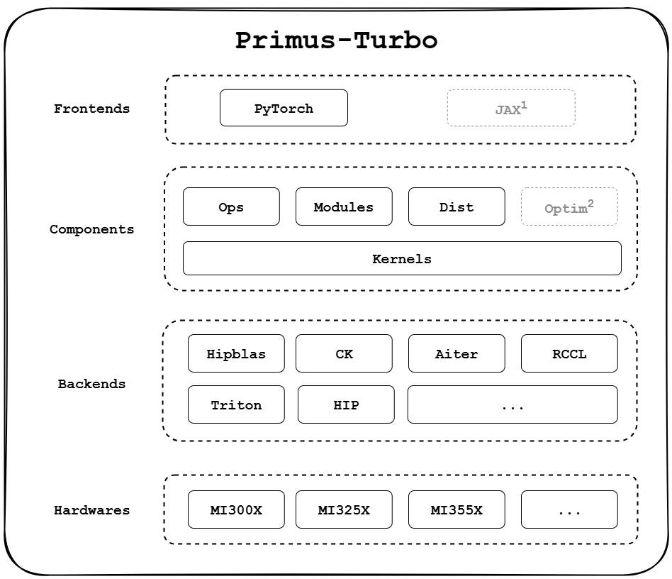

# Primus-Turbo
**Primus-Turbo** is a high-performance acceleration library dedicated to large-scale model training on AMD GPUs. Built and optimized for the AMD ROCm platform, it covers the full training stack — including core compute operators (GEMM, Attention, GroupedGEMM), communication primitives, optimizer modules, low-precision computation (FP8), and compute–communication overlap kernels.

With **High Performance**, **Full-Featured**, and **Developer-Friendly** as its guiding principles, Primus-Turbo is designed to fully unleash the potential of AMD GPUs for large-scale training workloads, offering a robust and complete acceleration foundation for next-generation AI systems.

<p align="center">
  
</p>
Note: JAX support is under active development. Optim support is planned but not yet available.

## 🚀 What's New
- **[2025/12/1]** 🔥[Efficient MoE Pre-training at Scale on 1K AMD GPUs with TorchTitan.](https://pytorch.org/blog/efficient-moe-pre-training-at-scale-with-torchtitan/)
- **[2025/9/19]** [Primus-Turbo introduction blog.](https://rocm.blogs.amd.com/software-tools-optimization/primus-large-models/README.html)
- **[2025/9/11]** Primus-Turbo initial release, version v0.1.0.

## 🧩 Primus Product Matrix

|     Module     | Role | Key Features |
|----------------|------|--------------|
| [**Primus-LM**](https://github.com/AMD-AGI/Primus)           | E2E training framework | - Supports multiple training backends (Megatron, TorchTitan, etc.)<br>- Provides high-performance, scalable distributed training<br>- Deeply integrates with Primus-Turbo and Primus-SaFE |
| [**Primus-Turbo**](https://github.com/AMD-AGI/Primus-Turbo)  | High-performance operators & modules | - Supports core training operators and modules (FlashAttention, GEMM, GroupedGemm, DeepEP etc.)<br>- Integrates multiple high-performance backends (e.g., CK, hipBLASLt, AITER) <br>- High performance and easy to integrate |
| [**Primus-SaFE**](https://github.com/AMD-AGI/Primus-SaFE)    | Stability & platform layer | - Cluster sanity check and benchmarking<br>- Kubernetes scheduling with topology awareness<br>- Fault tolerance<br>- Stability enhancements |


## 📦 Quick Start

### Requirements

#### Software
- ROCm >= 6.4
- Python >= 3.10
- PyTorch >= 2.6.0 (with ROCm support)
- rocSHMEM (optional, required for **experimental DeepEP**). Please refer to our [DeepEP Installation Guide](primus_turbo/pytorch/deep_ep/README.md) for instructions.

#### Hardware
| Architecture | Supported GPUs      |
| -------------| --------------------|
| GFX942       | ✅MI300X, ✅MI325X |
| GFX950       | ✅MI350X, ✅MI355X |

### 1. Installation

#### Docker (Recommended)
Use the pre-built AMD ROCm image:
```bash
# PyTorch Ecosystem
## For GFX942
rocm/primus:v25.9_gfx942
## For GFX950
rocm/primus:v25.9_gfx950

# JAX Ecosystem
rocm/jax-training:maxtext-v25.9
```

#### Install from Source
```bash
git clone https://github.com/AMD-AGI/Primus-Turbo.git --recursive
cd Primus-Turbo

pip3 install -r requirements.txt
pip3 install --no-build-isolation .

# (Optional) Set GPU_ARCHS environment variable to specify target AMD GPU architectures.
GPU_ARCHS="gfx942;gfx950" pip3 install --no-build-isolation .
```

### 2. Development

For contributors, use editable mode (`-e`) so that code changes take effect immediately without reinstalling.

```bash
git clone https://github.com/AMD-AGI/Primus-Turbo.git --recursive
cd Primus-Turbo

pip3 install -r requirements.txt
pip3 install --no-build-isolation -e . -v

# (Optional) Set GPU_ARCHS environment variable to specify target AMD GPU architectures.
GPU_ARCHS="gfx942;gfx950" pip3 install --no-build-isolation -e . -v

# (Optional) Set PRIMUS_TURBO_FRAMEWORK to compile for a specific framework.
# Supported values: PYTORCH (default), JAX.
# For example, to compile for JAX:
PRIMUS_TURBO_FRAMEWORK="JAX" pip3 install --no-build-isolation -e . -v
```

### 3. Testing

```bash
# Single-process mode (runs all tests)
pytest tests/pytorch/

# Multi-process mode (need both commands for full coverage)
pytest tests/pytorch/ -n 8        # single-GPU tests in parallel
pytest tests/pytorch/ --dist-only # distributed tests (skipped by -n)
```

### 4. Packaging

```bash
pip3 install -r requirements.txt
python3 -m build --wheel --no-isolation
pip3 install --extra-index-url https://test.pypi.org/simple ./dist/primus_turbo-XXX.whl
```

### 5. Minimal Example
```python
import torch
import primus_turbo.pytorch as turbo

dtype = torch.bfloat16
device = "cuda:0"

a = torch.randn((128, 256), dtype=dtype, device=device)
b = torch.randn((256, 512), dtype=dtype, device=device)
c = turbo.ops.gemm(a, b)

print(c)
print(c.shape)
```

## 💡 Example
See [Examples](./docs/examples.md) for usage examples.


## 📊 Performance
See [Benchmarks](./benchmark/README.md) for detailed performance results and comparisons.

## 📍 Roadmap
[Roadmap: Primus-Turbo Roadmap H2 2025](https://github.com/AMD-AGI/Primus-Turbo/issues/101)

## 📜 License

Primus-Turbo is licensed under the MIT License.

© 2025 Advanced Micro Devices, Inc. All rights reserved.
