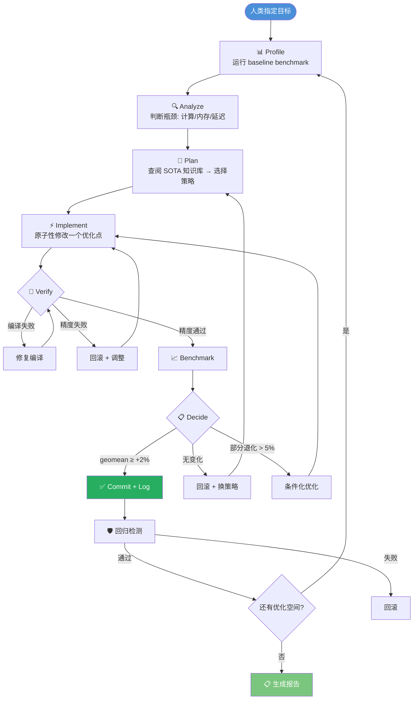

# Primus-Turbo Agent-Driven 算子优化总体计划

> **版本**: v0.2  
> **日期**: 2026-04-02  
> **状态**: Harness 建设完成，待 Review 后启动优化

---

## 目录

1. [Harness 建设成果](#1-harness-建设成果)
2. [现状评估](#2-现状评估)
3. [参考 SOTA 技术总结](#3-参考-sota-技术总结)
4. [Agent Loop 优化架构](#4-agent-loop-优化架构)
5. [算子优化路线图](#5-算子优化路线图)
6. [验证与质量保障](#6-验证与质量保障)
7. [风险与缓解措施](#7-风险与缓解措施)

---

## 1. Harness 建设成果

### 1.1 新建的规则文件

| 文件 | 类型 | 作用 |
|------|------|------|
| `rules/agent-optimization-loop.mdc` | Rule (always) | **Agent 优化闭环流程**: Profile→Analyze→Plan→Implement→Verify→Decide→Log，含精度标准、迭代限制、禁止行为 |
| `rules/performance-regression.mdc` | Rule (globs) | **性能回归检测**: 基线管理、三级回归判定 (pass/warn/fail)、异常检测 |

### 1.2 增强的规则文件

| 文件 | 增强内容 |
|------|----------|
| `rules/benchmark-workflow.mdc` | 加入完整 4 步工作流 (精度→性能→对比→记录)、基线对比步骤、环境变量清单 |

### 1.3 新建的 Skill 文件

| 文件 | 覆盖内容 |
|------|----------|
| `skills/triton-gemm-optimize/SKILL.md` | GEMM 核心文件映射、M-bucketed 配置、Split-K、XCD Swizzle、Persistent Kernel、后端决策树、效率目标 |
| `skills/moe-optimize/SKILL.md` | MoE 完整数据流图、Fused MoE E2E 方案、Grouped GEMM 优化、Router 优化、通信重叠、关键模型配置表 |
| `skills/sota-knowledge-base/SKILL.md` | 7 个参考项目索引、Attention/GEMM/MoE/通用 共 20+ 个 SOTA 技术条目、每个含来源/原理/收益/参考代码 |

### 1.4 增强的 Skill 文件

| 文件 | 增强内容 |
|------|----------|
| `skills/triton-attention-optimize/SKILL.md` | 从 4 个优化方向扩展到 9 个 (P0-P3)，每个含 AITER/FA3/TK 的具体参考路径 |
| `skills/kernel-profiling/scripts/quick_profile.sh` | 增强: 输出目录组织、rocprof 结果保存、MI300X roofline 参考、omniperf 指引 |

### 1.5 新建的工具脚本

| 文件 | 作用 |
|------|------|
| `tools/check_regression.py` | 性能回归检测: 对比基线 JSON、三级判定、geomean 检查、异常检测 |
| `tools/update_baseline.py` | 基线更新: 从 benchmark CSV 生成/更新 `benchmark/baselines/*.json` |
| `tools/quick_verify.sh` | 快速验证: 编译→精度测试→性能 benchmark 一键完成，支持按算子过滤 |

### 1.6 新建的目录

| 目录 | 作用 |
|------|------|
| `benchmark/baselines/` | 性能基线 JSON 文件存储 |
| `tools/` | 工具脚本集合 |

### 1.7 Harness 架构总览

```
.cursor/
├── rules/
│   ├── project-conventions.mdc        # 项目总体约定 (always)
│   ├── agent-optimization-loop.mdc    # ✨ Agent 优化闭环 (always)
│   ├── performance-regression.mdc     # ✨ 回归检测 (globs)
│   ├── triton-kernel-patterns.mdc     # Triton 编写规范 (globs)
│   └── benchmark-workflow.mdc         # 📝 Benchmark 工作流 (globs, 增强)
├── skills/
│   ├── amd-gpu-architecture/          # AMD 硬件知识
│   ├── kernel-profiling/              # 📝 Profiling 工作流 (增强)
│   ├── triton-attention-optimize/     # 📝 Attention 优化 (增强)
│   ├── triton-gemm-optimize/          # ✨ GEMM 优化
│   ├── moe-optimize/                  # ✨ MoE 优化
│   └── sota-knowledge-base/           # ✨ SOTA 知识库

tools/
├── check_regression.py                # ✨ 回归检测脚本
├── update_baseline.py                 # ✨ 基线更新脚本
└── quick_verify.sh                    # ✨ 快速验证脚本

benchmark/baselines/                   # ✨ 性能基线存储
```

---

## 2. 现状评估

### 2.1 算子矩阵

| 算子类别 | Triton | CK/HIP | hipBLASLt | Bench | Test | Accuracy |
|----------|--------|--------|-----------|-------|------|----------|
| **Attention** (FWD+BWD) | ✅ | - | - | ✅ | ✅ | ✅ |
| **GEMM BF16** | ✅ | ✅ | ✅ | ✅ | ✅ | ✅ |
| **GEMM FP8** | ✅ | ✅ | ✅ | ✅ | ✅ | ✅ |
| **GEMM FP4** | ✅ | - | - | - | ✅ | - |
| **Grouped GEMM BF16** | ✅ | ✅ | ✅ | ✅ | ✅ | - |
| **Grouped GEMM FP8** | ✅ | ✅ | - | ✅ | ✅ | - |
| **MoE Router** | ✅ | - | - | - | ✅ | - |
| **MoE Dispatch/Combine** | ✅ | - | - | - | ✅ | - |
| **Activation** | ✅ | - | - | - | ✅ | - |
| **Normalization** | - | ✅ | - | - | ✅ | - |
| **Quantization** | ✅ | ✅ | - | - | ✅ | - |
| **Reduce** | ✅ | ✅ | - | - | - | - |
| **Async TP** | ✅ | - | - | - | ✅ | - |

### 2.2 Benchmark 覆盖的模型

**Dense 模型**: Llama-2 (7B/70B), Llama-3.1 (8B/405B), Qwen2.5 (7B/72B), Mistral-7B  
**MoE 模型**: DeepSeek-V2/V3, Mixtral-8x7B/22B, Qwen3-30B/235B, Grok-2, Kimi-K2, MoE-1T

---

## 3. 参考 SOTA 技术总结

> 完整技术条目见 `skills/sota-knowledge-base/SKILL.md`

### 3.1 高优先级技术（P0，建议立即执行）

| 技术 | 算子 | 来源 | 预期收益 |
|------|------|------|----------|
| Block Size Autotune | Attention | AITER | 10-30% |
| Causal 三分法 | Attention | FA3/FA4 | 15-25% |
| M-Bucketed 配置 | GEMM | AITER | 10-30% |
| Split-K | GEMM | AITER/Triton | 15-40% |
| Fused MoE E2E | MoE | vLLM/AITER | 20-50% |

### 3.2 中优先级技术（P1，短期执行）

| 技术 | 算子 | 来源 | 预期收益 |
|------|------|------|----------|
| Branchless Rescaling | Attention | AVO | 5-10% |
| exp2 域 Softmax | Attention | ThunderKittens | 3-8% |
| KV Double Buffering | Attention | TK/FA3 | 5-15% |
| XCD Swizzle 调优 | GEMM | AITER | 5-15% |
| Fused RMSNorm+Residual | Normalization | Liger-Kernel | 15-25% |
| Grouped GEMM 负载均衡 | MoE | AITER | 10-20% |

### 3.3 探索性技术（P2，中期研究）

| 技术 | 算子 | 来源 | 备注 |
|------|------|------|------|
| Lean Attention | Attention | AITER | Stream-K for decode |
| SageAttention | Attention | AITER | INT8 Q/K, 精度风险 |
| Paged Attention | Attention | vLLM | 推理必需 |
| FP4 GEMM | GEMM | - | MI350X MXFP4 |
| GEMM+Comm Overlap | Async TP | AITER Iris | 多卡场景 |

---

## 4. Agent Loop 优化架构

### 4.1 闭环流程（定义在 `rules/agent-optimization-loop.mdc`）



### 4.2 验证工具链

| 步骤 | 工具/命令 | 用途 |
|------|-----------|------|
| 编译 | `pip3 install --no-build-isolation -e . -v` | 构建 C++/HIP 扩展 |
| 快速精度 | `pytest tests/pytorch/ops/test_<op>.py -x` | 单元测试 |
| 完整精度 | `python3 benchmark/accuracy/eval_<op>_accuracy.py` | 全配置精度 |
| 性能 | `python3 benchmark/ops/bench_<op>_turbo.py` | 性能度量 |
| 回归检测 | `python3 tools/check_regression.py --baseline ...` | 基线对比 |
| 基线更新 | `python3 tools/update_baseline.py --results ...` | 更新基线 |
| 一键验证 | `bash tools/quick_verify.sh <op>` | 编译+精度+性能 |
| Profiling | `bash .cursor/skills/kernel-profiling/scripts/quick_profile.sh` | 瓶颈分析 |

### 4.3 迭代限制（安全阀）

| 层级 | 限制 | 超限行为 |
|------|------|----------|
| 内循环 (编辑→验证) | 5 次 | 换策略 |
| 外循环 (策略) | 3 个 | 暂停，请人类 review |
| 精度标准 | BF16: atol=1e-2 | 不可放宽（除非人类批准） |
| 性能阈值 | geomean ≥ +2% | 低于此阈值不 commit |

---

## 5. 算子优化路线图

### 5.1 Phase 1: Attention（最高优先级）

| # | 优化项 | 文件 | 预期 | 难度 |
|---|--------|------|------|------|
| A1 | BLOCK_M/N autotune | `attention_kernel.py` | +10-30% | 低 |
| A2 | Causal skip fully-masked blocks | `attention_kernel.py` | +15-25% | 中 |
| A3 | Causal 三级路径 (skip/noMask/fullMask) | `attention_kernel.py` | +5-10% | 中 |
| A4 | Branchless rescaling | `attention_kernel.py` | +5-10% | 低 |
| A5 | exp2 域 softmax | `attention_kernel.py` | +3-8% | 低 |
| A6 | KV double buffering | `attention_kernel.py` | +5-15% | 中 |

### 5.2 Phase 2: GEMM

| # | 优化项 | 文件 | 预期 | 难度 |
|---|--------|------|------|------|
| G1 | M-bucketed 配置选择优化 | `gemm_kernel.py` | +10-30% | 低 |
| G2 | Split-K for decode (小 M) | `gemm_kernel.py` | +15-40% | 中 |
| G3 | XCD Swizzle GROUP_M 调优 | `gemm_kernel.py` | +5-15% | 低 |
| G4 | Persistent kernel 调度优化 | `gemm_kernel.py` | +5-15% | 中 |
| G5 | FP8 blockwise GEMM 优化 | `gemm_fp8_kernel.py` | +10-20% | 中 |

### 5.3 Phase 3: MoE

| # | 优化项 | 文件 | 预期 | 难度 |
|---|--------|------|------|------|
| M1 | Fused MoE E2E kernel | 新文件 | +20-50% | 高 |
| M2 | Grouped GEMM 负载均衡 | `grouped_gemm_kernel.py` | +10-20% | 中 |
| M3 | Router kernel 大 E 优化 | `fused_router_kernel.py` | +5-15% | 低 |
| M4 | Token dispatch/combine 融合 | `permutation.py` 等 | +10-20% | 中 |

### 5.4 Phase 4: 辅助算子

| # | 优化项 | 文件 | 预期 | 难度 |
|---|--------|------|------|------|
| H1 | Fused RMSNorm + Residual Add | Triton 新文件 | +15-25% | 中 |
| H2 | SwiGLU/GeGLU 向量化 | `swiglu_kernel.py` 等 | +5-10% | 低 |
| H3 | Blockwise quantization 融合 | `quant_blockwise.py` | +10-20% | 中 |

### 5.5 优先级决策矩阵

```
            ┌─ 高收益 ────────────────────────────────────┐
            │                                              │
            │  🔴 P0 (立即)        🟡 P0 (立即)            │
            │  A1 Attn Autotune    M1 Fused MoE            │
            │  A2 Causal Skip      G2 Split-K              │
            │  G1 M-bucket                                 │
    低难度  │                                              │  高难度
            │  🟢 P1 (短期)        🟠 P1 (短期)            │
            │  A4 Branchless       A6 KV Buffering          │
            │  A5 exp2             H1 Fused RMSNorm         │
            │  G3 XCD tuning       M2 Load Balance          │
            │                                              │
            │  🔵 P2 (中期)        🟣 P2 (探索)            │
            │  H2 SwiGLU           Paged Attention          │
            │                      SageAttention            │
            │                      FP4 GEMM                 │
            └──────────────────────────────────────────────┘
                         低收益 ──→
```

---

## 6. 验证与质量保障

### 6.1 三级验证体系

```
Level 1: 快速验证 (~2 min, 每次修改后)
├── 编译: pip3 install --no-build-isolation -e . -v
├── 精度: pytest tests/pytorch/ops/test_<target>.py -x
└── 快速 bench: 关键配置子集

Level 2: 完整验证 (~10 min, 每个 commit 前)
├── 完整精度: benchmark/accuracy/eval_*_accuracy.py
├── 完整 bench: benchmark/ops/bench_*_turbo.py
└── 回归检测: tools/check_regression.py

Level 3: 全量验证 (~30 min, 每个 Phase 完成后)
├── 全算子 suite: run_suite.py
├── 交叉影响检测
├── 端到端预训练测试
└── 生成优化报告
```

### 6.2 性能基线管理

```bash
# 首次建立基线
python3 benchmark/ops/bench_attention_turbo.py -o output/attention.csv
python3 tools/update_baseline.py --results output/attention.csv --operator attention

# 优化后对比
python3 benchmark/ops/bench_attention_turbo.py -o output/attention_new.csv
python3 tools/check_regression.py --baseline benchmark/baselines/ --current output/attention_new.csv

# 确认有效后更新基线
python3 tools/update_baseline.py --results output/attention_new.csv --operator attention
```

### 6.3 优化日志格式

每次有效 commit 追加到 `docs/optimization-log.md`:

```markdown
## [2026-04-03] Attention: Block Size Autotune

**修改**: attention_kernel.py — 添加 BLOCK_M/N autotune
**策略**: triton.autotune 搜索 {32, 64, 128}
**瓶颈**: 计算受限 (MFMA utilization < 50%)
**结果**: geomean +15.2%, 最佳 seq_len=4096 BLOCK_M=128
**Commit**: abc1234
**参考**: AITER attention autotune
```

---

## 7. 风险与缓解措施

### 7.1 风险矩阵

| 风险 | 概率 | 影响 | 缓解 |
|------|------|------|------|
| Triton 编译器 bug (AMD) | 中 | 高 | CK/hipBLASLt fallback |
| FP8 精度问题 | 高 | 中 | 严格精度验证 + 逐步降精度 |
| 过度优化降低可维护性 | 中 | 中 | 原子性修改 + 代码审查 |
| Agent 无效循环 | 中 | 低 | 迭代限制 (5次/策略, 3策略/算子) |
| 性能回归未检测 | 低 | 高 | 完整 benchmark + 基线对比 |
| ROCm/Triton 升级不兼容 | 低 | 高 | 版本记录 + CI 测试 |

### 7.2 人机协作断点

**必须暂停等人类 Review 的场景:**
1. 创建全新 kernel 文件（如 Paged Attention、Fused MoE）
2. 修改核心算法流程（如 online softmax 替换）
3. 放宽精度容忍度
4. 连续 3 次策略无效
5. geomean 提升超过 50%（可能测量问题）

---

## 附录: 执行检查清单

### 启动优化前
- [ ] 确认 GPU 可用且空闲
- [ ] 确认 ROCm/Triton 版本一致
- [ ] 建立性能基线: `tools/update_baseline.py`
- [ ] 创建 `docs/optimization-log.md` 文件

### 每个 Phase 完成后
- [ ] 运行全量 benchmark suite
- [ ] 更新性能基线
- [ ] 更新 optimization-log.md
- [ ] 人类 review 优化效果

### 整体完成后
- [ ] 生成最终优化报告
- [ ] 对比初始基线和最终基线
- [ ] 更新 SKILL 文件中的"当前实现概况"
- [ ] git tag 标记版本
