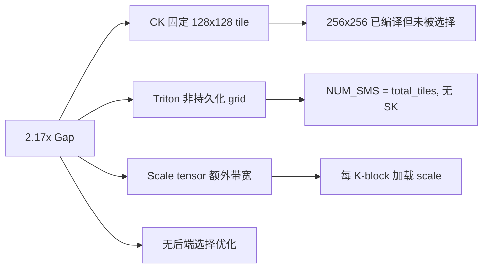

# Blockwise FP8 十轮优化计划

## 基线现状
- **GEMM FP8 Blockwise**: 429 TFLOPS (仅为 Tensorwise 919 TFLOPS 的 46.7%)
- **Blockwise / Tensorwise 平均慢倍数**: 2.17x
- **最差场景 (Llama-3.1-405B, N=106496)**: 3.35x

## 根因分析



## 十轮优化清单

| Round | 目标 | 算子 | 核心修改 | 预估收益 | 复杂度 |
|-------|------|------|---------|---------|-------|
| 1 | CK GEMM ABQuantGrouped 添加 256x256 tile 选择 | GEMM | `ck_gemm_kernel_instance_factory.{hip,cu}` | 20-40% | 低 |
| 2 | Triton blockwise GEMM 改为持久化 kernel + 离线配置选择 | GEMM | `gemm_fp8_kernel.py` | 10-25% | 中 |
| 3 | CK Grouped GEMM ABQuantGrouped tile 选择优化 | Grouped GEMM | `ck_grouped_gemm_kernel_instance_factory.{hip,cu}` | 15-30% | 低 |
| 4 | Triton blockwise GEMM 内循环优化 (EVEN_K + scale) | GEMM | `gemm_fp8_kernel.py` | 5-15% | 中 |
| 5 | Triton blockwise GEMM BLOCK_N=256 配置扩展 | GEMM | `gemm_fp8_kernel.py` | 5-15% | 中 |
| 6 | Blockwise FP8 后端选择优化 (CK vs Triton dispatch) | GEMM | `gemm_fp8_impl.py` | 5-10% | 低 |
| 7 | Triton blockwise 消除 host 端 scale transpose | GEMM | `gemm_fp8_kernel.py` | 3-5% | 低 |
| 8 | CK GEMM blockwise 添加 256x128 tile + padding 支持 | GEMM | `ck_gemm_kernel_instance_factory.*` | 5-10% | 中 |
| 9 | Grouped GEMM blockwise Triton 优化 | Grouped GEMM | `grouped_gemm_fp8_kernel.py` | 10-20% | 高 |
| 10 | Attention FP8 blockwise + 综合后端调优 | Attention + 全局 | 多文件 | 5-15% | 高 |

## Round 1 详细设计

### 问题
CK GEMM ABQuantGrouped（blockwise FP8）在 GFX942 上始终使用 `128x128x128` tile。对于大矩阵（M≥4096, N≥4096），256x256x128 tile 应该更高效：
- 每个 tile 计算量更大：$256^2 \times 128 \times 2 = 16.78M$ FLOP vs $128^2 \times 128 \times 2 = 4.19M$ FLOP
- 相同 M×N 需要的 tile 数减少 4x
- 减少 kernel launch / grid scheduling 开销

### 关键发现
**256x256x128 的 ABQuantGrouped runner 已经被 `APPLY_CK_GEMM_ALL_LAYOUT_WITH_ARCH` 编译**，但 factory 从未在 ABQuantGrouped 分支中选择它。

### 修改方案
在 `ck_gemm_kernel_instance_factory.{hip,cu}` 的 ABQuantGrouped 分支中添加 M/N-aware 选择：
```cpp
if constexpr (QuantMode == ck_tile::QuantType::ABQuantGrouped) {
    if (n % 256 == 0 && m >= 4096 && n >= 4096) {
        // Large shapes: use 256x256x128 for better compute efficiency
        using TileConfig = GFX942_CKGemmTileCfg_256x256x128_32x32x32_2x2x1;
        // ...
    } else {
        // Small/medium shapes: keep 128x128x128
        using TileConfig = GFX942_CKGemmTileCfg_128x128x128_32x32x32_2x2x1;
        // ...
    }
}
```
