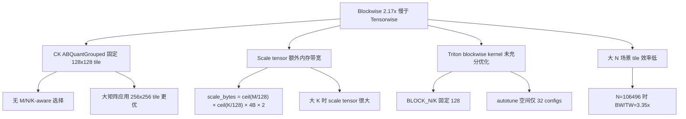

# Round 0: Blockwise FP8 性能基线分析

## 基线数据

| 算子 | 精度 | 平均 TFLOPS | 配置数 |
|------|------|----------:|------:|
| GEMM FP8 Tensorwise | FP8 | 919.12 | 84 |
| **GEMM FP8 Blockwise** | FP8 | **429.07** | 84 |
| GEMM BF16 | BF16 | 609.58 | 84 |

## 关键发现

$$\text{Blockwise/Tensorwise 比率} = \frac{429.07}{919.12} = 0.467 \quad (\text{仅为 46.7\% 的性能})$$

### 按 N 维度分析慢倍数

| N 范围 | 平均 BW/TW 比率 | 代表模型 |
|--------|:--------------:|---------|
| N < 10000 | 1.8x | Llama-2-7B, Qwen2.5-7B |
| 10000 ≤ N < 30000 | 2.1x | Llama-2-70B, Mistral-7B |
| 30000 ≤ N < 60000 | 2.4x | Qwen2.5-72B, Llama-3.1-8B |
| N ≥ 60000 | 2.8-3.4x | Llama-3.1-405B |

### 根因分析

## 优化空间估计

| 优化方向 | 预估收益 | 复杂度 | 优先级 |
|---------|---------|--------|-------|
| CK 添加 256x256 tile for blockwise | 20-40% | 中 | P0 |
| CK M-aware tile 选择 | 10-20% | 低 | P0 |
| Triton blockwise autotune 扩展 | 10-30% | 中 | P0 |
| Blockwise CK vs Triton 后端选择 | 5-15% | 低 | P1 |
| Scale tensor prefetch/layout 优化 | 5-10% | 高 | P1 |
| Triton BLOCK_N 扩展到 256 | 10-20% | 中 | P1 |
| Attention FP8 block_scaling fusion | 5-15% | 高 | P1 |
| CK kBlockPerCu for blockwise | 5-10% | 中 | P2 |
| Grouped GEMM blockwise 优化 | 10-20% | 中 | P1 |
| 端到端 pipeline 优化 | 5-10% | 高 | P2 |
