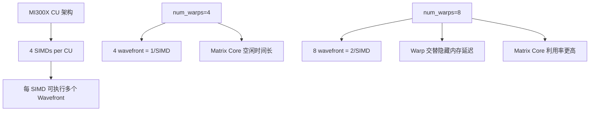

# Round 3: Forward NT num_warps=8 优化

## 概述

将 blockwise FP8 forward（NT layout）的 `num_warps` 从 4 提升到 8，匹配 tensorwise FP8 kernel 配置，获得显著性能提升。

## 核心修改

**文件**: `primus_turbo/triton/gemm/gemm_fp8_kernel.py`

**修改内容**: `_blockwise_nt` 函数中 `num_warps` 从 4 改为 8。

```python
# Before (Round 2)
num_warps=4,

# After (Round 3)
num_warps=8,
```

## 原理分析

### 为什么 num_warps=8 对 forward 有效



1. **NT forward 特性**: A 和 B 都是 K-contiguous，内存访问效率高
2. **延迟隐藏**: 8 warps 提供更多指令级并行，Warp 0 等待内存时 Warp 1 可执行计算
3. **与 tensorwise 对齐**: tensorwise FP8 kernel 已使用 `num_warps=8`，证明该配置对 FP8 MFMA 有效

### LDS 约束分析

```
128×128×128 FP8 tile, num_stages=2, async_copy=True:
  LDS = num_stages × (BLOCK_M × BLOCK_K + BLOCK_K × BLOCK_N) × 1 byte
      = 2 × (128×128 + 128×128) = 65536 bytes = 64KB ✓

num_warps 变化不影响 LDS 分配，只改变 wavefront 数量。
```

### 失败尝试记录

| 方案 | 结果 | 原因 |
|------|------|------|
| BLOCK_M=256 + async_copy | OOM: 98304 > 65536 | async_copy 使 LDS = num_stages × tile |
| 256×256×128 + no async_copy | 正确性错误 + 3x 回退 | BLOCK_N=256 > scale_block=128 导致 B scale 索引越界 |
| backward num_warps=8 + .cg | -1.8% geomean | 非连续访问模式下更多 warps 增加竞争 |

## 性能数据

### 总体结果

| 指标 | Round 2 (Baseline) | Round 3 | 变化 |
|------|-------------------|---------|------|
| Forward Avg TFLOPS | 449 | 481 | **+7.01% geomean** |
| Backward Avg TFLOPS | 332 | 329 | +0.04% geomean |
| 正确性 | 84/84 PASS | 84/84 PASS | ✓ |

### 按 Backend 分析

| Backend | 数量 | Forward Geomean |
|---------|------|----------------|
| Triton (K≥8192) | 42 shapes | **+11.69%** |
| CK (K<8192) | 27 shapes | +0.13% (不变) |

### Triton Forward 提升最大的 Shape

| M | N | K | Round 2 | Round 3 | 提升 |
|---|---|---|---------|---------|------|
| 8192 | 3584 | 18944 | 424.6 | 507.1 | **+19.4%** |
| 8192 | 8192 | 8192 | 462.3 | 533.0 | **+15.3%** |
| 8192 | 10240 | 8192 | 476.6 | 546.4 | **+14.6%** |
| 16384 | 8192 | 28672 | 452.8 | 518.6 | **+14.5%** |
| 16384 | 10240 | 8192 | 484.8 | 554.4 | **+14.4%** |

### 回退分析

**零回退**: 所有 84 个 shape 的 forward 性能均持平或提升。

## 累计收益（相对 Round 0 原始基线）

| 轮次 | Forward Geomean | Backward Geomean |
|------|----------------|------------------|
| Round 1 (persistent kernel) | +2.49% | +40.78% |
| Round 2 (shape dispatch) | +5.16% | +40.65% |
| **Round 3 (num_warps=8)** | **+12.53%** | **+40.70%** |
