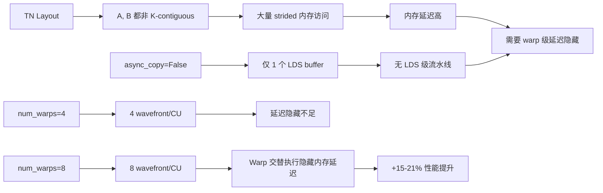

# Round 4: Backward NN/TN num_warps=8 优化

## 概述

将 blockwise FP8 backward（NN 和 TN layout）的 `num_warps` 从 4 提升到 8，与 Round 3 的 forward 优化统一配置，获得显著的 backward 性能提升。

## 核心修改

**文件**: `primus_turbo/triton/gemm/gemm_fp8_kernel.py`

**修改内容**:
- `_blockwise_nn` (NN backward): `num_warps` 4 → 8
- `_blockwise_tn` (TN backward): `num_warps` 4 → 8

## 原理分析

### Backward 两个 GEMM 的特性

| 路径 | 计算 | A K-contiguous | B K-contiguous | async_copy | 改进幅度 |
|------|------|---------------|---------------|------------|---------|
| NN (grad_X) | A[M,K] @ B[K,N] | ✓ | ✗ | 启用 | +1-2% |
| TN (grad_W) | A[K,M]^T @ B[K,N] | ✗ | ✗ | 禁用 | +15-21% |

### TN 为什么提升最大

TN backward 具备所有有利于 `num_warps=8` 的条件：
1. **双非连续访问**: A 和 B 的 K-维都是 strided，cache 命中率低
2. **无 async_copy**: LDS 只有 1 个 buffer set（32KB），无法通过 LDS 流水线隐藏延迟
3. **8 warps 提供**: 每 SIMD 2 个 wavefront，当 warp0 等待内存时 warp1 可执行计算

## 性能数据

### 总体结果 (Round 3 → Round 4)

| 指标 | Round 3 | Round 4 | 变化 |
|------|---------|---------|------|
| Forward Avg TFLOPS | 481 | 482 | +0.11% (不变) |
| Backward Avg TFLOPS | 329 | 358 | **+9.09% geomean** |
| 正确性 | 84/84 PASS | 84/84 PASS | ✓ |

### Backward 改进分布

| 范围 | Shape 数 |
|------|----------|
| +5% ~ +8% | 21 |
| +8% ~ +10% | 26 |
| +10% ~ +13% | 18 |
| +13% ~ +19% | 4 |

### Backward 提升最大的 Shape

| M | N | K | Round 3 | Round 4 | 提升 |
|---|---|---|---------|---------|------|
| 32768 | 106496 | 16384 | 310.4 | 368.0 | **+18.6%** |
| 32768 | 37888 | 3584 | 308.6 | 349.2 | **+13.2%** |
| 16384 | 37888 | 3584 | 307.0 | 345.8 | **+12.6%** |
| 16384 | 57344 | 8192 | 316.8 | 356.5 | **+12.5%** |
| 8192 | 57344 | 8192 | 313.6 | 352.1 | **+12.3%** |

## 累计收益（相对 Round 0 原始基线）

| 轮次 | Forward Geomean | Backward Geomean |
|------|----------------|------------------|
| Round 1 (persistent kernel) | +2.49% | +40.78% |
| Round 2 (shape dispatch) | +5.16% | +40.65% |
| Round 3 (fwd num_warps=8) | +12.53% | +40.70% |
| **Round 4 (bwd num_warps=8)** | **+12.65%** | **+53.49%** |

## 统一的 num_warps=8 配置

Round 3 + Round 4 完成后，所有三个 blockwise FP8 layout 统一使用 `num_warps=8`：

| Layout | 用途 | num_warps | async_copy |
|--------|------|-----------|------------|
| NT | Forward | 8 | 启用 |
| NN | Backward grad_X | 8 | 启用 |
| TN | Backward grad_W | 8 | 禁用 |
