# Round 7: 内循环 Scale 加载重排序

## 优化概述

将 blockwise FP8 GEMM 内循环中的 scale 加载从 `tl.dot` 之后移到之前，使 scale 内存请求与数据 tile 加载重叠，消除 MFMA 完成后的等待延迟。

## 技术分析

### 问题：Scale 加载延迟阻塞 accumulation

原始内循环（Round 6）：

```
每次 K 迭代:
  1. 加载 A tile (128×128 FP8 = 16KB)     ──── DMA/Memory 请求
  2. 加载 B tile (128×128 FP8 = 16KB)     ──── DMA/Memory 请求
  3. tl.dot(a, b) ─ MFMA pipeline          ──── ~1024 cycles
  4. 加载 a_s (128 float32 = 512B)         ──── Memory 请求 ← 延迟开始
  5. 加载 b_s (1 or 128 float32)           ──── Memory 请求
  6. acc += partial * scale                ──── 等待 scale 到达!
```

问题在于步骤 4-5：scale 在 MFMA 完成后才发起加载请求。Scale 数据虽小（512B ~ 1KB），但 HBM/L2 延迟 ~200-500 cycles，这段时间 MFMA 单元完全空闲。

### 解决方案：Scale 预加载

```
优化后的 K 迭代:
  1. 加载 a_s, b_s (scale)                 ──── Memory 请求 (小数据, 快速)
  2. 加载 A tile                           ──── DMA/Memory 请求 (大数据)
  3. 加载 B tile                           ──── DMA/Memory 请求
  4. tl.dot(a, b) ─ MFMA pipeline          ──── ~1024 cycles
                                                ↑ scale 已在 MFMA 执行期间到达!
  5. acc += partial * scale                ──── 立即执行, 无等待
```



```mermaid
gantt
    title 原始 vs 优化的指令时间线
    dateFormat X
    axisFormat %s

    section 原始
    Load A,B tile    :a1, 0, 200
    MFMA             :a2, 200, 1200
    Load scales      :a3, 1200, 1500
    Scale × acc      :a4, 1500, 1600
    
    section 优化后
    Load scales      :b0, 0, 100
    Load A,B tile    :b1, 0, 200
    MFMA             :b2, 200, 1200
    Scale × acc      :b3, 1200, 1300
```

关键差异：原始方案的 scale 加载在 MFMA 结束后才开始（~300 cycles 空闲等待），优化后 scale 在 MFMA 开始前即已请求，MFMA 结束时 scale 已就绪。

### 为什么对所有 layout 都有效

Scale 加载与 tile 加载完全独立：
- Scale 使用 scalar 指针（`as_ptrs + ki * stride_as_k`），不与 tile DMA 竞争
- Scale 数据极小（512B-1KB），L2 命中率高
- 提前发射 scale 请求不会延迟 tile 加载

## 代码修改

修改 `_blockwise_fp8_persistent_kernel` 内循环中的操作顺序：

```python
# 优化前                              # 优化后
for ki in range(loop_k):             for ki in range(loop_k):
    a = load(a_ptrs)                     a_s = load(scale_a)    # ← 提前
    b = load(b_ptrs)                     b_s = load(scale_b)    # ← 提前
    partial = dot(a, b)                  a = load(a_ptrs)
    a_s = load(scale_a)    # ← 晚     b = load(b_ptrs)
    b_s = load(scale_b)    # ← 晚     partial = dot(a, b)
    acc += partial * scale               acc += partial * scale  # ← 无等待
```

## 性能结果

### Forward

| 指标 | 值 |
|------|-----|
| Round 6 平均 | 493.77 TFLOPS |
| Round 7 平均 | 515.01 TFLOPS |
| Geomean vs R6 | **+4.31%** |
| Geomean vs Baseline | **+21.28%** |
| 提升 shape 数 | **68 / 69** |
| 回退 shape 数 | **0 / 69** |

### Backward

| 指标 | 值 |
|------|-----|
| Round 6 平均 | 392.64 TFLOPS |
| Round 7 平均 | 409.10 TFLOPS |
| Geomean vs R6 | **+4.23%** |
| Geomean vs Baseline | **+75.13%** |
| 提升 shape 数 | **68 / 69** |
| 回退 shape 数 | **0 / 69** |

### 精度验证

192/192 blockwise FP8 accuracy tests 全部通过。

### 失败的尝试（Round 7 同期探索）

| 方案 | 效果 | 结论 |
|------|------|------|
| Forward CACHE_A=".cg" | Fwd -12.5% | L1 对 async_copy DMA 管线有益 |
| TN num_stages=1 | Bwd -7.1% | Software pipelining 仍有价值 |
| Backward GROUP_M=4 | Bwd -0.35% | GROUP_M=5 已是合理选择 |
| TN kpack=1 | Bwd -2.17% | kpack=2 对 FP8 MFMA 更高效 |
| Backward CHUNK=16 | Bwd -0.09% | CHUNK=32 已是最优 |
| TN pre-transpose + async_copy | Bwd -6.95% | SCALE_2D_B=False + async_copy 寄存器冲突 |

### 累计优化效果（Round 0 → Round 7）

| 指标 | Baseline | Round 7 | 累计提升 |
|------|----------|---------|----------|
| Forward 平均 | 429.07 TFLOPS | 515.01 TFLOPS | **+20.0%** |
| Backward 平均 | 234.56 TFLOPS | 409.10 TFLOPS | **+74.4%** |
| Benchmark Status | 84 PASS | 84 PASS | 零错误 |
| Accuracy Tests | 192 passed | 192 passed | 零回退 |
