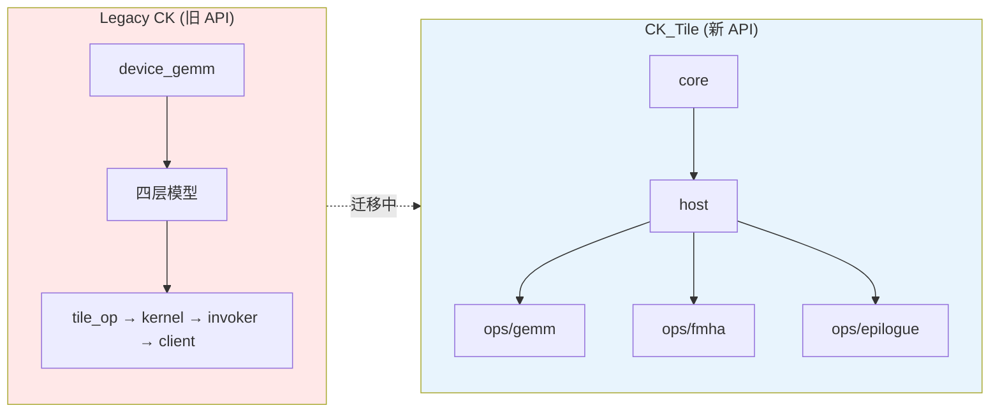
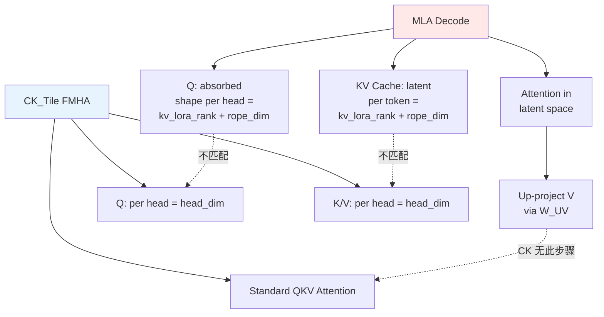
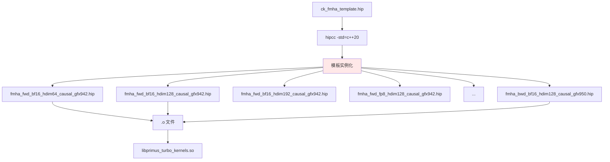
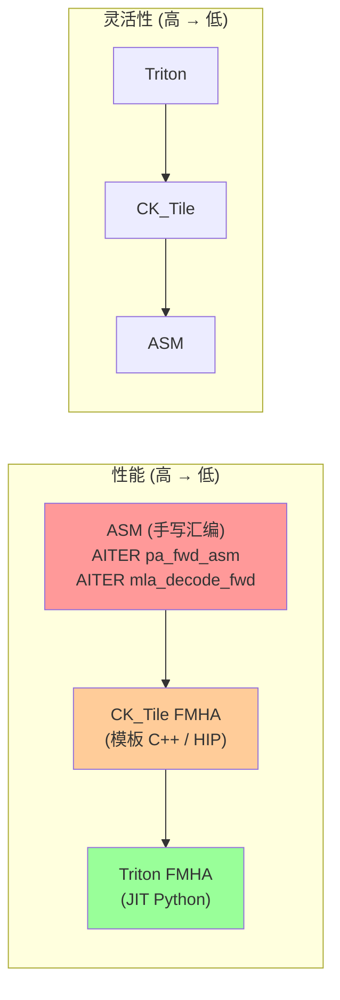
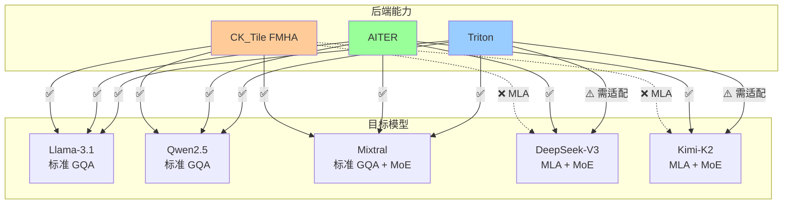

# 评估：直接使用 CK/CK_Tile 实现 Attention（vs AITER）

> **日期**: 2026-04-02  
> **背景**: Primus-Turbo 当前 Attention 使用 Triton 实现（FlashAttention v2 风格），GEMM 已集成 CK_Tile。评估直接引入 CK_Tile FMHA 作为 Attention 后端的可行性、复杂度和风险。

---

## 1. CK/CK_Tile 架构概览

### 1.1 CK_Tile vs Legacy CK



| 维度 | Legacy CK | CK_Tile |
|------|-----------|---------|
| 位置 | `include/ck/` | `include/ck_tile/` |
| 依赖 | 自包含 | **独立于** Legacy CK |
| 模型 | 四层 (tile→kernel→invoker→client) | 三层 (core + host + ops) |
| 类型系统 | 模板嵌套较深 | TileDistribution / TileWindow |
| 状态 | 维护模式 | **AMD 推荐的新方向** |
| FMHA 支持 | 无 (只有 GEMM) | ✅ 完整 (fwd/bwd/paged/split-KV) |

**关键结论**: CK_Tile 是 AMD 推荐的新框架，FMHA 完整实现**仅在 CK_Tile 中**，Legacy CK 不提供 Attention。

### 1.2 CK_Tile FMHA 代码结构

```
include/ck_tile/ops/fmha/
├── block/                      # 底层 block 级原语
│   ├── block_masking.hpp       # Causal / Sliding Window / Generic Mask
│   ├── page_block_navigator.hpp  # Paged KV 导航
│   └── ...                     # Dropout, Rotary, Bias, Quant enums
├── pipeline/                   # 计算 pipeline
│   ├── block_fmha_pipeline_qr_ks_vs.hpp     # 标准 Forward
│   ├── block_fmha_pipeline_qr_ks_vs_fp8.hpp # FP8 Forward
│   ├── block_fmha_fwd_splitkv_pipeline.hpp  # Split-KV (长序列)
│   └── ...                     # Backward, Batch Prefill, Append-KV
└── kernel/                     # 顶层 kernel 入口
    ├── fmha_fwd_kernel.hpp           # 标准 Forward
    ├── fmha_fwd_v3_kernel.hpp        # Forward V3 (优化版)
    ├── fmha_fwd_splitkv_kernel.hpp   # Split-KV Forward
    ├── fmha_fwd_pagedkv_kernel.hpp   # Paged KV Forward
    ├── fmha_fwd_appendkv_kernel.hpp  # KV Cache Append
    ├── fmha_bwd_kernel.hpp           # Backward
    └── fmha_batch_prefill_kernel.hpp # Batch Prefill
```

---

## 2. CK_Tile FMHA 特性支持矩阵

| 特性 | CK_Tile 支持 | 备注 |
|------|:------------:|------|
| FlashAttention v2 Forward | ✅ | `FmhaFwdV3Kernel`, AMD 官方博客有详细教程 |
| FlashAttention v2 Backward | ✅ | `fmha_bwd_kernel.hpp` |
| Causal Masking | ✅ | `GenericAttentionMask` — 支持 causal / sliding window |
| **GQA (Grouped Query Attention)** | ✅ | `nhead_ratio_qk`: nhead_q / nhead_k > 1 表示 GQA |
| Variable Length (Varlen) | ✅ | Batch 模式 (`cu_seqlen_*`) 和 Group 模式 (`seqstart_*`) |
| FP8 Forward | ✅ | 专用 pipeline `block_fmha_pipeline_qr_ks_vs_fp8.hpp` |
| Paged Attention | ✅ | `fmha_fwd_pagedkv_kernel.hpp` + `page_block_navigator.hpp` |
| Split-KV (长序列) | ✅ | `fmha_fwd_splitkv_kernel.hpp` |
| KV Cache Append | ✅ | `fmha_fwd_appendkv_kernel.hpp` |
| Batch Prefill | ✅ | `fmha_batch_prefill_kernel.hpp` |
| **MLA (Multi-Latent Attention)** | ❌ | **无专用实现** — 详见 §3 |
| Head Dim 支持 | ⚠️ | 编译时实例化 — 需要为每个 head_dim 组合生成模板实例 |
| Dropout | ✅ | Block 级 dropout 原语 |
| ALiBi / RoPE | ⚠️ | 有 Rotary 和 Bias 枚举，但非所有组合都有实例 |

---

## 3. MLA 支持分析（关键问题）

### 3.1 MLA 算法特殊性

MLA（DeepSeek-V2/V3）与标准 MHA 的根本差异：

$$
\text{Standard MHA}: \quad O = \text{softmax}\left(\frac{QK^\top}{\sqrt{d}}\right) V
$$

$$
\text{MLA (Absorbed)}: \quad O = \text{softmax}\left(\frac{[q^C; q^R] \cdot [c^{KV}; k^R]^\top}{\sqrt{d_c + d_R}}\right) \cdot c^{KV} \cdot W_{UV}
$$

关键差异：
- **KV Cache 是低秩 latent** `c^{KV} ∈ ℝ^{d_c}` (512 维)，不是 per-head K/V
- **Q 有 nope + rope 拆分**: `head_dim_qk = nope(128) + rope(64) = 192`
- **V head dim ≠ QK head dim**: `head_dim_v = 128`
- **Absorption**: `W_UK` 吸收进 Q 侧, `W_UV` 吸收进 O 侧 — 避免显式解压 K/V

### 3.2 CK_Tile FMHA 对 MLA 的适配难度



| 问题 | 详细说明 | 严重程度 |
|------|----------|:--------:|
| **Q/K 维度不对称** | MLA 的 `head_dim_qk=192` vs `head_dim_v=128`，CK_Tile 的 `hdim_q` / `hdim_v` 虽然分离，但实例化组合有限 | 🟡 中 |
| **KV Cache 形状** | MLA 存储 latent `[kv_lora_rank + rope_dim]` (576)，不是 per-head K/V。CK_Tile 期望标准 K/V layout | 🔴 高 |
| **Absorption GEMM** | MLA decode 需要在 attention **之后**做 `W_UV` up-projection，CK_Tile FMHA 不包含此步骤 | 🔴 高 |
| **Prefill vs Decode 路径差异** | MLA prefill 可用标准 MHA (W_UK 解压 K/V)，但 decode **必须**用 absorbed 路径 | 🟡 中 |

### 3.3 结论

**CK_Tile FMHA 无法直接用于 MLA decode**。原因是 MLA 的 absorbed 路径要求：
1. 在 **latent 空间** 做 attention（Q 经过 absorption，KV 是压缩 latent）
2. Attention 输出需要额外的 **W_UV up-projection**
3. KV Cache 布局与标准 FMHA 完全不同

**可行替代方案**:

| 方案 | 做法 | 复杂度 |
|------|------|--------|
| **A: MLA Prefill 用 CK_Tile** | Prefill 时显式解压 K/V (W_UK/W_UV)，用标准 FMHA。Decode 用其他方案 | 中 |
| **B: AITER mla_decode_fwd** | 使用 AITER 提供的 ASM/Triton MLA kernel | 低 |
| **C: 自研 MLA kernel** | 基于 Triton 或 CK_Tile 模板自行实现 MLA absorbed decode | 很高 |

---

## 4. 集成复杂度评估

### 4.1 Primus-Turbo 中已有的 CK 集成模式

当前 GEMM 集成路径（可参考）：

```
setup.py
  └── 3rdparty/composable_kernel (git submodule, header-only)
       └── include/ck_tile/ → 被 csrc/ 中的 HIP 代码 #include

csrc/kernels/gemm/ck_gemm_kernel_template_hip.h
  └── #include "ck_tile/ops/gemm.hpp"
  └── CKQuantGemmRunner<...> 模板类
  └── _launch_ck_gemm_kernel() 启动函数

csrc/kernels/gemm/instantiations/
  └── ck_gemm_kernel_fp8_e4m3_bf16_gfx942.hip  (编译时实例化)
  └── ck_gemm_kernel_fp8_e4m3_bf16_gfx950.hip

csrc/pytorch/gemm/ck_gemm_hip.cpp
  └── ck_gemm_fp8() → 运行时 dispatch → 对应实例
```

### 4.2 CK_Tile FMHA 集成所需工作

| 工作项 | 估算工时 | 说明 |
|--------|----------|------|
| **C++ Kernel 模板封装** | 3-5 天 | 类似 GEMM，创建 `CKFmhaRunner`，封装 `FmhaFwdV3Kernel` |
| **模板实例化** | 2-3 天 | 按 (head_dim, dtype, mask_type, arch) 组合生成 `.hip` 文件 |
| **PyTorch 封装** | 2-3 天 | 创建 `csrc/pytorch/attention/ck_fmha_hip.cpp` |
| **Python API 集成** | 1-2 天 | 添加 CK 后端到 `attention_triton_impl.py` 的 dispatch |
| **测试适配** | 2-3 天 | 确保现有 attention 测试覆盖 CK 后端 |
| **Benchmark 适配** | 1 天 | 添加 CK attention benchmark 对比 |
| **调试与调优** | 5-10 天 | 解决编译问题、精度对齐、性能调优 |
| **总计** | **16-27 天** | - |

### 4.3 编译复杂度



**编译时间风险**: CK_Tile 是重模板 C++20 代码。每个 `(dtype, head_dim, mask_type, arch)` 组合需要独立编译。

以当前 GEMM 为参考：
- FP8 GEMM: 2 dtype × 2 output × 2 arch = **8 个实例化文件**
- FMHA 预估: 3 dtype × 4 head_dim × 2 mask × 2 arch × 2 fwd/bwd = **~96 个实例化文件**

这将**显著增加编译时间**（当前 GEMM 编译已约 10-15 分钟，FMHA 可能翻 3-5 倍）。

---

## 5. 风险矩阵

### 5.1 高风险

| 风险 | 说明 | 缓解 |
|------|------|------|
| 🔴 **CK API 频繁变化** | CK_Tile 处于活跃开发期，`FmhaFwdKargs` 结构体字段、模板参数频繁变动。PyTorch 上游已报告 `fmha_fwd_args` 字段不匹配问题。**不遵循 semver**，模板 ABI 跨版本不兼容 | Pin submodule commit；建立 API 适配层隔离上下游变化；每次升级 CK 前做全量回归测试 |
| 🔴 **MLA 不可用** | CK_Tile FMHA **无 MLA 专用路径**。DeepSeek-V2/V3、Kimi-K2 等 MLA 模型只能用 AITER 或 Triton | 对 MLA 模型保留 AITER/Triton 路径；CK_Tile FMHA 仅用于标准 MHA/GQA |
| 🔴 **编译时间爆炸** | 多 (dtype, head_dim, mask, arch) 组合的模板实例化。gfx942 + gfx950 = 翻倍 | 限制实例化组合（只覆盖实际使用的 head_dim）；使用 ccache |

### 5.2 中风险

| 风险 | 说明 | 缓解 |
|------|------|------|
| 🟡 **Head Dim 覆盖不完整** | MLA 的 `head_dim_qk=192` 不是标准值，CK_Tile 可能没有此实例 | 需手动添加实例化；验证 MFMA 指令是否支持此 shape |
| 🟡 **CK 仓库迁移** | `ROCm/composable_kernel` 正迁移到 `ROCm/rocm-libraries`，旧仓库可能被废弃 | 关注上游迁移进度；准备切换 submodule URL |
| 🟡 **性能不确定** | CK_Tile FMHA **理论上**应比 Triton 快（手写 C++/HIP），但实际差距取决于具体配置。vLLM 测试显示 AITER（含 CK dispatch）比 Triton 快 ~1.3x，但不清楚多少归功于 CK vs ASM | 集成后需要完整 benchmark 对比；不能假设 CK 一定更快 |
| 🟡 **维护成本** | C++ 模板代码的可读性和调试难度远高于 Triton | 文档化关键模板参数含义；建立清晰的 instantiation 清单 |

### 5.3 低风险

| 风险 | 说明 | 缓解 |
|------|------|------|
| 🟢 **与 Triton 冲突** | 两个后端可共存，通过环境变量切换 | 已有 GEMM 的多后端 dispatch 模式可参考 |
| 🟢 **构建基础设施** | Primus-Turbo 已有 CK submodule 和 HIP 编译管线 | 复用现有 `setup.py` / `TurboBuildExt` |

---

## 6. 方案对比：CK_Tile vs AITER vs Triton

### 6.1 综合对比

| 维度 | CK_Tile 直接集成 | AITER | Triton |
|------|:-:|:-:|:-:|
| **性能上限** | ⭐⭐⭐⭐⭐ | ⭐⭐⭐⭐⭐ | ⭐⭐⭐⭐ |
| **标准 MHA/GQA** | ✅ | ✅ | ✅ |
| **MLA (DeepSeek)** | ❌ | ✅ (ASM decode) | ⚠️ (需自研) |
| **Paged Attention** | ✅ | ✅ (ASM) | ⚠️ (需自研) |
| **FP8 Attention** | ✅ | ✅ | ⚠️ (有限) |
| **开发复杂度** | 🔴 高 (~20 天) | 🟢 低 (~3 天) | 🟡 中 (~10 天) |
| **编译时间影响** | 🔴 大 (+3-5x) | 🟢 无 (Python) | 🟢 JIT |
| **API 稳定性** | 🔴 差 (频繁变化) | 🟡 中 (pin commit) | 🟢 好 (Triton 稳定) |
| **可调试性** | 🔴 差 (C++ 模板) | 🟡 中 (混合) | 🟢 好 (Python) |
| **可扩展性** | 🟡 中 (需改 C++) | 🟡 中 (上游依赖) | 🟢 好 (灵活修改) |
| **上游维护** | AMD 官方 | AMD 官方 | OpenAI + AMD 社区 |

### 6.2 性能定位图



vLLM 2026 年 benchmark 数据（MI300X, Qwen3-235B）：

| 后端 | TPS (相对值) | 备注 |
|------|:---:|------|
| ROCM_AITER_FA (CK/ASM) | **1.00x** (最快) | AITER dispatch → CK/ASM |
| TRITON_ATTN | ~0.74x | 比 AITER 慢 ~1.36x |
| Legacy ROCM_ATTN | ~0.45x | 旧 HIP paged attention |

### 6.3 MLA 模型覆盖能力



---

## 7. 建议方案

### 7.1 推荐架构：分层多后端

```mermaid
graph TD
    API["primus_turbo.pytorch.ops.attention API"] --> DISPATCH{后端 Dispatch}
    
    DISPATCH -->|标准 MHA/GQA<br/>训练场景| TRITON["Triton FMHA<br/>(可深度优化)"]
    DISPATCH -->|标准 MHA/GQA<br/>推理场景| CK_OR_AITER["CK_Tile 或 AITER<br/>(视性能对比)"]
    DISPATCH -->|MLA (DeepSeek等)<br/>Prefill| TRITON_MLA["Triton MHA<br/>(显式解压 K/V)"]
    DISPATCH -->|MLA (DeepSeek等)<br/>Decode| AITER_MLA["AITER mla_decode_fwd<br/>(absorbed 路径)"]
    DISPATCH -->|Paged Attention<br/>推理 KV Cache| AITER_PA["AITER pa_fwd_asm<br/>(最高性能)"]
    
    style API fill:#4a90d9,color:white
    style TRITON fill:#99ff99
    style CK_OR_AITER fill:#ffcc99
    style AITER_MLA fill:#ff9999
    style AITER_PA fill:#ff9999
```

### 7.2 分阶段执行

| 阶段 | 工作 | 理由 |
|------|------|------|
| **Phase 1** (当前) | 优化 Triton FMHA | 已有基础，灵活度高，训练+推理都可用 |
| **Phase 2** | 集成 AITER 作为推理后端 | MLA/PagedAttn 覆盖完整，性能已验证 |
| **Phase 3** (可选) | 评估 CK_Tile FMHA vs AITER | 仅当 Triton+AITER 无法满足性能目标时 |

### 7.3 不建议立即集成 CK_Tile FMHA 的理由

1. **MLA 不支持** — DeepSeek-V3/Kimi-K2 等 MLA 模型是当前重点，CK_Tile 无法覆盖
2. **ROI 不确定** — CK_Tile 的性能优势主要体现在推理 decode，但 AITER 已包装了 CK + ASM，直接用 AITER 即可获得同等或更好性能
3. **维护成本高** — C++ 模板代码的修改/调试成本远高于 Triton
4. **API 稳定性差** — 频繁的结构体变化会导致持续的适配工作
5. **编译时间代价** — 大量模板实例化会严重拖慢开发迭代速度

---

## 8. 总结

$$
\boxed{
\text{短期建议: Triton (训练/可优化) + AITER (推理/MLA/Paged)}
}
$$

$$
\boxed{
\text{不建议当前直接集成 CK\_Tile FMHA — ROI 不足, MLA 缺失, 维护成本高}
}
$$

| 决策项 | 结论 |
|--------|------|
| CK_Tile FMHA 技术可行性 | ✅ 可行，但工作量大 (~20 天) |
| CK_Tile FMHA 对 MLA 支持 | ❌ 不支持，需 AITER 或自研 |
| CK_Tile vs AITER 性能 | ≈ 持平（AITER 内部就 dispatch 到 CK/ASM） |
| CK_Tile API 稳定性 | 🔴 风险高，模板接口频繁变化 |
| 推荐方案 | **Triton + AITER** 分层多后端 |
| CK_Tile 集成时机 | 当 AITER 无法满足特定性能需求，或 CK_Tile API 稳定后再考虑 |
