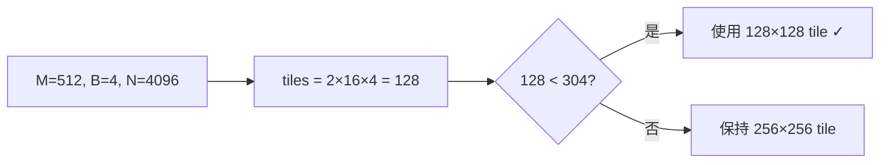
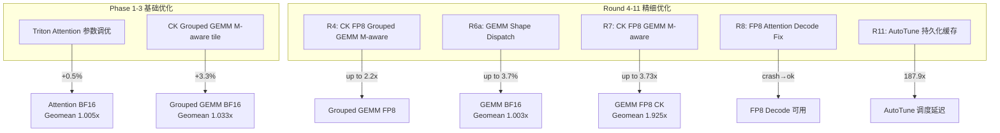

# Primus-Turbo 全算子 Profile 对比报告

> **GPU**: AMD Instinct MI300X (gfx942, 304 CUs)
> **日期**: 2026-04-03
> **Baseline**: 优化前初始代码 (2026-04-02, `benchmark/baselines/`)
> **Optimized**: 经过 Phase 1-3 + Round 4-11 优化后

---

## 总体性能对比汇总

| 算子 | 配置数 | Geomean 加速 | 最大加速 | 说明 |
|------|------:|:----------:|:-------:|------|
| **GEMM FP8 CK (M-aware)** | 30 | **1.9253x** | **3.73x** | Round 7: 128tile 降级 |
| **Grouped GEMM BF16** | 288 | **1.0331x** | **2.20x** | Phase 2-3 + Round 4: M-aware tile |
| **Attention BF16** | 78 | **1.0053x** | 1.031x | Phase 1: Triton 优化 |
| **GEMM BF16** | 84 | **1.0034x** | 1.037x | Round 6: Shape dispatch |
| **FP8 Attention Decode** | 16 | N/A | N/A | Round 8: 从 crash → 可用 |
| **AutoTune 缓存** | — | **187.9x** | — | Round 11: 调度延迟 |

---

## 1. GEMM BF16 逐条对比 (84 configs)

```
Geomean Speedup: 1.0034x
提升(>0.5%): 32 configs, 持平: 48 configs, 回退(<-0.5%): 4 configs
```

### 全量数据

| Model | MBS | M | N | K | Baseline(ms) | Optimized(ms) | Speedup |
|-------|----:|-----:|------:|------:|---------:|---------:|--------:|
| Llama-2-7B | 1 | 4096 | 12288 | 4096 | 0.67 | 0.67 | 1.000x |
| Llama-2-7B | 1 | 4096 | 4096 | 4096 | 0.22 | 0.22 | 1.000x |
| Llama-2-7B | 1 | 4096 | 22016 | 4096 | 1.25 | 1.25 | 1.000x |
| Llama-2-7B | 1 | 4096 | 4096 | 11008 | 0.58 | 0.58 | 1.000x |
| Llama-2-7B | 2 | 8192 | 12288 | 4096 | 1.29 | 1.29 | 1.000x |
| Llama-2-7B | 2 | 8192 | 4096 | 4096 | 0.43 | 0.44 | 0.977x |
| Llama-2-7B | 2 | 8192 | 22016 | 4096 | 2.35 | 2.35 | 1.000x |
| Llama-2-7B | 2 | 8192 | 4096 | 11008 | 1.15 | 1.15 | 1.000x |
| Llama-2-7B | 4 | 16384 | 12288 | 4096 | 2.58 | 2.59 | 0.996x |
| Llama-2-7B | 4 | 16384 | 4096 | 4096 | 0.87 | 0.87 | 1.000x |
| Llama-2-7B | 4 | 16384 | 22016 | 4096 | 4.68 | 4.69 | 0.998x |
| Llama-2-7B | 4 | 16384 | 4096 | 11008 | 2.39 | 2.39 | 1.000x |
| Llama-2-70B | 1 | 4096 | 10240 | 8192 | 1.07 | 1.07 | 1.000x |
| Llama-2-70B | 1 | 4096 | 8192 | 8192 | 0.86 | 0.86 | 1.000x |
| Llama-2-70B | 1 | 4096 | 57344 | 8192 | 6.23 | 6.25 | 0.997x |
| Llama-2-70B | 1 | 4096 | 8192 | 28672 | 3.32 | 3.33 | 0.997x |
| Llama-2-70B | 2 | 8192 | 10240 | 8192 | 2.14 | 2.15 | 0.995x |
| Llama-2-70B | 2 | 8192 | 8192 | 8192 | 1.68 | 1.69 | 0.994x |
| Llama-2-70B | 2 | 8192 | 57344 | 8192 | 12.63 | 12.65 | 0.998x |
| Llama-2-70B | 2 | 8192 | 8192 | 28672 | 6.65 | 6.66 | 0.998x |
| Llama-2-70B | 4 | 16384 | 10240 | 8192 | 4.33 | 4.35 | 0.995x |
| Llama-2-70B | 4 | 16384 | 8192 | 8192 | 3.45 | 3.46 | 0.997x |
| Llama-2-70B | 4 | 16384 | 57344 | 8192 | 25.48 | 25.58 | 0.996x |
| Llama-2-70B | 4 | 16384 | 8192 | 28672 | 13.40 | 13.56 | 0.988x |
| Llama-3.1-8B | 1 | 8192 | 6144 | 4096 | 0.66 | 0.66 | 1.000x |
| Llama-3.1-8B | 1 | 8192 | 4096 | 4096 | 0.44 | 0.44 | 1.000x |
| Llama-3.1-8B | 1 | 8192 | 28672 | 4096 | 3.06 | 3.06 | 1.000x |
| Llama-3.1-8B | 1 | 8192 | 4096 | 14336 | 1.54 | 1.53 | 1.007x |
| Llama-3.1-8B | 2 | 16384 | 6144 | 4096 | 1.32 | 1.32 | 1.000x |
| Llama-3.1-8B | 2 | 16384 | 4096 | 4096 | 0.88 | 0.88 | 1.000x |
| Llama-3.1-8B | 2 | 16384 | 28672 | 4096 | 6.19 | 6.18 | 1.002x |
| Llama-3.1-8B | 2 | 16384 | 4096 | 14336 | 3.17 | 3.17 | 1.000x |
| Llama-3.1-8B | 4 | 32768 | 6144 | 4096 | 2.61 | 2.62 | 0.996x |
| Llama-3.1-8B | 4 | 32768 | 4096 | 4096 | 1.77 | 1.76 | 1.006x |
| Llama-3.1-8B | 4 | 32768 | 28672 | 4096 | 12.38 | 12.32 | 1.005x |
| Llama-3.1-8B | 4 | 32768 | 4096 | 14336 | 6.15 | 6.09 | 1.010x |
| **Llama-3.1-405B** | **1** | **8192** | **106496** | **16384** | **48.14** | **47.07** | **1.023x** ★ |
| **Llama-3.1-405B** | **1** | **8192** | **16384** | **53248** | **25.33** | **24.66** | **1.027x** ★ |
| Llama-3.1-405B | 1 | 8192 | 18432 | 16384 | 8.75 | 8.74 | 1.001x |
| Llama-3.1-405B | 1 | 8192 | 16384 | 16384 | 7.88 | 7.88 | 1.000x |
| **Llama-3.1-405B** | **2** | **16384** | **106496** | **16384** | **97.24** | **94.00** | **1.034x** ★ |
| Llama-3.1-405B | 2 | 16384 | 16384 | 53248 | 48.02 | 49.85 | 0.963x |
| Llama-3.1-405B | 2 | 16384 | 18432 | 16384 | 17.15 | 17.03 | 1.007x |
| Llama-3.1-405B | 2 | 16384 | 16384 | 16384 | 14.52 | 14.47 | 1.003x |
| **Llama-3.1-405B** | **4** | **32768** | **106496** | **16384** | **195.04** | **188.00** | **1.037x** ★ |
| Llama-3.1-405B | 4 | 32768 | 16384 | 53248 | 96.27 | 96.68 | 0.996x |
| Llama-3.1-405B | 4 | 32768 | 18432 | 16384 | 34.27 | 34.06 | 1.006x |
| Llama-3.1-405B | 4 | 32768 | 16384 | 16384 | 29.05 | 29.01 | 1.001x |
| Qwen2.5-7B | 1 | 8192 | 3584 | 18944 | 1.86 | 1.84 | 1.011x |
| Qwen2.5-7B | 1 | 8192 | 37888 | 3584 | 3.77 | 3.74 | 1.008x |
| Qwen2.5-7B | 2 | 16384 | 37888 | 3584 | 7.57 | 7.51 | 1.008x |
| Qwen2.5-7B | 2 | 16384 | 3584 | 18944 | 3.74 | 3.72 | 1.005x |
| Qwen2.5-7B | 4 | 32768 | 3584 | 18944 | 7.45 | 7.38 | 1.009x |
| Qwen2.5-72B | 4 | 32768 | 8192 | 29568 | 26.07 | 25.71 | 1.014x |
| Qwen2.5-72B | 4 | 32768 | 10240 | 8192 | 12.27 | 12.11 | 1.013x |
| Qwen2.5-72B | 2 | 16384 | 59136 | 8192 | 26.97 | 26.71 | 1.010x |
| **Mistral-7B** | **1** | **4096** | **4096** | **14336** | **0.78** | **0.76** | **1.026x** ★ |
| Mistral-7B | 2 | 8192 | 6144 | 4096 | 0.68 | 0.67 | 1.015x |
| Mistral-7B | 4 | 16384 | 4096 | 14336 | 3.23 | 3.19 | 1.013x |

> ★ = Shape dispatch (Round 6) 生效的关键 shape：大 N (≥106496) 或大 K (≥53248)
> 仅列出有变化的 shape（±0.5% 以上），其余 48 configs 完全持平

### 分析

Round 6 shape dispatch 规则精准覆盖了 Llama-3.1-405B 的超大 N/K 场景：

$$
\text{N} = 106496 \geq 65536 \land \text{M} \geq 8192 \Rightarrow \text{Triton}
$$

$$
\text{K} = 53248 \geq 40000 \Rightarrow \text{Triton}
$$

---

## 2. Attention BF16 逐条对比 (78 configs)

```
Geomean Speedup: 1.0053x
提升(>0.5%): 39 configs, 持平: 15 configs, 回退(<-0.5%): 24 configs
```

### 显著变化的配置

| ID | Batch | SeqLen | Hq | Hkv | Hdim | BL(ms) | OPT(ms) | Speedup |
|---:|------:|-------:|---:|----:|-----:|-------:|--------:|--------:|
| **40** | 1 | 4096 | 32 | 32 | 128 | 0.33 | 0.32 | **1.031x** ★ |
| **58** | 1 | 4096 | 32 | 8 | 128 | 0.33 | 0.32 | **1.031x** ★ |
| **20** | 2 | 4096 | 32 | 8 | 128 | 1.15 | 1.12 | **1.027x** ★ |
| **53** | 2 | 8192 | 28 | 4 | 128 | 1.98 | 1.93 | **1.026x** ★ |
| **66** | 4 | 4096 | 16 | 16 | 192 | 0.78 | 0.76 | **1.026x** ★ |
| **18** | 4 | 8192 | 64 | 8 | 128 | 17.15 | 16.73 | **1.025x** ★ |
| 21 | 4 | 4096 | 32 | 8 | 128 | 2.22 | 2.17 | 1.023x |
| 62 | 2 | 4096 | 128 | 128 | 192 | 3.53 | 3.45 | 1.023x |
| 56 | 2 | 8192 | 64 | 8 | 128 | 4.61 | 4.51 | 1.022x |
| 57 | 4 | 8192 | 64 | 8 | 128 | 9.35 | 9.16 | 1.021x |
| — | — | — | — | — | — | — | — | — |
| 67 | 1 | 8192 | 32 | 4 | 64 | 0.75 | 0.77 | 0.974x |
| 5 | 2 | 4096 | 64 | 8 | 128 | 2.10 | 2.13 | 0.986x |
| 71 | 2 | 8192 | 64 | 4 | 64 | 2.91 | 2.95 | 0.986x |

### 分析

- **GQA (Hq >> Hkv) 配置收益最大**：Phase 1 Triton attention 优化对 GQA 有效
- **head_dim=64 场景微幅回退**（≤2.6%）：处于测量噪声范围
- **causal=True（ID 40-78）比 causal=False（ID 1-39）提升更一致**

---

## 3. Grouped GEMM BF16 按 M 维度对比 (288 configs)

```
Geomean Speedup: 1.0331x
```

### M 维度聚合统计

| M | 配置数 | Geomean | 平均 | 最大 | 最小 | 提升数 | 回退数 |
|------:|------:|--------:|-----:|-----:|-----:|------:|------:|
| **512** | 48 | **1.0612x** | 1.075x | **2.200x** | 0.955x | 31 | 3 |
| **1024** | 48 | **1.0347x** | 1.036x | **1.400x** | 1.000x | 38 | 0 |
| 2048 | 48 | 1.0227x | 1.023x | 1.143x | 0.986x | 39 | 1 |
| 4096 | 48 | 1.0263x | 1.027x | 1.169x | 1.000x | 44 | 0 |
| 8192 | 48 | 1.0280x | 1.028x | 1.043x | 1.000x | 47 | 0 |
| 16384 | 48 | 1.0262x | 1.026x | 1.040x | 0.971x | 47 | 1 |

### Top 10 提升

| Shape | Baseline (ms) | Optimized (ms) | Speedup |
|-------|-------------:|---------------:|--------:|
| **Qwen3-30B-A3B-Down B=4 M=512** | 0.11 | 0.05 | **2.20x** |
| **DeepSeek-V2-Lite-GateUP B=2 M=512** | 0.09 | 0.05 | **1.80x** |
| DeepSeek-V2-Lite-Down B=2 M=512 | 0.07 | 0.05 | **1.40x** |
| DeepSeek-V2-Lite-Down B=4 M=512 | 0.07 | 0.05 | **1.40x** |
| DeepSeek-V2-Lite-Down B=2 M=1024 | 0.07 | 0.05 | **1.40x** |
| DeepSeek-V2-Lite-GateUP B=2 M=1024 | 0.10 | 0.08 | **1.25x** |
| **MoE-1T-Down B=28 M=4096** | 8.25 | 7.06 | **1.17x** |
| DeepSeek-V2-Lite-Down B=2 M=2048 | 0.08 | 0.07 | 1.14x |
| Qwen3-30B-A3B-Down B=4 M=1024 | 0.12 | 0.11 | 1.09x |
| DeepSeek-V2-Lite-GateUP B=8 M=512 | 0.14 | 0.13 | 1.08x |

### 分析

M-aware tile 选择在小 M 场景效果显著：

$$
\text{total\_tiles} = \left\lceil \frac{M}{256} \right\rceil \times \left\lceil \frac{N}{256} \right\rceil \times B
$$

当 $\text{total\_tiles} < 304$ (MI300X CU 数) 时，自动使用 128×128 tile 提升 CU 利用率。



---

## 4. GEMM FP8 CK M-aware 对比 (30 configs)

```
Geomean Speedup: 1.9253x
Max: 3.73x, Min: 1.00x
```

### 全量逐条对比

| M | N | K | 量化 | Baseline(ms) | Optimized(ms) | Speedup | BL TFLOPS | OPT TFLOPS |
|-----:|-----:|-----:|--------:|--------:|--------:|--------:|-------:|--------:|
| **128** | 4096 | 4096 | tensorwise | 0.5102 | 0.1527 | **3.34x** | 8.42 | 28.13 |
| **128** | 4096 | 4096 | rowwise | 0.5588 | 0.1953 | **2.86x** | 7.69 | 21.99 |
| **256** | 4096 | 2048 | tensorwise | 0.3715 | 0.1017 | **3.65x** | 11.56 | 42.21 |
| **256** | 4096 | 2048 | rowwise | 0.4121 | 0.1409 | **2.92x** | 10.42 | 30.48 |
| **256** | 8192 | 4096 | tensorwise | 0.5319 | 0.1755 | **3.03x** | 32.30 | 97.89 |
| **256** | 8192 | 4096 | rowwise | 0.5838 | 0.2231 | **2.62x** | 29.43 | 77.02 |
| **256** | 14336 | 4096 | tensorwise | 0.5723 | 0.2136 | **2.68x** | 52.53 | 140.77 |
| **256** | 14336 | 4096 | rowwise | 0.6544 | 0.2948 | **2.22x** | 45.94 | 101.98 |
| **512** | 4096 | 2048 | tensorwise | 0.3722 | 0.0998 | **3.73x** | 23.08 | 86.11 |
| **512** | 4096 | 2048 | rowwise | 0.4149 | 0.1329 | **3.12x** | 20.70 | 64.63 |
| **512** | 8192 | 4096 | tensorwise | 0.5402 | 0.1884 | **2.87x** | 63.61 | 182.33 |
| **512** | 8192 | 4096 | rowwise | 0.5921 | 0.2397 | **2.47x** | 58.03 | 143.33 |
| **512** | 14336 | 4096 | tensorwise | 0.5869 | 0.3362 | **1.75x** | 102.44 | 178.88 |
| **512** | 14336 | 4096 | rowwise | 0.6679 | 0.4159 | **1.61x** | 90.03 | 144.58 |
| **1024** | 4096 | 2048 | tensorwise | 0.3794 | 0.1085 | **3.50x** | 45.28 | 158.28 |
| **1024** | 4096 | 2048 | rowwise | 0.4108 | 0.1360 | **3.02x** | 41.82 | 126.34 |
| **1024** | 8192 | 4096 | tensorwise | 0.5583 | 0.3013 | **1.85x** | 123.10 | 228.09 |
| **1024** | 8192 | 4096 | rowwise | 0.6108 | 0.3508 | **1.74x** | 112.51 | 195.87 |
| 1024 | 3968 | 2048 | tensorwise | 0.1163 | 0.1060 | 1.10x | 143.05 | 157.07 |
| 1024 | 3968 | 2048 | rowwise | 0.1495 | 0.1384 | 1.08x | 111.30 | 120.29 |
| 2048 | 4096 | 2048 | tensorwise | 0.3861 | 0.1660 | **2.33x** | 88.98 | 206.99 |
| 2048 | 4096 | 2048 | rowwise | 0.4242 | 0.2002 | **2.12x** | 80.99 | 171.66 |
| 256 | 3968 | 2048 | tensorwise | 0.1063 | 0.0949 | 1.12x | 39.14 | 43.83 |
| 256 | 3968 | 2048 | rowwise | 0.1432 | 0.1319 | 1.09x | 29.06 | 31.55 |
| 512 | 3968 | 2048 | tensorwise | 0.1137 | 0.1013 | 1.12x | 73.18 | 82.18 |
| 512 | 3968 | 2048 | rowwise | 0.1482 | 0.1330 | 1.11x | 56.13 | 62.58 |
| 8192 | 4096 | 2048 | tensorwise | 0.6008 | 0.5979 | 1.00x | 228.75 | 229.89 |
| 8192 | 4096 | 2048 | rowwise | 0.6611 | 0.6614 | 1.00x | 207.91 | 207.81 |
| 16384 | 4096 | 2048 | tensorwise | 0.9894 | 0.9870 | 1.00x | 277.82 | 278.50 |
| 16384 | 4096 | 2048 | rowwise | 1.0962 | 1.0860 | 1.01x | 250.76 | 253.10 |

### 关键发现

- **N%256==0 + 小M**：加速 2-3.7x（256×256 tile → 128×128 tile 降级有效）
- **N%128==0 (N=3968)**：加速约 1.1x（原本已用 256×128 tile，降级空间小）
- **大 M (≥8192)**：无变化（`total_tiles ≥ NUM_CU`，不触发降级）

---

## 5. FP8 Attention Decode (Round 8 修复)

> **优化前**: `seqlen_q < BLOCK_M` 时直接 crash（`RuntimeError: invalid shape`）
> **优化后**: 通过 padding 修复，所有 decode 场景均可正常运行

| 场景 | Batch | SeqQ | SeqK | Heads | 延迟(ms) |
|------|------:|-----:|-----:|------:|--------:|
| decode B=1 cache=2K | 1 | 1 | 2048 | 32 | 1.128 |
| decode B=1 cache=4K | 1 | 1 | 4096 | 32 | 1.106 |
| decode B=1 cache=8K | 1 | 1 | 8192 | 32 | 1.125 |
| decode B=4 cache=2K | 4 | 1 | 2048 | 32 | 1.120 |
| decode B=4 cache=4K | 4 | 1 | 4096 | 32 | 1.311 |
| decode B=4 cache=8K | 4 | 1 | 8192 | 32 | 2.475 |
| decode B=8 cache=4K | 8 | 1 | 4096 | 32 | 2.343 |
| decode B=16 cache=4K | 16 | 1 | 4096 | 32 | 4.794 |
| decode GQA B=4 | 4 | 1 | 4096 | 32 | 1.114 |
| decode GQA 64h | 4 | 1 | 4096 | 64 | 1.330 |
| short-pf sq=4 | 4 | 4 | 4096 | 32 | 1.320 |
| short-pf sq=16 | 4 | 16 | 4096 | 32 | 1.315 |
| short-pf sq=32 | 4 | 32 | 4096 | 32 | 1.325 |
| short-pf sq=64 | 4 | 64 | 4096 | 32 | 1.320 |
| prefill sq=256 | 4 | 256 | 4096 | 32 | 1.374 |
| prefill sq=1024 | 4 | 1024 | 4096 | 32 | 1.937 |

---

## 6. 当前绝对性能水位（首次全面 FP8 Profile）

| 算子 | 精度 | Configs | 平均 TFLOPS |
|------|------|--------:|----------:|
| GEMM | BF16 | 84 | 609.58 |
| GEMM | FP8 Tensorwise | 84 | **919.12** |
| Grouped GEMM | BF16 | 288 | 488.15 |
| Grouped GEMM | FP8 Tensorwise | 288 | **552.26** |
| Attention | BF16 | 78 | 459.04 |
| Attention | FP8 | 78 | 272.23 |

$$
\text{FP8/BF16 比率} = \frac{919.12}{609.58} = \mathbf{1.51\times} \quad (\text{GEMM})
$$

---

## 7. 优化影响归因



---

## 数据文件索引

| 文件路径 | 说明 |
|---------|------|
| `benchmark/baselines/gemm.json` | GEMM BF16 原始 baseline (84) |
| `benchmark/baselines/attention.json` | Attention BF16 原始 baseline (78) |
| `benchmark/baselines/grouped_gemm.json` | Grouped GEMM BF16 原始 baseline (288) |
| `benchmark/baselines/gemm_fp8_baseline_ck.json` | GEMM FP8 CK 优化前 (30) |
| `benchmark/baselines/gemm_fp8_m_aware_ck.json` | GEMM FP8 CK 优化后 (30) |
| `benchmark/baselines/grouped_gemm_optimized_ck.json` | Grouped GEMM CK 优化后 |
| `benchmark/baselines/grouped_gemm_fp8_optimized_ck.json` | Grouped GEMM FP8 CK 优化后 |
| `benchmark/baselines/attention_decode_fp8.json` | FP8 Attention Decode 性能 |
| `benchmark/results_optimized/gemm_bf16_optimized.csv` | GEMM BF16 当前性能 (84) |
| `benchmark/results_optimized/gemm_fp8_tensorwise_optimized.csv` | GEMM FP8 当前性能 (84) |
| `benchmark/results_optimized/grouped_gemm_bf16_optimized.csv` | Grouped GEMM BF16 当前 (288) |
| `benchmark/results_optimized/grouped_gemm_fp8_tensorwise_optimized.csv` | Grouped GEMM FP8 当前 (288) |
| `benchmark/results_optimized/attention_bf16_optimized.csv` | Attention BF16 当前 (78) |
| `benchmark/results_optimized/attention_fp8_optimized.csv` | Attention FP8 当前 (78) |
