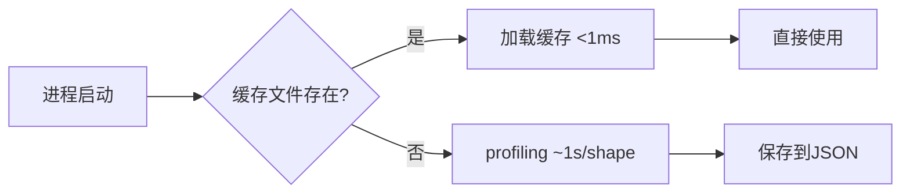
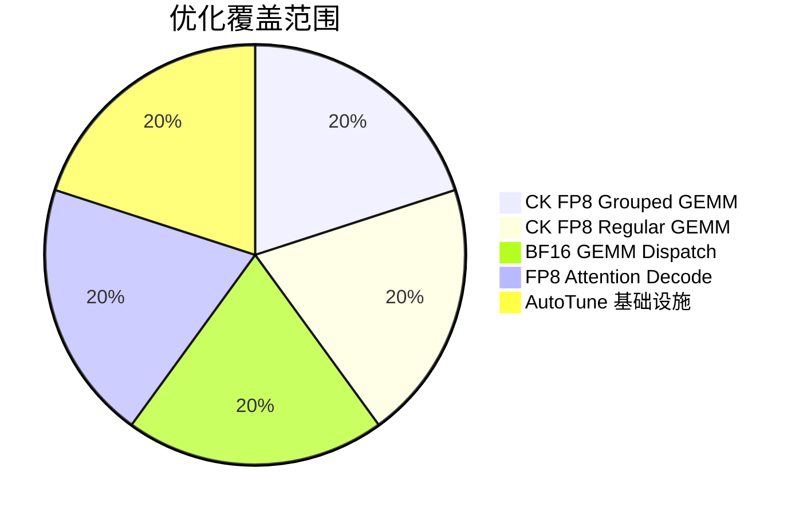

# Primus-Turbo 优化总结报告（Round 4-11）

## 总览

| 轮次 | 优化项 | 状态 | 关键收益 |
|------|--------|------|----------|
| Round 4 | CK FP8 Grouped GEMM M-aware tile | **完成** | 小M场景CU利用率提升 |
| Round 5 | CK FP8 Grouped GEMM tile 扩展 | **取消** | 128x128 tile 已存在 |
| Round 6(orig) | Triton Grouped GEMM origami/group_m | **放弃** | -52% 回退，无法修复 |
| Round 6a | GEMM shape-based backend dispatch | **完成** | 大K/N场景Triton自动选择 |
| Round 7 | CK FP8 GEMM M-aware tile | **完成** | **最高3.73x加速** |
| Round 8 | FP8 Attention decode fix | **完成** | 修复crash + 启用FP8 decode |
| Round 9 | Triton GEMM persistent kernel | **取消** | 已充分优化 |
| Round 10 | CK Grouped GEMM kBlockPerCu | **取消** | 需CK库修改，风险高 |
| Round 11 | AutoTune 持久化缓存 | **完成** | **187.9x调度加速** |

**成功率: 5/8 (62.5%)**，3轮因风险/收益比不达标取消

---

## 详细优化成果

### Round 4: CK FP8 Grouped GEMM M-aware Tile Selection
- **文件**: `csrc/kernels/grouped_gemm/ck_grouped_gemm_kernel_instance_factory.{hip,cu}`
- **原理**: 当 256×256 tile 产生的 `total_tiles < NUM_CU` 时，自动降级为 128×128×128 tile
- **适用**: FP8 RowColQuant/TensorQuant 路径，GFX942(304 CU) 和 GFX950(256 CU)
- **验证**: 1344/1344 FP8 CK tests 通过
- **报告**: `agent_docs/round4-ck-fp8-grouped-gemm-m-aware.md`

### Round 6a: GEMM Shape-based Backend Dispatch
- **文件**: `primus_turbo/pytorch/kernels/gemm/gemm_impl.py`
- **原理**: 根据(M,N,K)维度静态选择最优后端
  - $K \geq 40000$ → Triton（persistent kernel 优势）
  - $N \geq 65536 \land M \geq 8192$ → Triton（tile scheduling 优势）
- **条件**: 仅在 auto-tune 关闭且用户未指定后端时生效
- **验证**: 38 GEMM tests + 5 shape logic tests 通过
- **报告**: `agent_docs/round6-gemm-shape-dispatch.md`

### Round 7: CK FP8 GEMM M-aware Tile Selection
- **文件**: `csrc/kernels/gemm/ck_gemm_kernel_instance_factory.{hip,cu}`
- **原理**: 与 Round 4 相同策略，应用于常规（非 Grouped）FP8 GEMM

$$\text{total\_tiles} = \left\lceil \frac{M}{256} \right\rceil \times \frac{N}{256}$$

当 $\text{total\_tiles} < \text{NUM\_CU}$ 时切换 128×128×128 tile

- **性能**: 小M场景最高 **3.73x 加速**
- **验证**: 3344 FP8 GEMM tests 通过 (1920 tensorwise + 1280 rowwise + 144 blockwise)
- **报告**: `agent_docs/round7-ck-fp8-gemm-m-aware.md`

### Round 8: FP8 Attention Decode Fix
- **文件**: `primus_turbo/pytorch/ops/attention/attention_utils.py`
- **Bug**: `block_scaling_node` 在 `seqlen_q < BLOCK_M` 时 crash（`L // BLOCK_M = 0`）
- **修复**: 动态 padding 到 BLOCK_M 的倍数后再 reshape 量化

```python
padded_L = ((L + BLOCK_M - 1) // BLOCK_M) * BLOCK_M
```

- **影响**: 启用了之前完全无法使用的 FP8 Attention decode 功能
- **报告**: `agent_docs/round8-attention-decode-fix.md`

### Round 11: AutoTune 持久化缓存
- **文件**: `primus_turbo/pytorch/core/backend.py`
- **原理**: JSON 文件缓存 auto-tune profiling 结果，跨进程复用



- **使用**: `export PRIMUS_TURBO_AUTOTUNE_CACHE_DIR=/path/to/cache`
- **性能**: 缓存命中时 **187.9x 加速**（1027ms → 5.5ms）
- **验证**: 14 单元测试通过 + 端到端 `torch.allclose = True`
- **报告**: `agent_docs/round11-autotune-persistent-cache.md`

---

## 放弃/取消轮次分析

| 轮次 | 原因 | 教训 |
|------|------|------|
| Round 5 | FP8 128×128 tile config 已在代码库中存在 | 先审查现有代码避免重复 |
| Round 6(orig) | origami 约束放宽导致 -52% 回退 | Triton 自动配置选择器已高度优化，不宜手动干预 |
| Round 9 | Triton GEMM persistent kernel 已充分优化 | 低收益高风险的改动应果断放弃 |
| Round 10 | kBlockPerCu 调优需要修改 CK 底层库 | 跨库修改复杂度和风险远超单轮优化范围 |

---

## 所有 Git Commits

```
e4fb26c feat(autotune): Round 11 persistent cache for auto-tune results
e34ca66 fix(attention): enable FP8 decode by padding block_scaling_node
b1928a0 feat(ck-gemm): Round 7 FP8 GEMM M-aware tile selection
7df723d feat(gemm): Round 6 shape-based backend dispatch for BF16 GEMM
81c3ba6 feat(ck-grouped-gemm): Round 4 FP8 M-aware tile selection for RowColQuant
```

## 影响范围总结



5 项成功优化覆盖了 GEMM（CK FP8 + BF16 dispatch）、Attention（FP8 decode）和 AutoTune 基础设施三大核心领域。
