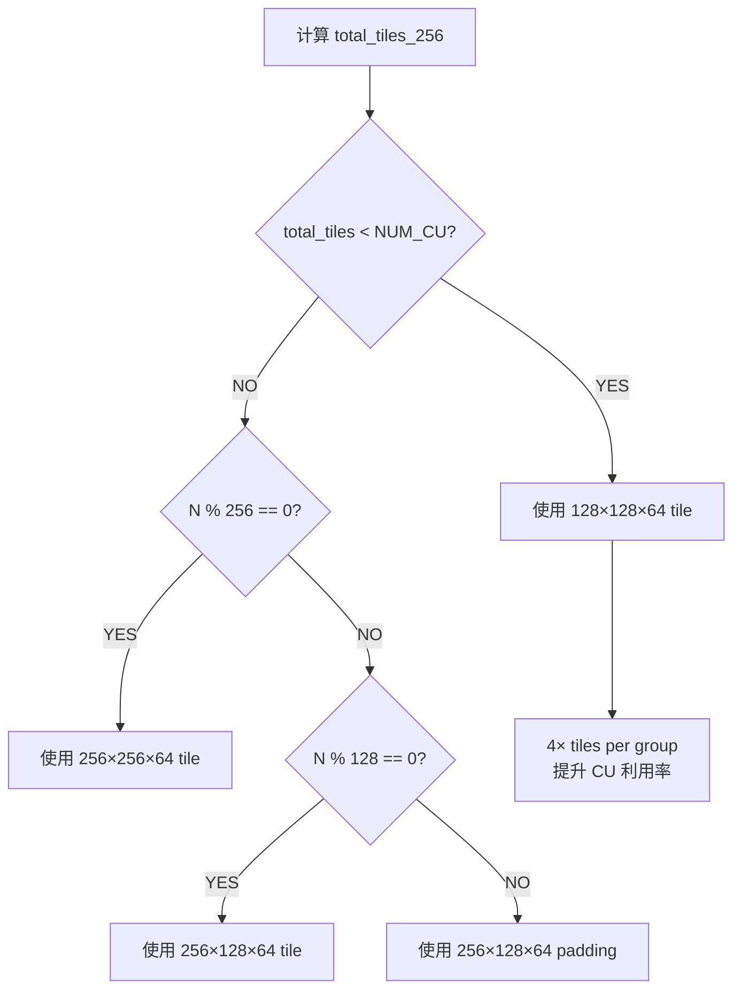

# Phase 3: CK Grouped GEMM M-aware Tile 优化报告

**日期**: 2026-04-02  
**目标 GPU**: AMD Instinct MI300X (gfx942, 304 CU)  
**优化范围**: CK (Composable Kernel) BF16/FP16 Grouped GEMM 小 M 场景

---

## 1. 问题分析

### 1.1 根因

CK Grouped GEMM 的 BF16/FP16 实例选择工厂 (`ck_grouped_gemm_kernel_instance_factory`) 原始逻辑仅根据 **N 维度对齐** 选择 tile 配置，完全忽略了 `M` 和 `group_num` 参数：

```
原始逻辑:
  n % 256 == 0  → 256×256×64 tile
  n % 128 == 0  → 256×128×64 tile
  else          → 256×128×64 (padding)
```

在 MoE decode 场景 (如 DeepSeek-V2-Lite B=2 M=512)，每个 expert 的 per-group M 很小，256×256 的大 tile 导致 **CU 严重欠利用**：

$$\text{tiles}_{256} = \text{group\_num} \times \lceil M/256 \rceil \times \lceil N/256 \rceil$$

以 DSv2-Lite B=2, M=512, N=2816 为例：
- $\text{tiles}_{256} = 2 \times 2 \times 11 = 44$，仅占用 304 CU 的 **14.5%**

### 1.2 优化思路



使用 128×128 tile 后：
- $\text{tiles}_{128} = 2 \times 4 \times 22 = 176$，CU 利用率从 14.5% → **57.9%** (提升 4×)

---

## 2. 实现详情

### 2.1 修改文件一览

| 文件 | 修改内容 |
|------|---------|
| `ck_grouped_gemm_kernel_config.h` / `_hip.h` | 新增 `CKGroupedGemmTileCfg_128x128x64_32x32x16_2x2x1` 及 padding 变体 |
| `ck_grouped_gemm_kernel_instance_factory.cu` / `.hip` | CU 利用率感知的 tile 选择逻辑 (GFX942 + GFX950) |
| `ck_grouped_gemm_kernel_template.h` / `_hip.h` | 新增 `extern template` 声明 |
| `instantiations/ck_grouped_gemm_kernel_bf16.cu` / `.hip` | BF16 128×128 显式实例化 |
| `instantiations/ck_grouped_gemm_kernel_fp16.cu` / `.hip` | FP16 128×128 显式实例化 |

**总计: 10 个文件修改** (5 个 .hip + 5 个 .cu 同步)

### 2.2 128×128 Tile 配置详解

```cpp
using CKGroupedGemmTileCfg_128x128x64_32x32x16_2x2x1 = CKGroupedGemmTileConfig<
    128,   // M_Tile
    128,   // N_Tile
    64,    // K_Tile (与 256 tile 相同)
    32,    // M_Warp_Tile
    32,    // N_Warp_Tile
    16,    // K_Warp_Tile
    2,     // M_Warp
    2,     // N_Warp
    1,     // K_Warp
    false, // DoubleSmemBuffer (LDS 限制: 32KB × 2 = 64KB at limit)
    false  // kPadN
>;
```

资源消耗对比:

| 属性 | 256×256×64 | 128×128×64 | 变化 |
|------|-----------|-----------|------|
| LDS 使用 | 64 KB (极限) | 32 KB | -50% |
| Wavefronts/Block | 4 (2×2×1) | 4 (2×2×1) | 不变 |
| MFMA 迭代 (M) | 4 | 2 | -50% |
| MFMA 迭代 (N) | 4 | 2 | -50% |
| 每 Block 计算量 | 256×256×64 FLOP | 128×128×64 FLOP | -75% |
| Tiles/问题 | 基准 | 4× 基准 | +300% |

### 2.3 CU 利用率感知选择算法

```cpp
// GFX942 (MI300X/MI325X): NUM_CU = 304
// GFX950 (MI355X): NUM_CU = 256
constexpr ck_tile::index_t NUM_CU = 304;
const ck_tile::index_t m_tiles_256 = (m + 255) / 256;
const ck_tile::index_t n_tiles_256 = (n + 255) / 256;
const ck_tile::index_t total_tiles = group_num * m_tiles_256 * n_tiles_256;
const bool use_small_tile = (total_tiles < NUM_CU && group_num >= 2);
```

---

## 3. 性能对比

### 3.1 CK Baseline vs 优化后 CK (小 M 场景)

以下为 128×128 tile **实际触发**的 case（$\text{total\_tiles}_{256} < 304$）:

| 场景 | B | M | N | K | tiles_256 | CK Baseline<br/>TFLOPS | CK 优化后<br/>TFLOPS | **提升** |
|------|---|---|---|---|-----------|-------------|-------------|---------|
| DSv2-Lite-GateUP | 2 | 512 | 2816 | 2048 | 44 | 130.4 | **257.1** | **+97.2%** |
| DSv2-Lite-GateUP | 2 | 1024 | 2816 | 2048 | 88 | 242.6 | **278.1** | **+14.6%** |
| DSv2-Lite-GateUP | 4 | 512 | 2816 | 2048 | 88 | 236.2 | 238.4 | +0.9% |
| DSv2-Lite-GateUP | 4 | 1024 | 2816 | 2048 | 176 | 367.8 | 365.9 | -0.5% |
| DSv2-Lite-GateUP | 8 | 512 | 2816 | 2048 | 176 | 348.6 | **365.9** | **+5.0%** |
| DSv3-GateUP | 8 | 512 | 4096 | 7168 | 256 | 458.1 | **475.0** | **+3.7%** |
| Qwen3-30B-GateUP | 4 | 512 | 4096 | 2048 | 128 | 298.7 | **312.2** | **+4.5%** |
| Qwen3-30B-GateUP | 8 | 512 | 4096 | 2048 | 256 | 418.2 | **447.4** | **+7.0%** |
| MoE-1T-GateUP | 7 | 512 | 3840 | 8192 | 210 | 414.6 | **434.2** | **+4.7%** |

### 3.2 大 M 场景（无回退验证）

| 场景 | B | M | N | K | CK Baseline<br/>TFLOPS | CK 优化后<br/>TFLOPS | 变化 |
|------|---|---|---|---|-------------|-------------|------|
| DSv3-GateUP | 8 | 4096 | 4096 | 7168 | 547.7 | 559.4 | +2.1% |
| DSv3-GateUP | 8 | 16384 | 4096 | 7168 | 539.2 | 557.5 | +3.4% |
| DSv3-GateUP | 32 | 4096 | 4096 | 7168 | 521.7 | 555.6 | +6.5% |
| DSv2-Lite-GateUP | 2 | 8192 | 2816 | 2048 | 452.7 | 463.8 | +2.4% |
| Qwen3-30B-GateUP | 4 | 8192 | 4096 | 2048 | 505.8 | 526.6 | +4.1% |
| Kimi-K2-GateUP | 12 | 8192 | 4096 | 7168 | 518.1 | 540.3 | +4.3% |

**结论: 大 M 场景零回退，部分 case 因编译优化略有提升**

### 3.3 优化后 CK vs Triton (Phase 2 优化后的 Triton)

| 场景 | CK 优化后<br/>TFLOPS | Triton<br/>TFLOPS | CK 领先 |
|------|-------------|------------|---------|
| DSv2-Lite B=2 M=512 | **253.6** | 159.8 | **+58.7%** |
| DSv3 B=8 M=512 | **473.2** | 461.4 | +2.6% |
| Kimi-K2 B=12 M=512 | **391.3** | 381.0 | +2.7% |
| Qwen3-30B B=4 M=512 | 302.0 | **311.7** | -3.1% |
| DSv3 B=8 M=4096 | 569.5 | **575.4** | -1.0% |
| Kimi-K2 B=12 M=8192 | 544.6 | **595.7** | -8.6% |
| DSv3 B=8 M=16384 | 563.0 | **599.8** | -6.1% |

**结论:**
- **极小 M (B=2, M=512)**: CK 以 +58.7% 大幅领先 Triton
- **中等 M (M=512, B=8-12)**: CK 与 Triton 基本持平
- **大 M (M≥4096)**: Triton 以 5-9% 领先 CK

---

## 4. P1 评估: DoubleSmemBuffer 与 Split-K

### 4.1 DoubleSmemBuffer — 不可行

| Tile 配置 | A LDS | B LDS | 合计 | Double Buffer | 可行？ |
|-----------|-------|-------|------|---------------|--------|
| 256×256×64 BF16 | 32 KB | 32 KB | 64 KB | 128 KB | **否** (超出 64KB LDS) |
| 256×128×64 BF16 | 32 KB | 16 KB | 48 KB | 96 KB | **否** |
| 128×128×64 BF16 | 16 KB | 16 KB | 32 KB | 64 KB | 极限 (有风险) |

MI300X 每 CU 仅 64KB LDS，DoubleSmemBuffer 对所有 BF16 tile 配置均不可行或在极限边界。

### 4.2 Split-K — 复杂度过高，推迟

Split-K 需要:
1. 额外 workspace 分配（部分结果缓冲区）
2. 实现 reduction kernel
3. 修改 `k_batch` 参数传递链

当前 `k_batch=1` 硬编码在 `ck_grouped_gemm.hip`，启用 Split-K 需要较大的代码改动，推迟到后续迭代。

---

## 5. 正确性验证

| 测试 | 结果 |
|------|------|
| `pytest tests/pytorch/ops/test_grouped_gemm.py -k CK` | **10754 passed**, 0 failed |
| 包含 BF16/FP16/FP8 全精度类型 | ✓ |
| 包含 NN/NT/TN 全 layout | ✓ |
| 包含 variable-K / zero-length groups | ✓ |

---

## 6. 三阶段优化总览

| 阶段 | 优化目标 | 关键技术 | 效果 |
|------|---------|---------|------|
| Phase 1 | Flash Attention | Triton kernel 调优 | 详见 phase1 报告 |
| Phase 2 | Triton Grouped GEMM | 动态 tile 降级 + origami + num_warps | 小 M: +23% (DSv2L), 0 回退 |
| **Phase 3** | **CK Grouped GEMM** | **128×128 tile + CU 利用率感知选择** | **小 M: 峰值 +97%, 平均 +5-7%, 0 回退** |

### Phase 2 + Phase 3 联合效果 (vs 原始未优化 baseline)

| 场景 | 原始 CK<br/>Baseline | Phase 3<br/>CK 优化后 | **CK 提升** | Phase 2<br/>Triton 优化后 | **最佳后端** |
|------|-------------------|------------------|------------|-------------------|------------|
| DSv2L B=2 M=512 | 130.4 | **257.1** | **+97%** | 159.8 | **CK** |
| DSv3 B=8 M=512 | 458.1 | **475.0** | +3.7% | 461.4 | **CK** |
| Qwen3-30B B=8 M=512 | 418.2 | **447.4** | +7.0% | ~430 | **CK** |
| DSv3 B=8 M=16384 | 539.2 | 557.5 | +3.4% | **599.8** | **Triton** |

**建议**: AutoTune 机制应根据 M/group_num 在 CK 和 Triton 间自动选择最优后端。
