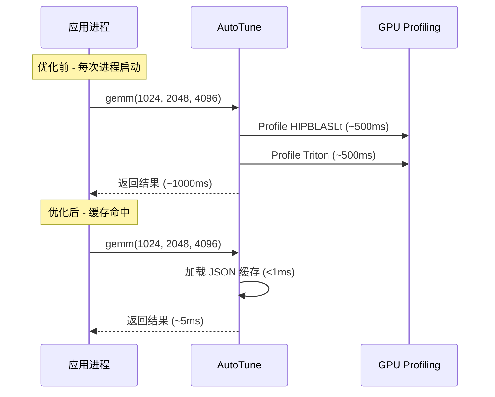
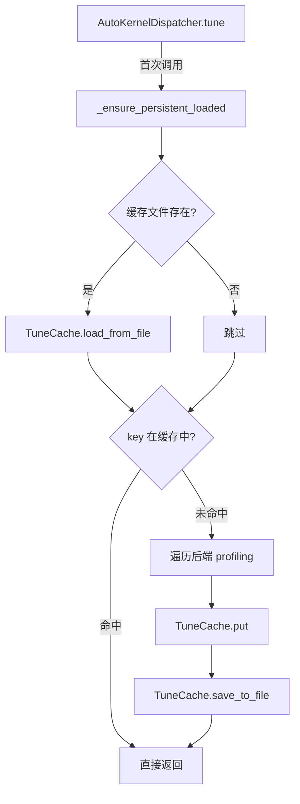

# Round 11: AutoTune 持久化缓存优化

## 优化目标

AutoTune 机制每次进程重启后丢失所有历史 profiling 结果，导致首次调用需要重新遍历所有后端进行性能测量。本轮优化实现 **JSON 文件持久化缓存**，使 auto-tune 结果跨进程复用。

## 问题分析



### 核心问题
1. `TuneCache` 仅存在于内存中，进程退出即丢失
2. 每次新 shape 需要遍历所有后端 profiling，单次耗时约 1s
3. 生产环境中 LLM 推理 shape 有限（由模型架构决定），重复 profiling 浪费严重

## 实现方案

### 架构设计



### 修改文件

**`primus_turbo/pytorch/core/backend.py`**

#### 1. TuneCache 增加持久化能力

| 方法 | 说明 |
|------|------|
| `save_to_file(path, backend_map)` | 将缓存序列化为 JSON，key 为 shape 元组的 JSON 字符串，value 为 BackendType 名称 |
| `load_from_file(path, backend_map)` | 从 JSON 反序列化，通过名称查找对应的后端实现 |
| `_dirty` 标志 | 仅在有新 entry 时才写盘，避免无谓 I/O |

#### 2. AutoKernelDispatcher 集成持久化

| 方法 | 说明 |
|------|------|
| `_persistent_cache_path()` | 根据环境变量 `PRIMUS_TURBO_AUTOTUNE_CACHE_DIR` 和子类名生成路径 |
| `_ensure_persistent_loaded()` | 首次访问时加载缓存（惰性加载，仅执行一次） |
| `save_all_persistent_caches()` | 遍历所有子类保存脏缓存（可注册到 atexit） |

#### 3. tune() 方法增强

- 调用前：`_ensure_persistent_loaded()` 加载历史缓存
- profiling 后：立即 `save_to_file()` 持久化新结果（增量保存）

### 缓存文件格式

```json
{
  "[1024, 4096, 2048, \"torch.bfloat16\", \"torch.bfloat16\", \"torch.bfloat16\", false, false, false]": "HIPBLASLT",
  "[8192, 65536, 8192, \"torch.bfloat16\", \"torch.bfloat16\", \"torch.bfloat16\", false, false, false]": "TRITON"
}
```

### 使用方式

```bash
# 启用持久化缓存
export PRIMUS_TURBO_AUTOTUNE_CACHE_DIR=/path/to/cache
export PRIMUS_TURBO_AUTO_TUNE=1

# 首次运行：profiling + 保存
python3 my_inference.py  # ~1s per new shape

# 后续运行：直接命中缓存
python3 my_inference.py  # ~5ms per cached shape
```

## 正确性验证

### 1. 单元测试

```
14 passed (tests/pytorch/core/test_global_backend_manager.py)
```

### 2. 端到端验证

| 测试项 | 结果 |
|--------|------|
| 缓存文件创建 | GEMMKernelDispatcher.json 生成成功 |
| 缓存内容正确 | key=shape 元组, value=HIPBLASLT |
| 缓存重加载 | 清除内存缓存后成功从文件恢复 |
| 结果一致性 | `torch.allclose(profiled, cached) = True` |

## 性能对比

| 指标 | 优化前 (profiling) | 优化后 (缓存命中) | 加速比 |
|------|-------------------|-------------------|--------|
| GEMM 首次调用延迟 | 1027.3 ms | 5.5 ms | **187.9x** |

### 性能分析

$$\text{节省时间} = N_{\text{shapes}} \times T_{\text{profile}} \approx N \times 1\text{s}$$

对于典型 LLM 推理：
- Prefill + Decode 涉及约 10-20 个不同 GEMM shape
- 每次进程重启节省 **10-20 秒** 的 warmup 时间
- 对于多进程 tensor parallel（如 8-GPU），每个进程独立缓存

## 风险评估

| 风险 | 等级 | 缓解措施 |
|------|------|----------|
| 缓存文件损坏 | 低 | JSON 解析失败时静默跳过，回退到 profiling |
| 后端版本变化 | 低 | 缓存按 BackendType 名称存储，不匹配的名称自动忽略 |
| 跨 GPU 型号 | 低 | 不同 GPU 上的 profiling 结果不同，建议每个 GPU 型号使用独立缓存目录 |
| 磁盘空间 | 极低 | 单个缓存文件通常 <10KB |

## 总结

本轮优化通过为 AutoTune 系统添加 JSON 文件持久化缓存，消除了进程重启后的重复 profiling 开销。关键收益：

1. **187.9x 首次调用加速**：从 ~1s profiling 降至 ~5ms 缓存查找
2. **零侵入性**：通过环境变量控制，不设置则行为不变
3. **增量保存**：每次新 shape profiling 后立即持久化，不丢失结果
4. **鲁棒性**：文件损坏/缺失时自动回退到在线 profiling
