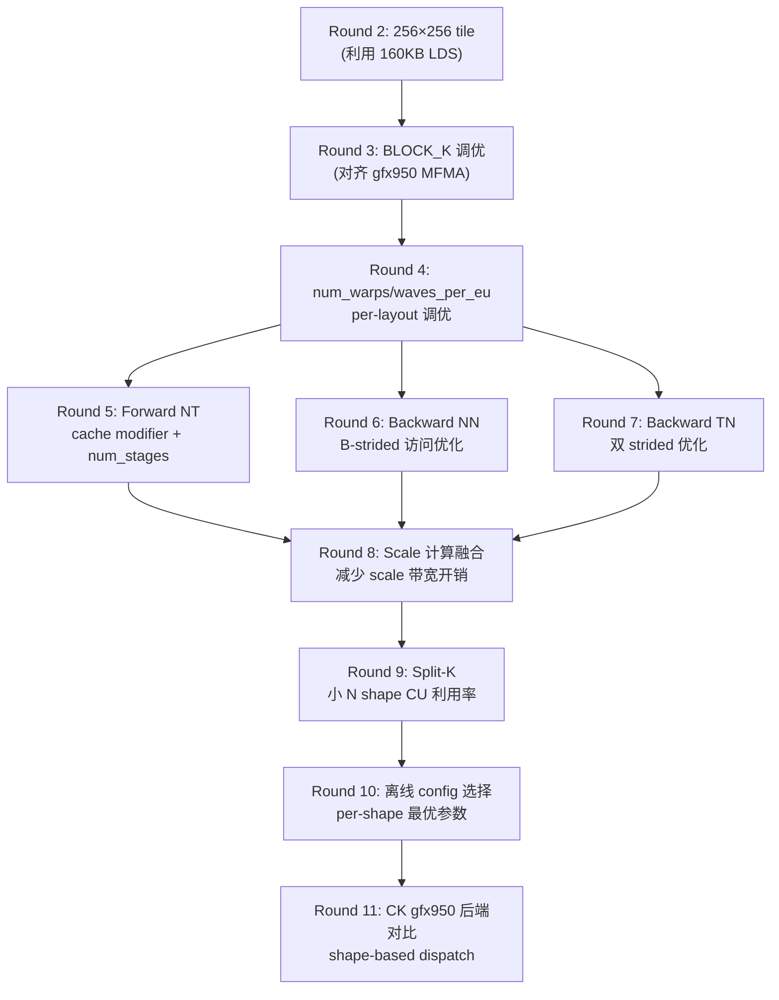

# MI355X FP8 Blockwise GEMM — 10 轮优化计划

> 本计划**仅聚焦** `gemm_fp8_blockwise` 算子 (GEMM FP8 with `ScalingGranularity.BLOCKWISE, block_size=128`)。
> 不涉及 Grouped GEMM、Attention 或其他算子。

## 1. 当前状态

### 1.1 性能概况 (agent-optimize 分支, Round 1 MI300X port)

| 指标 | Forward (NT) | Backward (NN+TN) |
|------|:-:|:-:|
| **Avg TFLOPS** | 866.4 | 813.7 |
| **Min TFLOPS** | 750.2 | 665.4 |
| **Max TFLOPS** | 1317.2 | 895.8 |
| **FP8 利用率 (avg)** | 17.3% | 16.3% |
| **FP8 利用率 (max)** | 26.3% | 17.9% |
| 精度 | 84/84 PASS | — |

### 1.2 Per-shape 瓶颈分析

**Forward (NT layout, C = A @ B^T):**

| Shape 特征 | 典型 TFLOPS | 瓶颈原因 |
|-----------|:-:|---------|
| N ≥ 22016, M ≥ 4096 | 950-1317 | tile 数充足，性能最佳 |
| N = 4096, K = 4096 | 750-783 | **tile 数不足占满 256 CU** |
| N = 4096, K = 14336 | 763-772 | K 大但 M×N tile 少 |

**Backward (NN/TN layout):**

| Layout | Avg TFLOPS | 特点 |
|--------|:-:|---------|
| NN (grad_X) | ~800 | B 为 K-strided, async_copy 已禁用 |
| TN (grad_W) | ~820 | A 和 B 都为 K-strided |
| 最差 (N≤3584) | 665 | tile 数 + strided 访问双重瓶颈 |

### 1.3 与 SOTA 的差距

| 参考 | Forward TFLOPS | 来源 |
|------|:-:|------|
| 当前 Primus-Turbo blockwise | **866** (avg) | 本次测量 |
| GB200 NV-TE blockwise | **~1944** (avg) | Q1 报告 |
| hipBLASLt tensorwise (MI355X) | **~2750** (M=N=K=4096) | AMD 博客 |
| HIP 手写 tensorwise (256×256_t512) | **~2288** (M=N=K=4096) | AMD 博客 |

> Blockwise 有额外 scale tensor 开销，理论上限约为 tensorwise 的 **80-90%**。
> 合理目标: Fwd **1500-1800 TFLOPS**。

### 1.4 关键硬件参数

| 特性 | MI300X (当前适配) | MI355X (目标优化) |
|------|:-:|:-:|
| LDS / CU | 64 KB | **160 KB** |
| LDS banks | 32 | **64** |
| LDS 读带宽 | 128 B/clk | **256 B/clk** |
| GLOBAL_LOAD_LDS | 32-bit/lane | **128-bit/lane** |
| FP8 MFMA (K dim) | 32×32×**16** | 32×32×**64** (新) |
| CU 数 | 304 | 256 |

---

## 2. 十轮优化清单



---

### Round 2: 256×256 Tile (利用 160KB LDS)

**目标**: 将默认 tile 从 128×128 提升到 256×256 (gfx950 only)。

**根因**: 当前所有 blockwise kernel 使用 128×128×128 tile。MI355X 有 160KB LDS，可以容纳更大 tile：

$$\text{LDS}_{256 \times 128 \times 2 \text{ (A+B)}} = 256 \times 128 \times 1\text{B} \times 2 = 64\text{ KB (single buffer)}$$
$$\text{Double buffer} = 128\text{ KB} < 160\text{ KB} \quad \checkmark$$

**修改文件**: `primus_turbo/triton/gemm/gemm_fp8_kernel.py`

**核心变更**: `_select_blockwise_config` 中 gfx950 分支：
```python
if _is_gfx950() and M >= 2048 and N >= 2048:
    block_m, block_n, block_k = 256, 256, 128
```

**预期收益**: 15-30%。AMD 博客: 256×256 vs 128×128 = 2288/1829 = **1.25x**。

**验证**: 精度 pytest + bench_gemm_turbo.py --dtype fp8 --granularity blockwise

**复杂度**: 低 — 仅修改 config 选择逻辑

---

### Round 3: BLOCK_K 对齐 gfx950 MFMA

**目标**: 测试 BLOCK_K = 64 / 128 / 256 在 gfx950 上的最优值。

**根因**: gfx950 引入 `V_MFMA_F32_32x32x64_F8F6F4`，单次处理 K=64 (vs CDNA3 K=16)。

| BLOCK_K | 32×32×64 MFMA 调用次数 | 内循环 iterations (K=4096) |
|---------|:-:|:-:|
| 64 | 1 | 64 |
| 128 | 2 | 32 |
| 256 | 4 | 16 |

**修改文件**: `gemm_fp8_kernel.py` (`_select_blockwise_config`)

**关键**: Triton `tl.dot` 自动映射到最优 MFMA 指令。BLOCK_K 影响循环次数和 LDS 容量。
- BLOCK_K=256 + 256×256 tile: LDS = 256×256×1B×2 = 128KB (single) → 需验证 double buffer 是否 fit
- BLOCK_K=128 (当前): 安全，double buffer fit 在 160KB 内

**预期收益**: 5-15%。减少循环控制开销，但可能增加寄存器压力。

**复杂度**: 低 — 参数调整

---

### Round 4: `num_warps` / `waves_per_eu` Per-Layout 调优

**目标**: 为 NT / NN / TN 三种 layout 分别找到最优 `num_warps` 和 `waves_per_eu`。

**根因**: 当前硬编码:
- NT (fwd): num_warps=8, waves_per_eu=0
- NN (bwd): num_warps=8, waves_per_eu=2
- TN (bwd): num_warps=8, waves_per_eu=2

MI355X CDNA4 CU 有 2× Matrix Core 吞吐，且 LDS 160KB 允许更高 occupancy。

**测试矩阵**:

| 参数 | 测试值 |
|------|--------|
| num_warps | 4, 8, **16** |
| waves_per_eu | 0, 1, **2**, 3 |
| 目标 layout | NT, NN, TN (分别测试) |

**修改文件**: `gemm_fp8_kernel.py` (`_blockwise_nt`, `_blockwise_nn`, `_blockwise_tn`)

**预期收益**: 5-15%。AMD 博客显示 8-wave (num_warps=8) 是 MI355X 最优，但 blockwise scale 开销可能改变平衡。

**复杂度**: 低 — 参数搜索

---

### Round 5: Forward (NT) Pipeline 深度 + Cache 策略

**目标**: 优化 Forward path 的 `num_stages` 和 cache modifier。

**根因**: 当前 Forward NT 使用:
- `num_stages=2` (double buffer)
- `CACHE_MODIFIER_A=".ca"`, `CACHE_MODIFIER_B=".ca"` (cache all)

MI355X 160KB LDS 可以支持 `num_stages=3` (triple buffer):

$$\text{Triple buffer (256×128 tile)} = 256 \times 128 \times 1\text{B} \times 2 \times 3 = 192\text{ KB} > 160\text{ KB} \quad \times$$
$$\text{Triple buffer (128×128 tile)} = 128 \times 128 \times 1\text{B} \times 2 \times 3 = 96\text{ KB} < 160\text{ KB} \quad \checkmark$$

Cache 策略: NT 中 A 被多次读取 (按行复用), B 也被复用 → `.ca` 合理。但对于超大矩阵，`.cs` (cache streaming) 可能更好以避免 cache thrashing。

**测试矩阵**:

| 参数 | 测试值 |
|------|--------|
| num_stages | 2, **3** (仅 128×128 tile), 4 |
| CACHE_MODIFIER_A | ".ca", **".cs"** |
| CACHE_MODIFIER_B | ".ca", **".cs"** |

**预期收益**: 3-10%。Triple buffer 可隐藏更多 memory latency。

**复杂度**: 低

---

### Round 6: Backward NN (grad_X) B-Strided 访问优化

**目标**: 优化 NN layout 中 B 矩阵的 K-strided 访问。

**根因**: NN layout 中 B=[K,N], 访问 B 时 K 维度是连续的（stride=N），但每个 tile 需要从不连续的 K 位置读取 N 维的列数据。当前已禁用 async_copy (`_set_amd_knobs(enable=False)`)。

gfx950 有增强的 GLOBAL_LOAD_LDS (128-bit/lane)。重新评估 async_copy 在 gfx950 上的表现。

**方案**:
1. 测试 gfx950 上 `use_async_copy=True` 对 NN 的影响
2. 测试 `use_block_pingpong=True` 对 NN 的影响
3. 如果 async_copy 仍然有害，尝试手动 prefetch 下一 K-block 的 B 数据

**预期收益**: 5-15%。NN 是 backward 中最弱的路径。

**复杂度**: 中

---

### Round 7: Backward TN (grad_W) 双 Strided 优化

**目标**: 优化 TN layout 中 A 和 B 都是 K-strided 的情况。

**根因**: TN layout: C = A^T[K,M] @ B[K,N]。A_view=[M,K] 但 K 是 strided, B=[K,N] 也是 K-strided。两个矩阵都没有 K-contiguous 内存，内存效率最差。

**方案**:
1. 对于 shape 满足特定条件的 TN，做一次 host 端 `.contiguous()` 转换代价 vs kernel 收益的 trade-off
2. 测试 `BLOCK_K=64` 是否对 strided 访问更友好（减少每次 load 的 stride 跨距）
3. 参考 tensorwise FP8 kernel 的 TN 路径 (`offline_select_fp8` 中 TN 用 `BLOCK_K=64`)

**预期收益**: 5-10%。

**复杂度**: 中

---

### Round 8: Scale 计算融合优化

**目标**: 减少 blockwise scale tensor 的内存带宽开销。

**根因**: Blockwise vs Tensorwise 的核心差异在于每个 K-block 需要加载 scale：

```python
# 当前内循环:
for ki in range(loop_k):
    a_s = tl.load(as_ptrs + ki * stride_as_k)    # [BLOCK_M] floats
    b_s = tl.load(bs_ptr_base + ki * stride_bs_1) # [1] 或 [BLOCK_N] floats
    a = tl.load(a_ptrs, ...)                       # [BLOCK_M, BLOCK_K] FP8
    b = tl.load(b_ptrs, ...)                       # [BLOCK_K, BLOCK_N] FP8
    partial = tl.dot(a, b)
    acc += partial * (a_s * b_s)[:, None]           # scale 乘法
```

每 K-block 额外带宽:
$$\text{Scale BW} = (\text{BLOCK\_M} + 1) \times 4\text{B} = 516\text{B per tile per K-iter}$$

**方案**:
1. **Scale 预取**: 在当前 MFMA 计算期间预加载下一 K-block 的 scale
2. **Scale 寄存器缓存**: 如果 K 较小，一次加载所有 K 的 scale 到寄存器
3. **Scale 计算简化**: 当 a_s 和 b_s 都是标量时, `a_s * b_s` 可提到循环外只算一次

**预期收益**: 3-8%。Scale 开销在大 K 时累积显著。

**复杂度**: 中

---

### Round 9: Split-K for 小 N Shapes

**目标**: 解决 N ≤ 4096 时 CU 利用率不足的问题。

**根因**: 当 N=4096, M=4096, 使用 128×128 tile 时:

$$\text{tiles} = \lceil 4096/128 \rceil \times \lceil 4096/128 \rceil = 32 \times 32 = 1024$$

1024 tiles 对 256 CU 而言看似足够 (4 waves/CU)，但 persistent kernel grid = NUM_SMS ≤ total_tiles，实际调度可能不充分。

换 256×256 tile 后:
$$\text{tiles} = 16 \times 16 = 256 = \text{NUM\_CU}$$

刚好 1 wave/CU，没有并行余量。

**Split-K 方案**:

$$\text{Split factor} = \min\left(\max\left(1, \frac{\text{CU}\_\text{count}}{\text{total\_tiles}}\right), \frac{K}{\text{BLOCK\_K}}\right)$$

当 split > 1 时，K 维切分为多个 partition，各 CU 独立计算 partial sum，最后 atomic add 或 two-pass reduce。

**修改文件**: `gemm_fp8_kernel.py` (新增 split-K 路径)

**预期收益**: 10-25% (仅对小 N shapes)。这些 shape 当前是最弱的 (750 TFLOPS vs 最佳 1317)。

**复杂度**: 高 — 需要新 kernel 或 kernel 修改

---

### Round 10: 离线 Per-Shape Config 选择

**目标**: 建立 MI355X blockwise FP8 的 shape → config 最优映射表。

**根因**: 不同 shape 的最优 (BLOCK_M, BLOCK_N, BLOCK_K, GROUP_M, num_warps, waves_per_eu) 不同。当前 `_select_blockwise_config` 使用简单规则，未区分 gfx950。

**方案**:
1. 对所有 benchmark shapes 做 config sweep (Round 2-9 的参数组合)
2. 建立 `(M_bucket, N_bucket, K_bucket, layout)` → `config` 映射表
3. 实现为 `_select_blockwise_config_gfx950(M, N, K, layout)` 函数
4. 参考 tensorwise `offline_select_fp8` 的设计模式

**预期收益**: 5-10%。消除 one-size-fits-all 的次优选择。

**复杂度**: 中 — 主要是 profiling + 规则整理

---

### Round 11: CK gfx950 Blockwise 后端对比 + Dispatch

**目标**: 评估 CK (Composable Kernel) gfx950 blockscale 后端，选择 per-shape 最优后端。

**根因**: CK 已添加 gfx950 FP8 blockscale 支持 (PR #2297)，且 CK 是手写 HIP kernel，可以利用 MI355X 的 GLOBAL_LOAD_LDS (128-bit/lane) 和 LDS swizzle 等 Triton 无法直接控制的特性。

**方案**:
1. 编译并测试 CK gfx950 blockwise FP8 GEMM 性能
2. 对比 Triton vs CK per-shape
3. 在 `gemm_fp8_impl.py` 中实现 gfx950 blockwise shape-based backend dispatch：
   - 某些 shape 用 CK (如 hipBLASLt/CK 对大 MNK 更优)
   - 某些 shape 用 Triton (如 persistent kernel 对不规则 shape 更灵活)

**预期收益**: 10-20% (某些 shape)。CK 手写 kernel 在大矩阵上通常更快。

**复杂度**: 中 — 需要 CK 编译和对比

---

## 3. 累积预估收益

| Round | 优化项 | 核心修改 | 增量 | 累积 Fwd Avg (预估) |
|-------|--------|---------|:----:|:-:|
| 1 (done) | MI300X port | — | +78% | **866 T** |
| 2 | 256×256 tile | `_select_blockwise_config` | +20% | **~1040 T** |
| 3 | BLOCK_K 调优 | `_select_blockwise_config` | +10% | **~1140 T** |
| 4 | warps/waves 调优 | layout helpers | +8% | **~1230 T** |
| 5 | NT pipeline/cache | `_blockwise_nt` | +5% | **~1290 T** |
| 6 | NN B-strided | `_blockwise_nn` | +8% | **~1390 T** |
| 7 | TN 双 strided | `_blockwise_tn` | +5% | **~1460 T** |
| 8 | Scale 融合 | kernel inner loop | +5% | **~1530 T** |
| 9 | Split-K | 新路径 | +8% | **~1650 T** |
| 10 | Per-shape config | `_select_blockwise_config_gfx950` | +5% | **~1730 T** |
| 11 | CK dispatch | `gemm_fp8_impl.py` | +5% | **~1820 T** |

**最终目标**: Fwd Avg **~1700-1800 TFLOPS**，对标 GB200 ~1944 TFLOPS，差距缩小到 **~10%**。

---

## 4. 执行节奏

| Phase | Rounds | 核心目标 | 预计时长 |
|-------|--------|---------|---------|
| **I 基础提升** | 2-4 | Tile + MFMA + 参数调优 | 各 1 轮 |
| **II Layout 专项** | 5-7 | Fwd/Bwd 各 layout 逐个优化 | 各 1 轮 |
| **III 深度优化** | 8-9 | Scale 融合 + Split-K | 各 1-2 轮 |
| **IV 系统级** | 10-11 | Config 表 + 后端选择 | 各 1 轮 |

每轮严格遵循: **Profile → Analyze → Implement → Verify (accuracy + perf) → Commit/Revert → Log**
