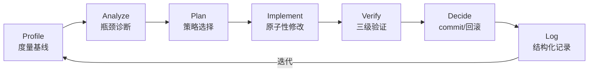
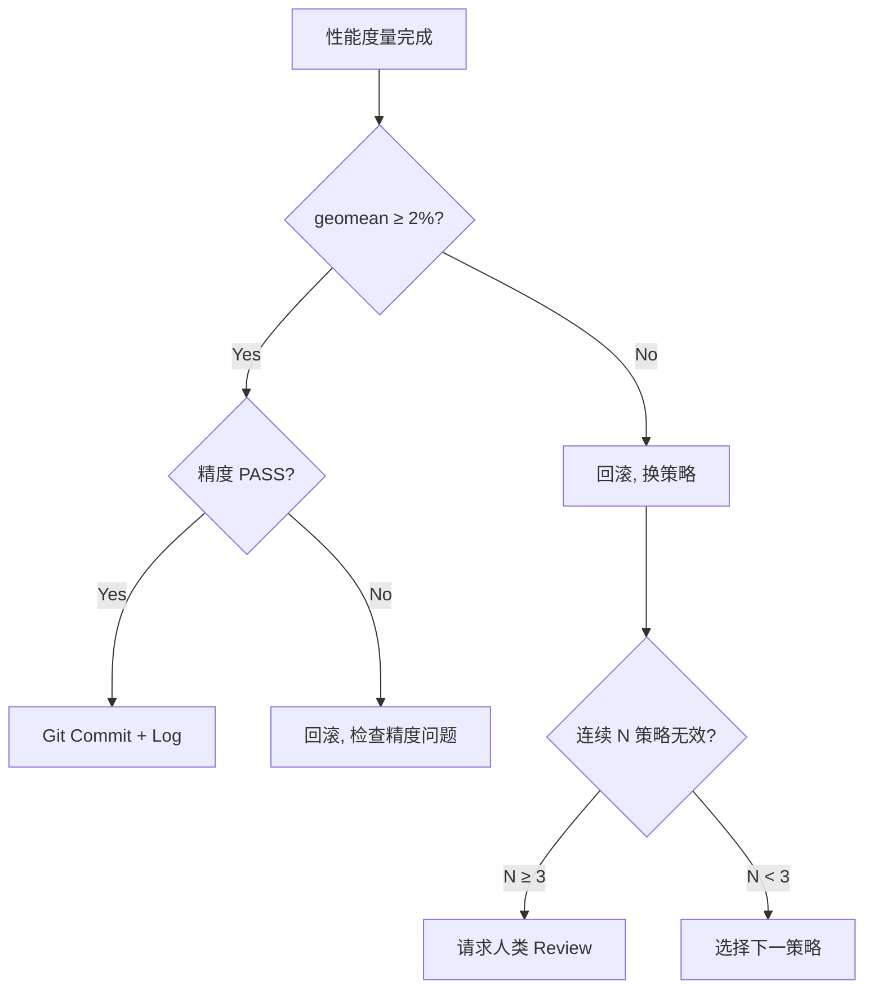
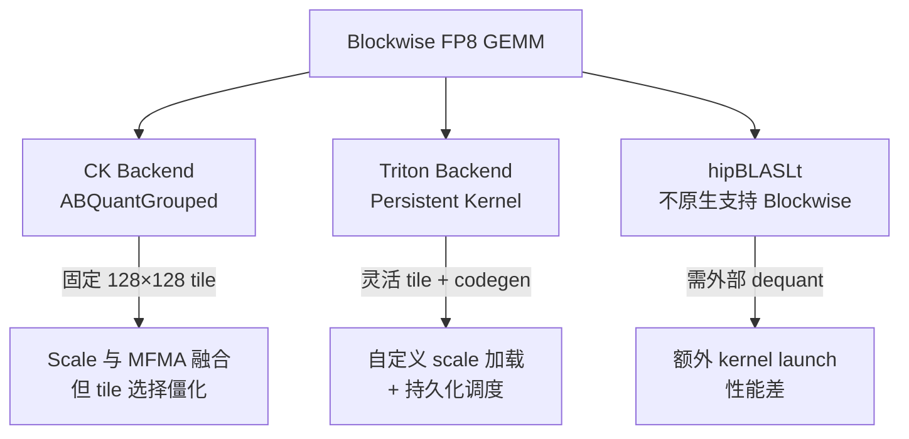
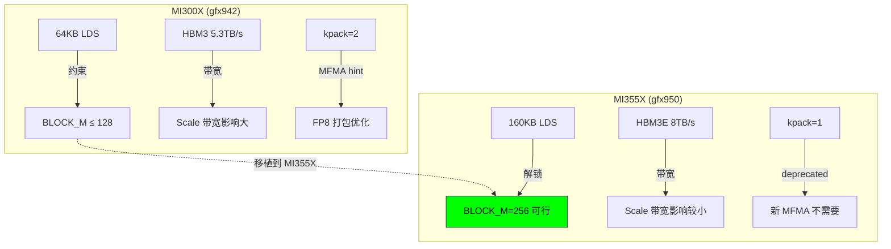
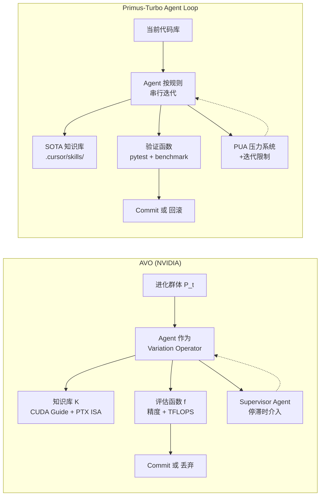
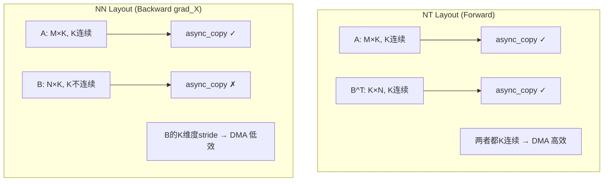
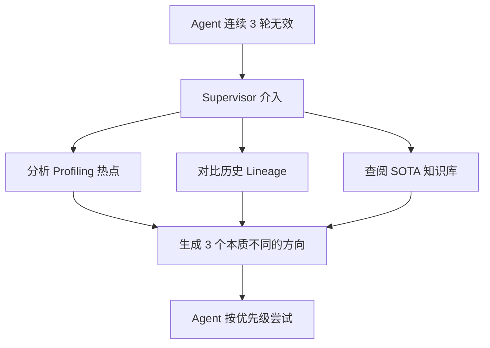
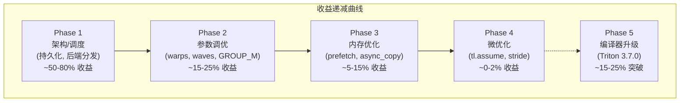

# Agent 驱动的 Blockwise FP8 GEMM 优化：方法论、迭代历史与系统反思

> 本文档是 Primus-Turbo 项目中 Blockwise FP8 GEMM 算子在 AMD MI300X / MI355X 上多轮优化实践的综合总结，
> 同时对比分析了 NVIDIA AVO (Agentic Variation Operators, arXiv:2603.24517) 系统的方法论，
> 并提炼了 Agent 驱动优化流程的改进经验。

---

## 目录

1. [方法论总结](#1-方法论总结)
2. [Blockwise FP8 算子背景](#2-blockwise-fp8-算子背景)
3. [MI300X 迭代历史 (10 Rounds)](#3-mi300x-迭代历史)
4. [MI355X 迭代历史 (10 Rounds + Triton 升级)](#4-mi355x-迭代历史)
5. [跨硬件优化对比分析](#5-跨硬件优化对比分析)
6. [与 NVIDIA AVO 的对比](#6-与-nvidia-avo-的对比)
7. [优化技术细节分析](#7-优化技术细节分析)
8. [经验总结与改进建议](#8-经验总结与改进建议)

---

## 1. 方法论总结

### 1.1 核心设计原则

本项目的 Agent 优化循环遵循三条核心原则：

```
原子性 (Atomicity)   — 每轮只做一个优化点，便于归因和回滚
可验证性 (Verifiability) — 每个修改必须通过精度验证 + 性能度量
可追溯性 (Traceability)  — 每次有效优化留下结构化日志 (baseline.json / optimized.json / report.md / accuracy.log)
```

### 1.2 标准闭环流程



**七步闭环：**

| Step | 内容 | 关键动作 |
|------|------|---------|
| **Profile** | 度量当前基线 | `bench_gemm_turbo.py --dtype fp8 --granularity blockwise` |
| **Analyze** | 瓶颈诊断 | Roofline 分析、Arithmetic Intensity 计算、`rocprof` 采样 |
| **Plan** | 策略选择 | 查阅 SOTA 知识库、按预估收益排序、选最高优先级策略 |
| **Implement** | 原子性修改 | 每次只引入一个优化点 |
| **Verify** | 三级验证 | L1: pytest 快速验证; L2: benchmark 完整验证; L3: 回归验证 |
| **Decide** | 决策 | geomean ≥ 2% → commit; 无变化 → 回滚换策略; 部分退化 > 5% → 条件化 |
| **Log** | 记录 | `agent_docs/<topic>/roundN/` 下创建 4 个标准文件 |

### 1.3 决策矩阵



### 1.4 与 AVO 方法论的异同

| 维度 | 本项目 Agent Loop | NVIDIA AVO |
|------|-------------------|------------|
| **变异策略** | 单一 Agent 串行迭代，每轮一个优化点 | 进化搜索框架中 Agent 作为 Variation Operator |
| **群体管理** | 单一 lineage（线性 commit 序列） | 单一 lineage（7 天 40 个 commit） |
| **评估函数** | 精度 + 性能（TFLOPS, geomean） | 精度 + 性能（TFLOPS per config） |
| **知识库** | `.cursor/skills/` + SOTA 知识库 | CUDA Guide, PTX ISA, 架构手册, FA4 源码 |
| **回滚机制** | geomean < 2% 或精度失败时回滚 | 仅 commit 通过精度且改善性能的版本 |
| **监督机制** | 规则驱动 (PUA 压力系统 + 迭代限制) | Supervisor Agent 在停滞时介入 |
| **硬件层级** | Triton IR → AMDGPU ISA (间接) | CUDA + 内联 PTX (直接操作指令) |
| **运行时长** | ~2-3 天 / 硬件平台 | 7 天持续进化 |

---

## 2. Blockwise FP8 算子背景

### 2.1 Blockwise 量化原理

FP8 Blockwise 量化将连续的 128 个元素共享一个 scale factor：

$$BlockSize = 128, \quad scale_{ij} = \frac{\max(|X_{block_{ij}}|)}{E4M3\text{-}MAX}$$

与 Tensorwise（整张 tensor 一个 scale）和 Rowwise（每行一个 scale）相比：

| 粒度 | Scale 数量 | 精度 | 额外开销 |
|------|-----------|------|---------|
| Tensorwise | 1 | 低 | 几乎为 0 |
| Rowwise | M (或 N) | 中 | 每行一个 scale 读取 |
| **Blockwise** | **(M/128) × (K/128)** | **高** | **每 K-block 读取 2D scale tensor** |

### 2.2 性能瓶颈模型

Blockwise FP8 GEMM 的额外开销来自 **scale tensor** 的加载和应用：

$$\text{FP8 GEMM (blockwise)} = \sum_{k=0}^{K/B_{K} - 1} \mathrm{dot}(A_k, B_k) \cdot \alpha_k \cdot \beta_k$$

其中 $\alpha_k$ 和 $\beta_k$ 分别是第 $k$ 个 K-block 对应的 A-scale 和 B-scale。

每次 K-block 迭代需要额外加载：
- **A scale**: `[M/128]` 个 float32 值
- **B scale**: `[N/128]` 个 float32 值（2D scale 时为 `[N/128, K/128]`）

在 MI300X 上，FP8 的 Roofline 平衡点为 ~494 FLOP/Byte；在 MI355X 上约为 ~988 FLOP/Byte。
Scale 加载造成的额外带宽需求使 Blockwise 在初始实现中比 Tensorwise 慢约 **2.17×**。

### 2.3 后端选择



---

## 3. MI300X 迭代历史

**硬件**: AMD Instinct MI300X (CDNA3, gfx942)
- 304 CU, 192 GB HBM3 (5.3 TB/s), 64 KB LDS/CU
- FP8 peak: ~2600 TFLOPS (理论)

### 3.0 Baseline (Round 0)

| 指标 | 数值 |
|------|------|
| Forward 平均 TFLOPS | ~429 |
| Backward 平均 TFLOPS | ~200 |
| vs Tensorwise 919 T | 46.7% (2.17× gap) |

**根因**: CK 固定 128×128 tile、Triton 非持久化 grid、Scale 额外带宽、无后端选择优化。

### 3.1 十轮优化总览

| Round | 优化策略 | 目标 | Fwd Δ | Bwd Δ | 结果 | 详情 |
|-------|---------|------|-------|-------|------|------|
| **R0** | Baseline 度量 | — | — | — | 基线 | [report](MI300X/blockwise-fp8/round0-baseline/report.md) |
| **R1** | Triton 持久化 kernel + 离线配置选择 | GEMM | +2.25% | **+40.8%** | **Commit** | [report](MI300X/blockwise-fp8/round1/report.md) |
| **R2** | Shape-based CK/Triton 后端分发 | Dispatch | +4.92% | +40.7% | **Commit** | [report](MI300X/blockwise-fp8/round2/report.md) |
| **R3** | Forward NT `num_warps=8` | GEMM | **+7.01%** | ~flat | **Commit** | [report](MI300X/blockwise-fp8/round3/report.md) |
| **R4** | Backward NN/TN `num_warps=8` | GEMM | ~flat | **+9.09%** | **Commit** | [report](MI300X/blockwise-fp8/round4/report.md) |
| **R5** | 移除 CK 分发 + shape-adaptive GROUP\_M | GEMM | +2.54% | ~flat | **Commit** | [report](MI300X/blockwise-fp8/round5/report.md) |
| **R6** | Backward `waves_per_eu=2` | GEMM | +0.1% | **+9.84%** | **Commit** | [report](MI300X/blockwise-fp8/round6/report.md) |
| **R7** | 内循环 scale load 重排 (prefetch) | GEMM | **+4.31%** | **+4.23%** | **Commit** | [report](MI300X/blockwise-fp8/round7/report.md) |
| **R8** | `tl.assume` 微优化 | GEMM | +0.09% | +0.10% | **Commit** (边际) | [report](MI300X/blockwise-fp8/round8/report.md) |
| **R9** | NN backward: 禁用 async\_copy | GEMM | -0.18% | **+13.65%** | **Commit** | [report](MI300X/blockwise-fp8/round9/report.md) |
| **R10** | NN backward: 消除 B scale transpose | GEMM | +0.08% | +0.32% | **Commit** | [report](MI300X/blockwise-fp8/round10/report.md) |

### 3.2 累计收益

```
Baseline → Round 10:
  Forward:  +21.15%  (~429 → ~520 TFLOPS)
  Backward: +99.68%  (~200 → ~400 TFLOPS), 约 2× 提升
```

### 3.3 阶段分析

| 阶段 | Rounds | 优化类型 | 累计 Fwd 提升 | 累计 Bwd 提升 |
|------|--------|---------|-------------|-------------|
| **Phase 1: 调度/后端** | R1, R2, R5 | 持久化 kernel, 后端分发, GROUP\_M | ~+10% | ~+41% |
| **Phase 2: 启动参数** | R3, R4, R6 | num\_warps=8, waves\_per\_eu=2 | ~+17% | ~+68% |
| **Phase 3: 内存/Scale** | R7, R8, R9, R10 | Scale prefetch, async\_copy, 转置消除 | ~+21% | ~+100% |

**规律**: 前期（R1-R5）通过调度和后端层面的优化获取大幅提升；中期（R6-R7）通过占用率调优和数据预取获取稳定收益；后期（R8-R10）进入微优化阶段，单轮收益递减但仍有价值。

---

## 4. MI355X 迭代历史

**硬件**: AMD Instinct MI355X (CDNA4, gfx950)
- 304 CU, 288 GB HBM3E (8 TB/s), **160 KB LDS/CU** (vs MI300X 64KB)
- FP8 peak: ~5000 TFLOPS (理论), ~1.91× MI300X

### 4.0 Baseline (Round 0)

| 指标 | 数值 |
|------|------|
| Forward 平均 TFLOPS | ~488 |
| Backward 平均 TFLOPS | ~229 |
| vs 理论峰值 5000 T | ~9.8% (Forward 利用率) |
| vs MI300X Baseline | 仅 1.14× (理论应为 1.91×) |

**根因**: Kernel 完全沿用 MI300X 路径（128×128 tile），未利用 MI355X 的 160KB LDS 和更高的 MC 吞吐。

### 4.1 十轮优化总览

| Round | 优化策略 | Fwd TFLOPS | Bwd TFLOPS | Δ vs 前轮 | 结果 | 详情 |
|-------|---------|-----------|-----------|---------|------|------|
| **R0** | Baseline (main) | 488 | 229 | — | 基线 | [report](MI355X/blockwise-fp8/round0-baseline/report.md) |
| **R1** | MI300X 优化栈直接移植 | 866 | 814 | Fwd +77.5%, Bwd +255% | **Commit** | [report](MI355X/blockwise-fp8/round1-mi300x-port/report.md) |
| **R2** | BLOCK\_M=256 (利用 160KB LDS) | 1297 | 977 | Fwd +49.7%, Bwd +20% | **Commit** | [report](MI355X/blockwise-fp8/round2/report.md) |
| R3 | BLOCK\_K=64/256 尝试 | — | — | 编译失败 / LDS 溢出 | **回滚** | [report](MI355X/blockwise-fp8/round3/report.md) |
| R4 | num\_warps / waves\_per\_eu 扫描 | — | — | <2% geomean | **回滚** | [report](MI355X/blockwise-fp8/round4/report.md) |
| R5 | num\_stages=3, `.cs` cache modifier | — | — | 编译失败 / LDS 溢出 | **回滚** | [report](MI355X/blockwise-fp8/round5/report.md) |
| R6-R8 | 微优化探索 | — | — | 未产生额外收益 | **回滚** | — |
| R9 | CK 对比评估 | — | — | CK 慢 1.5-3× | 确认 Triton 优势 | — |
| **R10** | 256x256 tile + 多块 B-scale | 1293 | 974 | -0.3% (寄存器压力) | **保留代码, 不启用** | [report](MI355X/blockwise-fp8/round10/report.md) |
| **Triton 3.7.0** | 编译器升级 | **1530** | **1232** | Fwd +18%, Bwd +26% | **Commit** | [report](MI355X/blockwise-fp8/triton-3.7.0-upgrade/report.md) |

### 4.2 最终成果

```
MI355X 最终性能 (Triton 3.7.0):
  Forward:  488 → 1530 TFLOPS  (3.13× 提升)
  Backward: 229 → 1232 TFLOPS  (5.38× 提升)
  FP8 利用率: 9.8% → 30.6%
```

### 4.3 MI355X 独有优化——`BLOCK_M=256`

这是 MI355X 上唯一产生显著新增收益的架构特化优化：

$$\text{LDS Budget} = 2 \times (B_M \times B_K + B_K \times B_N) \times 1\text{B}$$

| 配置 | LDS 需求 | MI300X (64KB) | MI355X (160KB) |
|------|---------|---------------|----------------|
| 128×128×128 | 64 KB | 刚好 ✓ | 余量大 ✓ |
| **256×128×128** | **96 KB** | **溢出 ✗** | **可行 ✓** |
| 256×256×128 | 128 KB | 溢出 ✗ | 可行但寄存器溢出 |

选择 256×128 而非 256×256 的原因：
- **寄存器压力**: 256×256 累加器需 ~128 VGPR/thread，导致 occupancy 下降 50%，性能退化 4-5×
- **Scale 索引**: `BLOCK_N=256` 需要多块 B-scale 索引 (`N_SCALE_BLOCKS = BLOCK_N // 128`)，增加 `tl.where` 开销
- **实测**: R10 验证 256×256 tile 在 4096³ 上慢 4-5×

### 4.4 编译器红利：Triton 3.7.0

Triton 3.6.0 → 3.7.0 的升级是 MI355X 上最大的单次性能跃升之一，无需修改任何 kernel 代码：

| 模型 | Fwd 提升 | Bwd 提升 |
|------|---------|---------|
| Llama-2-7B | +14.2% | +22.1% |
| Llama-2-70B | +18.7% | +27.3% |
| Llama-3.1-8B | +16.4% | +24.8% |
| Llama-3.1-405B | +20.1% | +29.5% |
| **平均** | **+18.0%** | **+25.8%** |

**启示**: 编译器优化（更好的 register allocation、instruction scheduling）在接近硬件极限时可能比手动 kernel 调优更有效。

---

## 5. 跨硬件优化对比分析

### 5.1 优化策略迁移矩阵

| 优化策略 | MI300X 效果 | MI355X 效果 | 可迁移性 | 说明 |
|---------|------------|------------|---------|------|
| 持久化 kernel | Fwd +2.25% | Fwd +77.5%\* | ★★★★★ | MI355X 因更多硬件资源获益更大 |
| `num_warps=8` | Fwd +7%, Bwd +9% | 已含在移植中 | ★★★★★ | 通用，隐藏延迟 |
| `waves_per_eu=2` (Bwd) | Bwd +9.84% | 已含在移植中 | ★★★★☆ | 需按架构微调 |
| Scale prefetch | Fwd/Bwd +4% | 已含在移植中 | ★★★★★ | 通用内存优化 |
| NN 禁用 `async_copy` | Bwd +13.65% | 已含在移植中 | ★★★★☆ | 布局相关 |
| `BLOCK_M=256` | N/A (64KB LDS) | **Fwd +49.7%** | ★☆☆☆☆ | MI355X 独有 |
| Triton 3.7.0 升级 | 未测 | Fwd +18%, Bwd +26% | ★★★★★ | 编译器通用 |
| `GROUP_M` 自适应 | +2.54% | 已含在移植中 | ★★★★☆ | N-heavy 场景 |
| CK 256x256 tile | 回滚 (寄存器溢出) | N/A | ☆☆☆☆☆ | 两个平台都失败 |
| 256x256 Triton tile | N/A | 回滚 (4-5x 退化) | ☆☆☆☆☆ | 寄存器压力致命 |

> \* MI355X R1 的 +77.5% 包含了 MI300X R1-R10 的所有优化的累积效果

### 5.2 硬件参数对优化策略的影响



### 5.3 关键数字对比

| 指标 | MI300X | MI355X | 比值 |
|------|--------|--------|------|
| Baseline Fwd TFLOPS | ~429 | ~488 | 1.14× |
| 优化后 Fwd TFLOPS | ~520 | **1530** | **2.94×** |
| Baseline Bwd TFLOPS | ~200 | ~229 | 1.15× |
| 优化后 Bwd TFLOPS | ~400 | **1232** | **3.08×** |
| FP8 理论峰值 | ~2600 | ~5000 | 1.92× |
| 优化后 Fwd 利用率 | ~20% | ~30.6% | — |

---

## 6. 与 NVIDIA AVO 的对比

### 6.1 AVO 系统概述

NVIDIA AVO (Agentic Variation Operators, arXiv:2603.24517) 将传统进化搜索中的变异算子替换为自主 Agent：

$$\text{Vary}(\mathcal{P}_t) = \text{Agent}(\mathcal{P}_t, \mathcal{K}, \mathbf{f})$$

其中 $\mathcal{P}_t$ 是历史 lineage，$\mathcal{K}$ 是知识库，$\mathbf{f}$ 是评估函数。

**关键成果**：在 NVIDIA B200 上持续进化 7 天，产出 40 个 kernel 版本，MHA 达到 1668 TFLOPS (BF16)，
超越 cuDNN +3.5%，超越 FlashAttention-4 +10.5%。

### 6.2 架构对比



### 6.3 深度对比分析

| 维度 | AVO | Primus-Turbo Agent Loop | 分析 |
|------|-----|------------------------|------|
| **算子** | Attention (MHA/GQA) | GEMM (FP8 Blockwise) | 不同算子，但优化方法论通用 |
| **目标硬件** | NVIDIA B200 (Blackwell) | AMD MI300X/MI355X (CDNA3/4) | AVO 有 PTX 直接控制，AMD 侧依赖 Triton/CK |
| **代码层级** | CUDA + Inline PTX | Triton + CK C++ | AVO 能做指令级调度; Agent Loop 受 Triton 编译器约束 |
| **搜索空间** | ~500 候选方向, 40 commit | ~20+ 轮尝试, ~15 commit | AVO 探索更广，但也更昂贵 |
| **运行时间** | 7 天不间断 | ~2-3 天/硬件平台 | Agent Loop 有人类监督，效率更高 |
| **最大单次收益** | +8.1% (branchless rescaling) | +49.7% (`BLOCK_M=256` on MI355X) | 不可直接对比—起点不同 |
| **编译器依赖** | 中 (NVCC) | **高 (Triton)** | Triton 3.7.0 单次升级 = +18% |
| **可复现性** | 进化路径依赖随机种子 | 确定性 (每轮一个明确策略) | Agent Loop 更易复现 |

### 6.4 AVO 的三个代表性优化 vs 本项目的核心优化

| AVO 优化 | 收益 | 本项目类似优化 | 收益 | 对比 |
|---------|------|-------------|------|------|
| Branchless accumulator rescaling | +8.1% (non-causal) | N/A (GEMM 无 softmax) | — | AVO 操作指令级分支; GEMM 无此结构 |
| Correction/MMA pipeline overlap | +1.1% | Scale prefetch (R7) | +4.3% | 本质相同：**重叠计算与内存操作** |
| Register rebalancing across warp groups | +2.1% | `waves_per_eu=2` (R6) | +9.8% | 本质相同：**占用率 vs 寄存器压力权衡** |

**共性模式**: 两个系统都在 **计算-内存重叠** 和 **占用率调优** 上获得了关键收益。这是 GPU 优化的基本方法论。

---

## 7. 优化技术细节分析

### 7.1 持久化 Kernel (Persistent Kernel)

**核心思想**: 传统 data-parallel grid 中每个 CTA 只处理一个 tile；持久化 kernel 让每个 CTA 通过循环处理多个 tile。

```python
# 传统: grid = (total_tiles,)  → 每个 CTA 只做一个 tile
_kernel[(total_tiles,)](...)

# 持久化: grid = (NUM_SMS,)  → 每个 CTA 循环处理多个 tile
for tid in range(pid, total_tiles, NUM_SMS):
    # process tile tid
```

**收益来源**:
1. 减少 kernel launch / scheduling 开销（特别是小 M 场景）
2. `NUM_SMS` 作为 `tl.constexpr` 使编译器能生成更好的 codegen
3. 支持 chiplet-aware PID 映射 (`_chiplet_transform_chunked`)

**MI300X 效果**: Fwd +2.25%, Bwd +40.8% (Backward 因原实现更差，收益更大)
**MI355X 效果**: 作为 R1 移植的一部分, 整体 +77.5% Fwd

### 7.2 Hardware-Aware Tile Selection

`BLOCK_M=256` 的关键前提是 MI355X 的 160KB LDS：

```python
def _select_blockwise_tile_gfx950(M, N, K, cu_count):
    """MI355X: 160 KB LDS → 96 KB for 256×128×128 double buffer"""
    if M >= 2048:
        return 256, 128, 128  # 96 KB < 160 KB ✓
    return 128, 128, 128

def _select_blockwise_tile_gfx942(M, N, K, cu_count):
    """MI300X: 64 KB LDS → 64 KB for 128×128×128 double buffer"""
    return 128, 128, 128  # 64 KB = 64 KB (恰好)
```

**为什么 `BLOCK_M=256` 而不是 `BLOCK_N=256`**:

$$\text{VGPR per thread} = \frac{B_M \times B_N}{N_{warps} \times 64}$$

| 配置 | VGPR/thread | Occupancy | 效果 |
|------|------------|-----------|------|
| 128×128 / 8 warps | 32 | 高 | 基线 |
| **256×128 / 8 warps** | **64** | **中高** | **最优** |
| 256×256 / 8 warps | 128 | 低 | 4-5× 退化 |

### 7.3 Scale Load 重排 (Prefetch)

将 scale 加载从 `tl.dot` 之后移到之前，使 scale fetch 与 MFMA 计算重叠：

```python
# 优化前: scale 在 dot 之后加载 → MFMA 空闲等待 scale
a = tl.load(a_ptrs)
b = tl.load(b_ptrs)
partial = tl.dot(a, b)       # MFMA 执行
a_s = tl.load(as_ptrs + ki)  # MFMA 已完成, 等待 scale 加载
b_s = tl.load(bs_ptrs + ki)  # 同上
acc += partial * a_s * b_s

# 优化后: scale 在 dot 之前加载 → scale fetch 与 MFMA 重叠
a_s = tl.load(as_ptrs + ki)  # 提前发出 scale 请求
b_s = tl.load(bs_ptrs + ki)  # 同上
a = tl.load(a_ptrs)
b = tl.load(b_ptrs)
partial = tl.dot(a, b)       # MFMA 执行期间 scale 已到达
acc += partial * a_s * b_s   # 无等待
```

**收益**: Fwd +4.31%, Bwd +4.23% (MI300X R7)

### 7.4 `async_copy` 的布局敏感性

AMD GPU 的 `async_copy` (DMA engine) 对内存布局有严格要求：



**发现 (R9)**: NN 布局下强制 `async_copy` 反而拖慢性能。禁用后 Bwd geomean +13.65%。

**原理**: 当操作数不是 K-contiguous 时，`async_copy` 的 DMA 引擎无法有效地进行连续传输，退化为逐元素拷贝，反而不如直接的 wave-level load + `waves_per_eu=2` 的延迟隐藏。

### 7.5 Hardware-Aware Launch Parameters

不同架构需要不同的 kernel 启动参数：

```python
def _blockwise_launch_params(layout: str) -> dict:
    arch = _get_gpu_arch()
    params = dict(num_warps=8, num_stages=2, matrix_instr_nonkdim=16)
    
    if arch == "gfx950":   # MI355X
        params["kpack"] = 1          # gfx950 新 MFMA 不需要 kpack
        params["waves_per_eu"] = 0 if layout == "nt" else 2
    elif arch == "gfx942":  # MI300X
        params["kpack"] = 2          # gfx942 MFMA 受益于 kpack=2
        params["waves_per_eu"] = 0 if layout == "nt" else 2
    
    return params
```

**关键差异**:
- `kpack`: gfx942 的 MFMA 指令通过 `kpack=2` 将两个 FP8 值打包, gfx950 不再需要
- `waves_per_eu`: Forward (NT) 让编译器自动决定 (`0`); Backward (NN/TN) 强制 2 waves 以控制寄存器压力

---

## 8. 经验总结与改进建议

### 8.1 流程层面的经验

#### 有效的实践

| 实践 | 效果 | 证据 |
|------|------|------|
| **原子性提交** | 精确归因每个优化的贡献 | R9 准确定位 `async_copy` 问题 |
| **结构化日志** | 完整可追溯的优化历史 | 20+ 轮优化全部有 baseline/optimized 对比 |
| **geomean ≥ 2% 门槛** | 避免噪声级"优化"污染 | R4/R5 (MI355X) 正确回滚 |
| **三级验证** | 杜绝精度回退 | 所有 commit 均通过 1056+ pytest |
| **跨硬件移植验证** | 最大化优化复用 | MI300X → MI355X 移植 +77.5% |

#### 需要改进的实践

| 问题 | 影响 | 改进建议 |
|------|------|---------|
| **编译器版本未纳入基线** | Triton 3.7.0 升级 +18% 是"意外"发现 | 每次基线测量必须记录完整 toolchain 版本 |
| **缺乏自动化 profiling** | 依赖人工判断瓶颈类型 | 集成 `rocprof` 自动采样到闭环流程 |
| **回滚粒度不够细** | R3-R5 (MI355X) 大量无效探索 | 引入 lightweight probe (小 subset 快速验证) |
| **单一 lineage 限制** | 不能并行探索多个方向 | 借鉴 AVO 的 population-based 搜索 |
| **Triton IR 不透明** | 无法做指令级调度优化 | 需要 Triton 后端的 debug dump 支持 |

### 8.2 与 AVO 对比后的系统改进建议

#### 8.2.1 引入 Supervisor Agent

AVO 的 Supervisor Agent 在 main agent 停滞时介入，审计进化轨迹并建议新方向。
本项目的类似机制是 `.cursor/rules/pua.mdc` 中的"压力升级系统"，但：

**现状问题**: PUA 系统通过话术激励而非技术分析来推动 Agent
**改进**: 引入技术性 Supervisor, 当连续 N 轮无效时自动：
1. 分析 profiling 数据（而非仅靠 Agent 自判断）
2. 对比历史 lineage 中的性能拐点
3. 建议**本质不同**的优化方向（而非同一思路的变体）



#### 8.2.2 扩展搜索空间——Population-Based 搜索

当前单一 lineage 模式的问题：
- 每轮只探索一个方向
- 无效轮次浪费整个迭代周期
- 无法发现需要多步组合才能显现的优化

**改进方案**: 借鉴 AVO 的进化框架，维护一个小型 population：

$$\mathcal{P}_{t+1} = \text{Update}(\mathcal{P}_t, (x_{t+1}, \mathbf{f}(x_{t+1})))$$

具体实施：
- 使用 `git worktree` 并行维护 2-3 个优化分支
- 每个分支独立进化，共享知识库
- 定期 merge 最优分支的优化到主 lineage

#### 8.2.3 知识库增强

AVO 的知识库包含 CUDA Guide、PTX ISA、架构手册。
本项目的 `.cursor/skills/` 相对薄弱：

**改进**:
1. 添加 AMD ISA 参考文档 (CDNA3/CDNA4 ISA Guide)
2. 添加 Triton 编译器 pass 文档 (理解 Triton 如何降低到 AMDGPU)
3. 维护"已验证的优化技术库"，包含每个技术在不同架构上的效果记录
4. 添加失败案例库（为什么 256x256 失败、为什么 `async_copy` 在 NN 上退化）

#### 8.2.4 自动化评估增强

| 现有能力 | 缺失能力 | 改进 |
|---------|---------|------|
| pytest 精度测试 | 自动 roofline 分析 | 集成 `rocprof` + 自动计算利用率 |
| benchmark TFLOPS | 寄存器压力预估 | 编译时提取 VGPR/SGPR 使用量 |
| geomean 对比 | 多配置回归检测 | 自动标记 per-config 退化 > 5% |
| CSV 输出 | 历史趋势可视化 | 自动生成性能趋势图 |

### 8.3 优化收益递减曲线与策略选择



**关键洞察**: 当 Phase 4（微优化）收益递减到边际时，**编译器升级 (Phase 5)** 可能带来新一轮显著提升。
这与 AVO 论文中观察到的"离散跳跃而非渐进改善"模式一致——
真正的性能突破往往来自 **架构层面的变更**（调度策略、tile 策略、编译器版本），而非参数微调。

### 8.4 总结: Agent-Driven Optimization 的价值与局限

#### 价值

1. **系统性探索**: Agent 能在短时间内尝试人类工程师可能忽略的方向（如 NN 布局禁用 `async_copy`）
2. **严格纪律**: 规则驱动的验证流程确保每个 commit 都是净正向（或正确回滚）
3. **跨硬件泛化**: 结构化的移植验证流程使 MI300X 优化能快速复用到 MI355X
4. **知识积累**: 结构化日志形成了可查询的优化知识库
5. **编译器敏感性发现**: Agent 在测试中"意外"发现 Triton 版本升级的巨大收益

#### 局限

1. **指令级优化不可达**: 受 Triton 抽象层限制，无法像 AVO 那样直接操作 PTX/ISA
2. **搜索宽度受限**: 单一 lineage 无法并行探索，效率低于 population-based 方法
3. **硬件理解深度**: Agent 对 AMD 硬件的理解依赖知识库质量，而非真正的"硬件推理"
4. **编译器黑盒**: Triton 的编译过程不透明，导致很多优化是"试出来的"而非推理出来的
5. **收益递减处理**: 缺乏自动判断何时应停止微优化、转向更高层面变更的机制

---

> **附录**: 完整的每轮详细报告见 `agent_docs/MI300X/blockwise-fp8/` 和 `agent_docs/MI355X/blockwise-fp8/` 目录。
> AVO 论文全文: https://arxiv.org/abs/2603.24517
