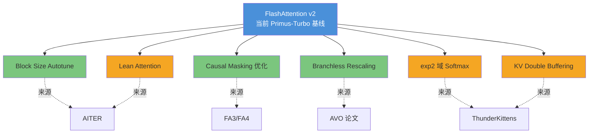
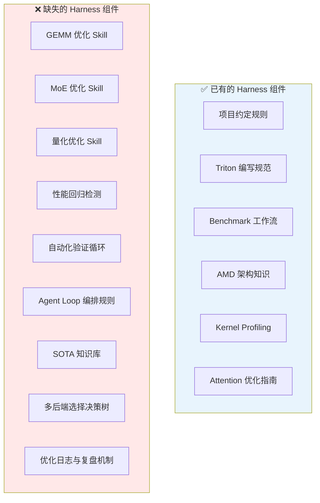
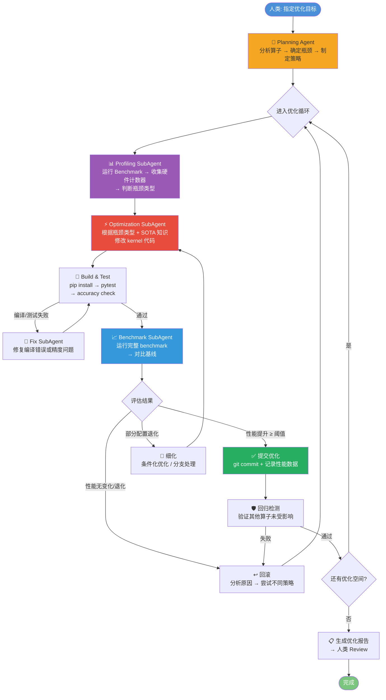
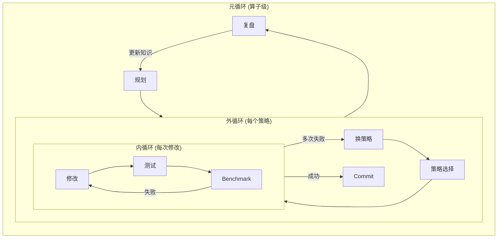
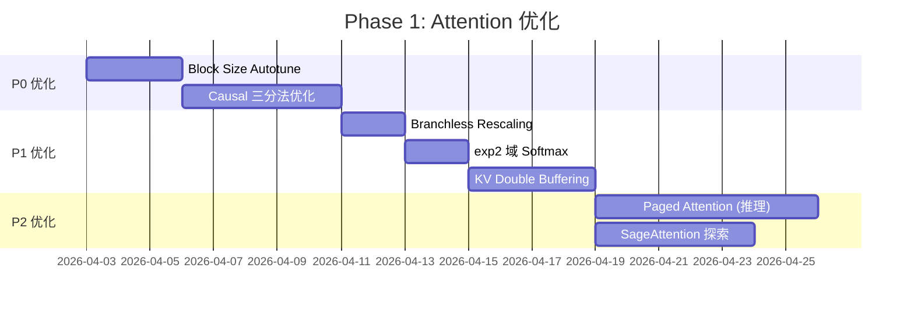
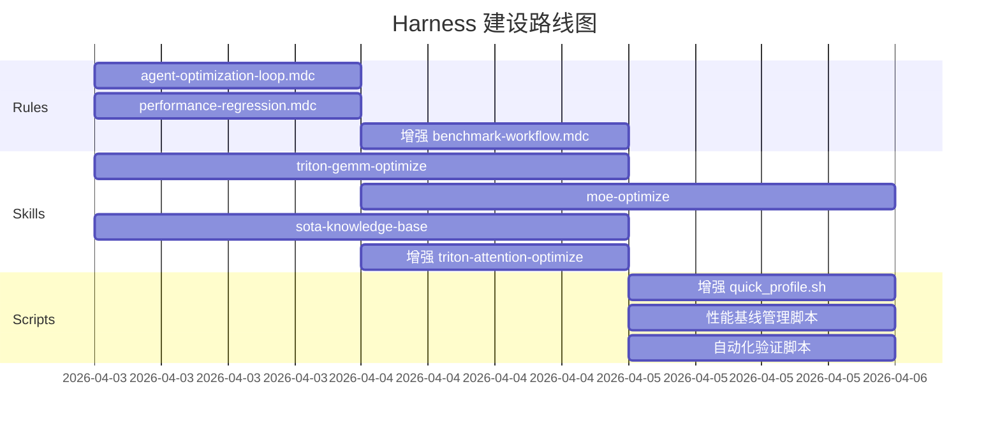

# Primus-Turbo Agent-Driven 算子优化总体计划

> **版本**: v0.1-draft  
> **日期**: 2026-04-02  
> **状态**: 待 Review

---

## 目录

1. [现状评估](#1-现状评估)
2. [参考 SOTA 技术总结](#2-参考-sota-技术总结)
3. [现有 Harness 缺口分析](#3-现有-harness-缺口分析)
4. [Agent Loop 优化架构设计](#4-agent-loop-优化架构设计)
5. [算子优化路线图](#5-算子优化路线图)
6. [Harness 建设计划](#6-harness-建设计划)
7. [验证与质量保障](#7-验证与质量保障)
8. [风险与缓解措施](#8-风险与缓解措施)

---

## 1. 现状评估

### 1.1 代码库算子覆盖

```
primus_turbo/
├── triton/                     # Triton kernel 实现
│   ├── attention/              # FlashAttention v2 (~1700行)
│   ├── gemm/                   # GEMM BF16 + FP8
│   ├── grouped_gemm/           # Grouped GEMM BF16 + FP8
│   ├── moe/                    # MoE routing/permutation
│   ├── activation/             # SwiGLU, GeGLU
│   ├── quantization/           # blockwise, MXFP4, MXFP8
│   ├── reduce/                 # reduction ops
│   └── async_tp/               # GEMM+ReduceScatter
├── pytorch/kernels/            # PyTorch 封装层
└── pytorch/ops/                # 高级 API 层

csrc/kernels/                   # HIP C++ kernel
├── gemm/                       # CK + hipBLASLt GEMM
├── grouped_gemm/               # CK + hipBLASLt Grouped GEMM
├── normalization/              # RMSNorm/LayerNorm
├── quantization/               # HIP 量化
├── reduce/                     # HIP reduction
└── deep_ep/                    # Expert Parallel 通信
```

### 1.2 算子矩阵（当前状态）

| 算子类别 | Triton | CK/HIP | hipBLASLt | Benchmark | 单元测试 | 精度测试 |
|----------|--------|--------|-----------|-----------|----------|----------|
| **Attention** (FWD+BWD) | ✅ | ❌ | - | ✅ | ✅ | ✅ |
| **GEMM BF16** | ✅ | ✅ | ✅ | ✅ | ✅ | ✅ |
| **GEMM FP8** | ✅ | ✅ | ✅ | ✅ | ✅ | ✅ |
| **GEMM FP4** | ✅ | ❌ | ❌ | ❌ | ✅ | ❌ |
| **Grouped GEMM BF16** | ✅ | ✅ | ✅ | ✅ | ✅ | ❌ |
| **Grouped GEMM FP8** | ✅ | ✅ | ❌ | ✅ | ✅ | ❌ |
| **MoE Router** | ✅ | - | - | ❌ | ✅ | ❌ |
| **MoE Dispatch/Combine** | ✅ | - | - | ❌ | ✅ | ❌ |
| **Activation (SwiGLU/GeGLU)** | ✅ | - | - | ❌ | ✅ | ❌ |
| **Normalization** | - | ✅ | - | ❌ | ✅ | ❌ |
| **Quantization** | ✅ | ✅ | - | ❌ | ✅ | ❌ |
| **Reduce** | ✅ | ✅ | - | ❌ | ❌ | ❌ |
| **Async TP** | ✅ | - | - | ❌ | ✅ | ❌ |

### 1.3 现有 .cursor Harness 覆盖

| 文件 | 类型 | 覆盖范围 | 评估 |
|------|------|----------|------|
| `rules/project-conventions.mdc` | Rule (always) | 项目总体约定 | ⚠️ 偏简略，缺少自动化反馈循环 |
| `rules/triton-kernel-patterns.mdc` | Rule (globs) | Triton 编写规范 | ✅ 优化优先级分层明确 |
| `rules/benchmark-workflow.mdc` | Rule (globs) | Benchmark 工作流 | ⚠️ 缺少性能回归检测机制 |
| `skills/amd-gpu-architecture/` | Skill | AMD 硬件知识 | ✅ MI300X/MI350X 覆盖完整 |
| `skills/kernel-profiling/` | Skill | Profiling 工作流 | ⚠️ 脚本功能偏弱 |
| `skills/triton-attention-optimize/` | Skill | Attention 优化 | ✅ 但缺少 SOTA 技术参考 |

---

## 2. 参考 SOTA 技术总结

基于对 7 个参考项目的深度分析，以下是可直接应用于 Primus-Turbo 的关键技术：

### 2.1 Attention 优化 SOTA



| 技术 | 来源 | 预估收益 | 难度 | 优先级 |
|------|------|----------|------|--------|
| **Block Size Autotune** (M/N ∈ {32,64,128}) | AITER/Triton | 10-30% | 低 | P0 |
| **Causal 三分法** (skip/full/partial) | FA3/FA4 | 15-25% (causal) | 中 | P0 |
| **Branchless Rescaling** | AVO 论文 | 5-10% (non-causal) | 低 | P1 |
| **exp2 域 Softmax** ($\text{scale} \times \log_2 e$) | ThunderKittens | 3-8% | 低 | P1 |
| **KV Double Buffering** | ThunderKittens/FA3 | 5-15% | 中 | P1 |
| **Lean Attention (Stream-K)** | AITER | 10-20% (decode) | 高 | P2 |
| **SageAttention (INT8 Q/K)** | AITER/fav3_sage | 20-40% | 高 | P2 |
| **Paged Attention** | vLLM/AITER | 必需 (推理) | 高 | P2 |

### 2.2 GEMM 优化 SOTA

| 技术 | 来源 | 适用场景 | 预估收益 | 优先级 |
|------|------|----------|----------|--------|
| **M-bucketed Config** (按 M 值分段选配置) | AITER | 所有 GEMM | 10-30% | P0 |
| **Split-K** (并行 K 维度归约) | AITER/Triton | 窄 M (decode) | 15-40% | P0 |
| **XCD Swizzle** (8 XCD 均匀调度) | AITER | MI300X | 5-15% | P1 |
| **Persistent Kernel** (Super-M 行调度) | ThunderKittens/Triton | 大矩阵 | 5-15% | P1 |
| **Block-Scale FP8** (blockwise 量化) | AITER/vLLM | FP8 GEMM | 10-20% | P1 |
| **Preshuffle Weight Layout** | AITER/CK | MFMA 友好 | 5-10% | P2 |

### 2.3 MoE 优化 SOTA

| 技术 | 来源 | 预估收益 | 优先级 |
|------|------|----------|--------|
| **Fused MoE E2E** (routing → GEMM → combine 融合) | vLLM/AITER | 20-50% | P0 |
| **2-Stage vs 1-Stage** 自动选择 | AITER/CK | 10-20% | P1 |
| **Gate-Up Fused (G1U1)** | AITER | 10-15% | P1 |
| **GEMM+Comm Overlap** (via Iris/DeepEP) | AITER | Scale 场景 | P2 |

### 2.4 其他算子 SOTA

| 技术 | 来源 | 算子 | 优先级 |
|------|------|------|--------|
| **Fused RMSNorm + Residual Add** | Liger-Kernel | Normalization | P1 |
| **Chunked Linear + CE** (分块 LM Head) | Liger-Kernel | Loss 计算 | P2 |
| **In-place Logit Gradients** | Liger-Kernel | CE Backward | P2 |
| **Online Softmax CE** | Liger-Kernel | Cross Entropy | P2 |
| **HIP-specific num_warps** (16 vs 32) | Liger-Kernel/vLLM | 所有 Triton | P0 |
| **int64 索引** (防 int32 溢出) | AITER/Liger | 长序列 | P1 |

---

## 3. 现有 Harness 缺口分析

### 3.1 缺口总览



### 3.2 缺口详细分析

#### 缺口 1: 缺少算子级优化 Skill（GEMM/MoE/量化）

**现状**: 只有 Attention 有专门的优化 Skill，其他核心算子（GEMM、MoE、量化）没有。  
**影响**: Agent 在优化非 Attention 算子时缺乏结构化指导。  
**建议**: 创建 `skills/triton-gemm-optimize/`、`skills/moe-optimize/`、`skills/quantization-optimize/`。

#### 缺口 2: 缺少性能回归检测

**现状**: `benchmark-workflow.mdc` 描述了如何运行 benchmark，但没有自动化的性能基线对比机制。  
**影响**: 优化可能引入其他配置的性能回退而不被察觉。  
**建议**: 建立 `performance_baselines.json` + 自动化对比脚本。

#### 缺口 3: 缺少 Agent Loop 编排规则

**现状**: 没有描述"Agent 如何系统地优化一个算子"的规则或流程。  
**影响**: Agent 行为不可预测，可能跳步骤或遗漏验证。  
**建议**: 创建 `rules/agent-optimization-loop.mdc` 定义标准流程。

#### 缺口 4: 缺少 SOTA 知识库

**现状**: 参考技术分散在外部仓库中，Agent 无法直接访问。  
**影响**: Agent 优化时缺乏行业最佳实践的指导。  
**建议**: 将本文档的 SOTA 技术总结纳入 Skill 文件。

#### 缺口 5: 缺少多后端决策树

**现状**: `amd-gpu-architecture` Skill 中有简单的后端选择指南，但不够精细。  
**影响**: Agent 可能在不合适的场景使用错误的后端。  
**建议**: 建立基于 shape、dtype、场景的后端自动选择规则。

#### 缺口 6: 缺少优化日志与复盘机制

**现状**: 规则中提到"每次有效优化必须 git commit 并记录性能数据"，但没有标准化格式。  
**影响**: 历史优化经验无法被 Agent 复用。  
**建议**: 创建标准化的优化日志格式和知识积累机制。

---

## 4. Agent Loop 优化架构设计

### 4.1 核心理念

借鉴 **Harness Engineering** 的三大支柱，设计以 Agent 为执行者、以 Harness 为控制面的优化系统：

$$
\text{OptimizationSystem} = \underbrace{\text{ContextEng}}_{\text{SOTA 知识 + 代码库理解}} + \underbrace{\text{ArchConstraints}}_{\text{规则 + 验证}} + \underbrace{\text{EntropyMgmt}}_{\text{回归检测 + 复盘}}
$$

### 4.2 Agent Loop 总体架构



### 4.3 SubAgent 定义

#### SubAgent 1: Planning Agent（规划 Agent）

**职责**: 分析目标算子，确定优化策略和优先级  
**输入**: 算子名称、当前 benchmark 数据、硬件目标  
**输出**: 优化策略列表（按优先级排序）  
**工具**: 代码阅读、SOTA 知识库查询、Profiling 数据分析  

```
Planning Agent 决策流程:
1. 阅读目标 kernel 源码，理解当前实现
2. 运行基线 benchmark，获取性能数据
3. 与理论峰值对比，计算效率缺口
4. 查阅 SOTA 知识库，匹配适用技术
5. 输出: 优先级排序的优化策略列表
```

#### SubAgent 2: Profiling Agent（性能分析 Agent）

**职责**: 深入分析 kernel 性能瓶颈  
**输入**: 目标 kernel、benchmark 配置  
**输出**: 瓶颈诊断报告（计算/内存/延迟受限）  
**工具**: rocprof、omniperf、PyTorch Profiler  

#### SubAgent 3: Optimization Agent（优化执行 Agent）

**职责**: 根据策略修改 kernel 代码  
**输入**: 优化策略、目标 kernel 文件、SOTA 参考  
**输出**: 修改后的 kernel 代码  
**工具**: 代码编辑、Triton/HIP 编写规范  
**约束**: 
- 每次只做一个优化点（原子性修改）
- 修改前必须理解现有代码逻辑
- 保持代码可读性

#### SubAgent 4: Verification Agent（验证 Agent）

**职责**: 编译、测试、benchmark 完整验证  
**输入**: 修改后的代码  
**输出**: 验证报告（编译状态、精度、性能）  
**工具**: pip install、pytest、benchmark scripts  
**标准**:
- BF16: `atol=1e-2, rtol=1e-2`
- FP8: `atol=1e-1, rtol=1e-1`
- 性能: geomean 提升 ≥ 2% 视为有效

### 4.4 反馈循环设计



**关键阈值**:
- 内循环最大迭代: **5 次**（修改→测试→benchmark 失败 5 次后换策略）
- 外循环最大策略: **3 个**（尝试 3 个策略无效后暂停，请人类 review）
- 元循环: **无限制**（持续优化直到达到理论峰值 80% 或人类满意）

---

## 5. 算子优化路线图

### 5.1 Phase 1: Attention 优化（高优先级）

当前 Attention 是最关键的算子，也是已有 Skill 支持的算子。



**具体优化项**:

| 序号 | 优化项 | 修改文件 | 验证方式 | 预期收益 |
|------|--------|----------|----------|----------|
| A1 | BLOCK_M/N autotune | `attention_kernel.py` | bench + accuracy | 10-30% |
| A2 | Causal skip fully-masked blocks | `attention_kernel.py` | bench (causal) | 15-25% |
| A3 | Causal 三级分支 (skip/noMask/fullMask) | `attention_kernel.py` | bench (causal) | 额外 5-10% |
| A4 | Branchless rescaling (AVO) | `attention_kernel.py` | bench (non-causal) | 5-10% |
| A5 | exp2 softmax ($s \cdot \log_2 e$) | `attention_kernel.py` | accuracy + bench | 3-8% |
| A6 | KV 双缓冲 prefetch | `attention_kernel.py` | bench | 5-15% |
| A7 | Paged Attention (decode 推理) | 新文件 | bench + 新测试 | 推理必需 |

### 5.2 Phase 2: GEMM 优化

GEMM 覆盖三个后端（Triton/CK/hipBLASLt），需要 shape-aware 的策略：

| 序号 | 优化项 | 适用后端 | 预期收益 |
|------|--------|----------|----------|
| G1 | M-bucketed 配置选择 | Triton | 10-30% |
| G2 | Split-K (小 M decode 场景) | Triton | 15-40% |
| G3 | XCD Swizzle (MI300X 8 XCD) | Triton | 5-15% |
| G4 | Persistent kernel | Triton | 5-15% |
| G5 | Block-scale FP8 量化 GEMM | Triton/CK | 10-20% |
| G6 | hipBLASLt 配置搜索空间扩展 | hipBLASLt | 5-15% |

### 5.3 Phase 3: MoE 优化

MoE 是 DeepSeek/Mixtral 等模型的关键路径：

| 序号 | 优化项 | 预期收益 |
|------|--------|----------|
| M1 | Fused MoE E2E kernel (routing → GEMM → combine) | 20-50% |
| M2 | 2-stage vs 1-stage 自动选择 | 10-20% |
| M3 | Gate-Up Fused (G1U1) GEMM | 10-15% |
| M4 | MoE Dispatch/Combine Triton kernel 优化 | 10-20% |

### 5.4 Phase 4: 辅助算子优化

| 序号 | 优化项 | 算子 | 预期收益 |
|------|--------|------|----------|
| H1 | Fused RMSNorm + Residual Add | Normalization | 15-25% |
| H2 | SwiGLU/GeGLU 向量化优化 | Activation | 5-10% |
| H3 | Blockwise 量化 kernel 融合 | Quantization | 10-20% |
| H4 | FP4 GEMM (MI350X MXFP4) | GEMM | 新能力 |

### 5.5 优先级决策矩阵

```
               高收益
                 ↑
    P0:          │  A1(Attn Autotune)
    立即执行      │  A2(Causal Skip)    M1(Fused MoE)
                 │  G1(M-bucket)       G2(Split-K)
                 │
    ─────────────┼──────────────────────── → 高难度
                 │
    P1:          │  A4(Branchless)  A5(exp2)
    短期执行      │  G3(XCD)  G4(Persistent)
                 │  H1(Fused RMSNorm)  M2(2-stage)
                 │
    P2:          │  A7(Paged Attn)  A8(SageAttn)
    中期探索      │  H4(FP4 GEMM)  M4(MoE+Comm)
                 │
```

---

## 6. Harness 建设计划

### 6.1 需要新建的规则文件

#### 6.1.1 `rules/agent-optimization-loop.mdc`

定义 Agent 优化的标准闭环流程：

```yaml
---
description: Agent 驱动的算子优化标准流程
alwaysApply: true
---

# Agent 优化循环规则

## 标准流程（必须严格遵循）
1. **Profile**: 运行基线 benchmark + profiling
2. **Analyze**: 判断瓶颈类型（计算/内存/延迟）
3. **Plan**: 选择优化策略（查阅 SOTA 知识库）
4. **Implement**: 原子性修改（每次只改一个优化点）
5. **Verify**: 编译 → 精度测试 → 性能 benchmark
6. **Decide**: 
   - 提升 ≥2%（geomean）→ commit + 记录
   - 无变化 → 回滚 + 分析原因
   - 部分退化 → 条件化处理
7. **Iterate**: 回到步骤 1

## 禁止行为
- 跳过精度验证直接 commit
- 一次修改多个独立优化点
- 不运行完整 benchmark 就声称"性能提升"
- 修改后不重新编译
```

#### 6.1.2 `rules/performance-regression.mdc`

```yaml
---
description: 性能回归检测规则
globs: "benchmark/**/*.py,primus_turbo/**/*.py"
alwaysApply: false
---

# 性能回归检测

## 基线管理
- 每次成功优化后更新 benchmark/baselines/
- 基线格式: JSON，包含 kernel/config/mean_ms/std_ms/gpu/date
- 回归阈值: geomean 下降 > 2% 视为回归

## 回归检测流程
1. 修改后运行完整 benchmark suite
2. 与基线对比每个配置
3. 任何配置退化 > 5% 需要解释
4. geomean 退化 > 2% 必须修复或回滚
```

### 6.2 需要新建的 Skill 文件

#### 6.2.1 `skills/triton-gemm-optimize/SKILL.md`

覆盖内容：
- GEMM 核心文件映射
- M-bucketed 配置策略（来源: AITER）
- Split-K 实现指南
- XCD Swizzle 原理与实现
- Persistent kernel 设计
- 各 shape 区间的后端选择建议

#### 6.2.2 `skills/moe-optimize/SKILL.md`

覆盖内容：
- MoE 完整数据流（routing → dispatch → GEMM → combine）
- Fused MoE E2E 参考实现（来源: vLLM/AITER）
- 2-stage vs 1-stage 选择逻辑
- Token permutation 优化
- Expert Parallel 通信策略

#### 6.2.3 `skills/sota-knowledge-base/SKILL.md`

覆盖内容：
- 本文档第 2 节的所有 SOTA 技术
- 每个技术的参考代码路径
- 适用性分析和预估收益
- AMD GPU 特化注意事项

### 6.3 需要增强的现有文件

#### 6.3.1 增强 `skills/triton-attention-optimize/SKILL.md`

- 加入 AITER FA2/FA3 AMD 移植参考
- 加入 ThunderKittens exp2 softmax 技术
- 加入 AVO branchless rescaling
- 加入 Lean Attention (Stream-K) 参考
- 加入 Paged Attention 推理路径

#### 6.3.2 增强 `skills/kernel-profiling/scripts/quick_profile.sh`

- 添加 omniperf 集成
- 添加瓶颈自动判断逻辑
- 输出结构化 JSON 供 Agent 解析

#### 6.3.3 增强 `rules/benchmark-workflow.mdc`

- 添加性能基线对比步骤
- 添加回归检测步骤
- 添加标准化输出格式

### 6.4 Harness 建设路线图



---

## 7. 验证与质量保障

### 7.1 三级验证体系

```
Level 1: 快速验证（每次修改后，~2 分钟）
├── 编译通过: pip3 install --no-build-isolation -e . -v
├── 精度通过: pytest tests/pytorch/ops/test_<target>.py
└── 快速 benchmark: 关键配置子集

Level 2: 完整验证（每个优化 commit 前，~10 分钟）
├── 完整精度测试: benchmark/accuracy/eval_*_accuracy.py
├── 完整 benchmark: benchmark/ops/bench_*_turbo.py
└── 性能基线对比: 确认 geomean 提升

Level 3: 回归验证（每个 Phase 完成后，~30 分钟）
├── 全算子 benchmark suite: run_suite.py
├── 交叉影响检测: 其他算子未退化
├── 端到端预训练测试: pretrain benchmark
└── 生成优化报告
```

### 7.2 性能基线格式

```json
{
  "operator": "attention",
  "gpu": "MI300X",
  "rocm_version": "6.x.x",
  "date": "2026-04-02",
  "configs": [
    {
      "batch": 2, "seq_len": 4096, "heads": 32, "head_dim": 128,
      "dtype": "bf16", "causal": true,
      "mean_ms": 1.234, "std_ms": 0.012,
      "backend": "triton"
    }
  ],
  "geomean_ms": 1.100,
  "baseline_tag": "v0.1.0"
}
```

### 7.3 优化日志格式

每次有效优化 commit 时，在 `docs/optimization-log.md` 中追加：

```markdown
## [日期] Attention: Block Size Autotune

**修改**: attention_kernel.py - 添加 BLOCK_M/N autotune 支持
**策略**: 启用 triton.autotune，搜索 {32, 64, 128} 的 M/N 组合
**瓶颈类型**: 计算受限 (MFMA utilization 偏低)
**结果**:
- geomean 提升: +15.2%
- 最佳配置: seq_len=4096, BLOCK_M=128, BLOCK_N=64
- 最差配置: seq_len=512, 无显著变化
**Commit**: abc1234
**参考**: AITER attention autotune, Triton AMD backend
```

---

## 8. 风险与缓解措施

### 8.1 风险矩阵

| 风险 | 概率 | 影响 | 缓解 |
|------|------|------|------|
| Triton 编译器 bug (AMD 后端) | 中 | 高 | 保留 CK/hipBLASLt fallback |
| 精度问题 (FP8/低精度) | 高 | 中 | 严格精度验证 + 逐步降精度 |
| 过度优化导致代码可维护性下降 | 中 | 中 | 每次修改保持原子性 + 代码审查 |
| Agent 陷入无效优化循环 | 中 | 低 | 设置最大迭代次数 + 人类断点 |
| 性能回归未被检测 | 低 | 高 | 完整 benchmark + 基线对比 |
| ROCm/Triton 版本升级导致不兼容 | 低 | 高 | 记录版本依赖 + CI 测试 |

### 8.2 人机协作断点

以下场景需要 **暂停 Agent Loop，等待人类 Review**：

1. **新算子实现**: 创建全新的 kernel 文件（如 Paged Attention）
2. **架构级修改**: 修改 kernel 的核心算法流程
3. **精度容忍度调整**: 需要放宽精度标准时
4. **连续 3 次优化无效**: Agent 可能需要新的方向指引
5. **性能异常**: geomean 提升超过 50%（可能是测量问题）

### 8.3 KernelBench 式验证思路

借鉴 KernelBench 的方法论：
- **多试次验证**: 每个配置运行至少 3 次取平均
- **L2 冷缓存**: benchmark 前清空 L2 cache
- **异常检测**: 超过 10x 加速视为可疑，需人工确认
- **静态检查**: 确保 kernel 没有 fallback 到 PyTorch 默认实现

---

## 附录 A: 参考项目速查

| 项目 | 路径 | 核心价值 |
|------|------|----------|
| AITER | `ref/OP_optimize/aiter` | AMD 官方高性能算子库，多后端 (Triton/CK/ASM) |
| FlashAttention | `ref/OP_optimize/flash-attention` | FA2/FA3/FA4 算法演进，Hopper 特化技术 |
| ThunderKittens | `ref/OP_optimize/ThunderKittens` | Tile-based 编程模型，exp2 softmax，KV 流水线 |
| Liger-Kernel | `ref/OP_optimize/Liger-Kernel` | Triton 训练算子库，kernel 融合，HIP 适配 |
| KernelBench | `ref/OP_optimize/KernelBench` | Kernel 性能评估框架，Agent 驱动优化评估 |
| Triton | `ref/OP_optimize/triton` | AMD 后端编译器优化 Pass，调度提示 |
| vLLM | `ref/OP_optimize/vllm` | 推理服务，多注意力后端，Fused MoE |
| SGLang | `ref/OP_optimize/sglang` | 推理服务，Triton decode attention |

## 附录 B: 关键算法参考

### B.1 Online Softmax (FlashAttention 核心)

$$
\begin{aligned}
m_{\text{new}} &= \max(m_i, \max_j(S_{ij})) \\
P_{ij} &= \exp(S_{ij} - m_{\text{new}}) \\
l_{\text{new}} &= e^{m_i - m_{\text{new}}} \cdot l_i + \sum_j P_{ij} \\
O_i &= e^{m_i - m_{\text{new}}} \cdot O_i + P_{ij} \cdot V_j \\
O_{\text{final}} &= O_i / l_i
\end{aligned}
$$

### B.2 exp2 域 Softmax (ThunderKittens 优化)

$$
\text{scale}_{\log_2} = \frac{1}{\sqrt{d}} \cdot \log_2 e
$$

用 $\text{exp2}$ 替代 $\exp$：
$$
\exp(x - m) = 2^{(x - m) \cdot \log_2 e} = \text{exp2}((x - m) \cdot \log_2 e)
$$

预乘 scale 后：
$$
S_{ij} = Q_i \cdot K_j^T \cdot \text{scale}_{\log_2}
$$

可直接用 $\text{exp2}(S_{ij} - m \cdot \text{scale}_{\log_2})$，避免额外乘法。

### B.3 Arithmetic Intensity (Roofline 分析)

$$
\text{AI} = \frac{\text{FLOPs}}{\text{Bytes}} \quad\quad
\text{AI}_{\text{balance}} = \frac{\text{Peak TFLOPS}}{\text{Peak BW (TB/s)}}
$$

MI300X BF16:
$$
\text{AI}_{\text{balance}} = \frac{1307.4}{5.3} \approx 247 \text{ FLOP/Byte}
$$

- $\text{AI} < 247$: 内存受限 → 优化内存访问
- $\text{AI} > 247$: 计算受限 → 优化 MFMA 利用率

---

> **下一步**: 请 Review 此计划，确认后将按以下顺序执行：
> 1. 建设 Harness（规则 + Skill 文件）
> 2. 建立性能基线
> 3. 按 Phase 1 → 4 顺序开始算子优化
