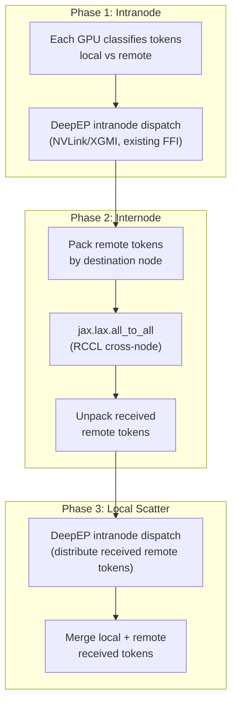

# RCCL Two-Phase Internode DeepEP for JAX

## Background

The current JAX DeepEP only supports intranode communication (up to 8 GPUs on one node). Cross-node (internode) communication is blocked by:

1. Hardcoded assertions: `assert num_ranks <= 8, "not support internode"` in multiple Python files
2. `num_rdma_bytes = 0` in C++ FFI layer
3. No rocSHMEM initialization in JAX path
4. `g_buffer_pool` uses in-process shared memory (only works within one node)

The rocSHMEM library requires 1-process-per-GPU, which conflicts with MaxText's 1-process-per-node JAX deployment. Instead, we use RCCL (via `jax.lax` collectives) for cross-node communication.

## Architecture: Two-Phase Dispatch/Combine




**Key design decisions:**

- 2D mesh: `jax.make_mesh((num_nodes, gpus_per_node), ("node", "gpu"))` -- `"gpu"` axis for intranode (DeepEP FFI), `"node"` axis for internode (`jax.lax.all_to_all`)
- Fixed-size padding for `all_to_all` (RCCL requires uniform sizes); exchange actual counts separately
- C++ FFI layer unchanged -- it continues to handle local rank 0-7 via `hipGetDevice()`/`hipGetDeviceCount()`

## Files to Modify

### 1. Remove intranode-only assertions

- `[primus_turbo/jax/lax/moe/moe_dispatch_combine.py](primus_turbo/jax/lax/moe/moe_dispatch_combine.py)` lines 51, 76: Remove `assert num_ranks <= 8`
- `[primus_turbo/jax/primitive/moe/moe_dispatch.py](primus_turbo/jax/primitive/moe/moe_dispatch.py)` lines 65, 119: Remove `assert num_ranks <= 8`

### 2. Add internode routing utilities

New file or section in `[primus_turbo/jax/lax/moe/moe_utils.py](primus_turbo/jax/lax/moe/moe_utils.py)`:

```python
def split_routing(topk_idx, num_experts, num_local_gpus, num_nodes):
    """Split token routing into intranode and internode components.
    
    Returns:
        local_topk_idx: expert indices remapped to local range [0, num_local_experts)
                        with -1 for tokens going to remote nodes
        remote_dest_node: [num_tokens, num_topk] destination node for each selection
        remote_mask: boolean mask for tokens with remote destinations
    """
    experts_per_gpu = num_experts // (num_local_gpus * num_nodes)
    dest_global_gpu = topk_idx // experts_per_gpu
    dest_node = dest_global_gpu // num_local_gpus
    dest_local_gpu = dest_global_gpu % num_local_gpus
    # ...
```

### 3. Add internode dispatch in Python

In `[primus_turbo/jax/lax/moe/moe_dispatch_combine.py](primus_turbo/jax/lax/moe/moe_dispatch_combine.py)`, add new function:

```python
def _moe_dispatch_internode(x, topk_idx, topk_weights, num_experts, 
                            num_local_gpus, num_nodes, config):
    """Two-phase internode dispatch.
    
    Phase 1: Intranode -- use existing moe_dispatch_p for local expert tokens
    Phase 2: Internode -- jax.lax.all_to_all("node") for remote tokens
    Phase 3: Local scatter -- intranode dispatch of received remote tokens
    """
    # 1. Split routing
    local_topk_idx, remote_info = split_routing(topk_idx, ...)
    
    # 2. Phase 1: existing intranode dispatch for local tokens
    local_recv_x, ... = moe_dispatch_p.bind(x, ..., local_topk_idx, ...)
    
    # 3. Phase 2: pack + all_to_all for remote tokens
    max_remote_per_node = estimate_worst_case(num_tokens, num_nodes)
    send_buf = pack_tokens_by_node(x, remote_info, max_remote_per_node)
    send_counts = count_tokens_per_node(remote_info)
    
    recv_buf = jax.lax.all_to_all(send_buf, "node", split_axis=0, concat_axis=0)
    recv_counts = jax.lax.all_to_all(send_counts, "node", split_axis=0, concat_axis=0)
    
    # 4. Phase 3: intranode scatter of received remote tokens  
    remote_recv_x = unpack_and_scatter(recv_buf, recv_counts)
    
    # 5. Merge
    recv_x = merge(local_recv_x, remote_recv_x)
    return recv_x, recv_topk_idx, recv_topk_weights, handle
```

### 4. Update top-level `moe_dispatch` / `moe_combine`

In `[primus_turbo/jax/lax/moe/moe_dispatch_combine.py](primus_turbo/jax/lax/moe/moe_dispatch_combine.py)`:

```python
def moe_dispatch(x, handle=None, topk_idx=None, topk_weights=None,
                 expert_alignment=1, num_experts=None, config=None):
    num_local_gpus = jax.local_device_count()
    num_total_gpus = jax.device_count()
    
    if num_total_gpus > num_local_gpus:
        # Multi-node: two-phase dispatch
        return _moe_dispatch_internode(x, topk_idx, topk_weights, 
                                       num_experts, num_local_gpus, 
                                       num_total_gpus // num_local_gpus, config)
    else:
        # Single-node: existing intranode dispatch
        return _moe_dispatch(x, handle, topk_idx, topk_weights, ...)
```

### 5. Add internode combine (reverse of dispatch)

Mirror of internode dispatch:

1. Split received tokens into "came from local" vs "came from remote"
2. Intranode combine for local portion
3. Intranode gather + `all_to_all("node")` for remote portion
4. Sum contributions

### 6. Gradient support (custom_vjp)

The existing `custom_vjp` structure already defines dispatch_bwd = combine and combine_bwd = dispatch. For internode:

- `_moe_dispatch_internode` needs its own `custom_vjp` where backward = internode combine
- `_moe_combine_internode` needs its own `custom_vjp` where backward = internode dispatch
- The internode handle must store enough routing metadata for the reverse pass

### 7. Add internode configs

In `[primus_turbo/jax/lax/moe/moe_dispatch_combine.py](primus_turbo/jax/lax/moe/moe_dispatch_combine.py)`:

```python
def get_dispatch_config(num_total_ranks=None, num_local_ranks=None):
    """Extended config that supports internode settings."""
    if num_total_ranks is None:
        num_total_ranks = jax.device_count()
    if num_local_ranks is None:
        num_local_ranks = jax.local_device_count()
    
    intranode_config = _intranode_config_map[num_local_ranks]
    if num_total_ranks > num_local_ranks:
        return InternodeConfig(
            intranode=intranode_config,
            max_remote_tokens_per_node=...,  # tunable
        )
    return intranode_config
```

### 8. Test with 2D mesh

Update `[tests/jax/lax/test_dispatch_combine.py](tests/jax/lax/test_dispatch_combine.py)`:

```python
# Multi-node test (requires >= 2 nodes or simulated with axis_index_groups)
num_local = jax.local_device_count()
num_total = jax.device_count()
if num_total > num_local:
    mesh_2d = jax.make_mesh(
        (num_total // num_local, num_local), ("node", "gpu"),
        axis_types=(jax.sharding.AxisType.Explicit, jax.sharding.AxisType.Explicit))
    
    @jax.shard_map(mesh=mesh_2d, 
                   in_specs=PartitionSpec(("node", "gpu")),
                   out_specs=PartitionSpec(("node", "gpu")))
    def test_internode(x, scores, topk_weights):
        ...
```

## What stays unchanged

- **All C++ code** (`[csrc/jax/deep_ep/deep_ep.cpp](csrc/jax/deep_ep/deep_ep.cpp)`, `[csrc/jax/deep_ep/handler.cpp](csrc/jax/deep_ep/handler.cpp)`, `[csrc/jax/deep_ep/deep_ep.h](csrc/jax/deep_ep/deep_ep.h)`): The FFI handlers continue to use `hipGetDevice()`/`hipGetDeviceCount()` for local rank/count, which is correct for intranode operations
- **Kernel code** (`[csrc/kernels/deep_ep/intranode.cu](csrc/kernels/deep_ep/intranode.cu)`): No changes needed
- **Build system**: No new C++ dependencies; RCCL is already available through JAX's runtime

## Performance Considerations

- **Bandwidth overhead**: `all_to_all` uses padded fixed-size buffers, wasting some bandwidth on padding. Typical MoE routing has ~12.5% of tokens per destination rank (with 8 ranks), so worst-case padding is moderate.
- **Latency**: Two-phase adds a serialization point between intranode and internode phases. The PyTorch rocSHMEM approach pipelines these, so this will be slower for latency-sensitive workloads.
- **Optimization path**: If benchmark shows cross-node latency is insufficient, the next step is switching to 1-process-per-GPU deployment with full rocSHMEM integration (matching PyTorch behavior).

