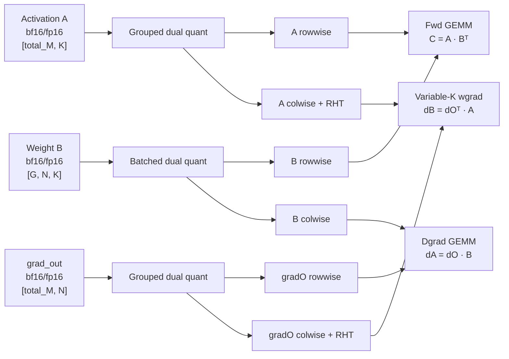

# MXFP4 Quant、GEAK stacked Quant 与 K256 紧凑 wgrad 优化在 Primus-Turbo PR #460 上的验证报告

## 结论

本报告覆盖三套必须按 exact source boundary 分开解读的证据：最初移植到
Primus-Turbo PR #460（下文简称 `primus-460`）的两项 Quant-only 优化、随后加入当前
branch 的 K256 wgrad producer/consumer 原子合约，以及 2026-08-19 新归档的 GEAK
stacked grouped-Quant winner。kernel-bearing commit `84b61690` 已将三者合入同一 source
snapshot；其后的提交只更新报告，kernel code 完全相同。

两项 Quant-only 优化在相同 PR #460 GEMM、相同 routing、相同进程和交替配对计时
条件下，三次独立 full-op session 的等权汇总结果为：

| 指标 | primus-460 原生 Quant | 优化后 Quant | 加速比 | 性能提升 |
|---|---:|---:|---:|---:|
| Quant | 3.293491 ms | 2.552228 ms | **1.290438x** | **+29.0438%** |
| Full-op | 8.312024 ms | 7.574293 ms | **1.097399x** | **+9.7399%** |

这里的“性能提升”定义为 `(baseline_latency / candidate_latency - 1) * 100%`。对应的延迟下降分别为 22.5070%（Quant）和 8.8755%（full-op）。

结论是：**Quant 优化在 primus-460 上仍然明确有效**。三次独立 session 的 full-op 加速均为 1.0932x～1.1019x，95% bootstrap CI 下界均大于 1，同 session A/A 噪声门限也全部通过。Fwd、dgrad、wgrad 三个 GEMM phase 汇总均在 ±0.12% 内，且两臂 GEMM 文件 SHA256 完全相同，因此该轮 full-op 收益可归因于 Quant 优化，而不是 GEMM 配置或实现差异。

K256-only 候选在 primus-460 上的另一组三 session 正式复测结果为：

| 指标 | K256-only 加速比 | 性能提升 |
|---|---:|---:|
| Quant collateral benefit | **1.045990x** | **+4.5990%** |
| Wgrad | **1.016496x** | **+1.6496%** |
| 六 GEMM aggregate | **1.005547x** | **+0.5547%** |
| Full-op | **1.020800x** | **+2.0800%** |

K256 的三个 full-op session 为 `1.021137x / 1.020317x / 1.020949x`，全部通过
CI、MDE99、route floor、correctness、zero fallback、cache 和 selector gate。

新归档的 GEAK stacked grouped-Quant candidate 在 48 个 route×shape case 上给出：

| 聚合指标 | 加速比 | 性能提升 |
|---|---:|---:|
| Workload-aligned time-weighted ratio-of-sums | **1.0206x** | **+2.06%** |
| Unweighted geomean | **1.02158x** | **+2.158%** |
| Arithmetic mean | **1.02164x** | **+2.164%** |

该数字是原始 GEAK **grouped Quant kernel-only** 结果，baseline geomean latency 为
`3.7122 ms`，优化后约为 `3.634 ms`。它来自 BM=128、仍使用 512-aligned colwise padding
的旧 Quant-only source boundary，不包含 K256。

将相同 GEAK patch 合入当前 K256 producer 后，我们又以 pre-GEAK `5a886073` 代码为
baseline、以 `84b61690` 为 candidate，完成了 exact incremental 三 session paired A/B：

| Phase | Baseline | Candidate | 加速比 | 性能提升 |
|---|---:|---:|---:|---:|
| Quant | 2.504113 ms | 2.457435 ms | **1.018995x** | **+1.8995%** |
| Fwd | 1.644913 ms | 1.645629 ms | 0.999565x | -0.0435% |
| Dgrad | 1.552311 ms | 1.557998 ms | 0.996350x | -0.3650% |
| Wgrad | 1.633654 ms | 1.627675 ms | 1.003673x | +0.3673% |
| Full-op | 7.502051 ms | 7.458372 ms | **1.005856x** | **+0.5856%** |

三轮 Quant 增量均为正（`1.013361x / 1.020937x / 1.022695x`），三轮 full-op 的
95% CI 下界也都大于 1；但 S1/S2 的 full-op 收益没有超过各自偏高的 same-session
MDE99，只有 S3 通过全部八项 promotion gate。因此当前结论是：**GEAK 改动与 K256
组合后的 correctness 已关闭，Quant 增量可复现；full-op 点估计为正，但尚未达到三轮全部
promotion 的证据强度。**这些 exact incremental 数字也不能与旧的 `1.290438x` 或
`1.045990x` 再相乘后称为 end-to-end 实测。

## 背景：这项优化在 GPT-OSS-20B MoE 训练中的位置

### 1. 从普通 GEMM 到 grouped GEMM

GPT-OSS-20B 的 MoE（Mixture of Experts，专家混合）层会先由 router 为每个 token 选择
少数几个 expert。本报告对应的 capture 使用 `topk=4`：一个逻辑 token 会产生 4 份
token→expert 计算任务。完成 routing 后，发往同一个 expert 的任务会被排在一起，形成
长度不同的 32 个 group：

- `G=32`：当前设备上有 32 个本地 expert，也就是 grouped GEMM 的 32 个 group；
- `group_lens[g]`：expert `g` 实际收到的 token-assignment 数；
- `group_offs[g]`：`group_lens` 的前缀和，指明每个 expert 在 packed activation 中的起点；
- `total_M = sum(group_lens) = 131072`：所有 token→expert assignment 的总数，不是去重后的
  token 数量。

`EP1`（部分记录中也简写为 `E1`）表示 expert-parallel size 为 1，因此 32 个全局 expert
都在本地，当前算子不需要在不同 expert-parallel rank 之间切分 expert。`G32` 则强调一次
grouped operation 同时处理 32 个 expert。由于 router 的分配通常不均匀，各 expert 的
`M_g=group_lens[g]` 可能相差很多，还可能出现很小的 group 或 zero expert。这种不均匀性
正是 padding、tile 利用率和 variable-K wgrad 性能必须使用真实 routing 验证的原因。

对于一个 grouped linear，输入与权重可写成：

```text
A: [total_M, K]             packed activation，按 expert 在 M 维连续排列
B: [G, N, K]                每个 expert 一份权重
C_g = A_g @ B_g^T           每个 expert 独立做 GEMM
C: [total_M, N]             再按原 packed-M 顺序拼接
```

本报告覆盖 GPT-OSS-20B 的两组生产 shape：

| 名称 | `G` | `N` | `K` | 直观含义 |
|---|---:|---:|---:|---|
| GG1 | 32 | 5760 | 2880 | free dimension 较大、N-block 更多的 grouped linear |
| GG2 | 32 | 2880 | 2880 | 方形的 grouped linear |

### 2. 本报告中的 “full-op” 到底是什么

这里的 full-op 不是“一个 GPU launch 内完成所有工作”的单体 fused kernel，而是公开接口
`grouped_gemm_fp4` 的一次完整 forward + backward replay。它由自定义 autograd function
把 Quant、fwd、dgrad 和 wgrad 组织成一条训练算子流水线；对调用者而言它是一个完整的
MXFP4 grouped linear，对 GPU 而言内部仍会启动多个 kernel。



按 benchmark 的计时定义：

- `Quant`：三次量化调用的总时间，即 activation grouped dual quant、weight batched dual
  quant 和 backward `grad_out` grouped dual quant；
- `Fwd`：使用 rowwise activation/weight 的 grouped GEMM；
- `Dgrad`：计算输入梯度 `grad_a` 的 grouped GEMM；
- `Wgrad`：按每个 expert 的真实 `M_g` 做 contraction，计算 `[G,N,K]` 权重梯度；
- `Full-op`：从调用 `grouped_gemm_fp4`、完成 forward 到 `output.backward(grad_out)` 返回的
  整段 GPU 时间，包括上述阶段以及它们之间的 dispatch、workspace/preshuffle、tail 处理等。

因此，Quant kernel 变快会直接降低 `Quant` latency；只有当节省的时间没有被其他阶段或
调度开销抵消时，才会转化为 `Full-op` 收益。`Full-op` 又只是一个完整公共算子的 replay，
仍不等同于包含 router、通信、其他层和优化器的真实 GPT-OSS training step。

### 3. MXFP4 与 block scale 的基本概念

MXFP4 使用 E2M1 FP4 数值格式：每个数只有 4 bit，包含 1 个符号位、2 个指数位和 1 个
尾数位。代码中的 `float4_e2m1fn_x2` 表示一个 byte 打包两个 FP4 数。FP4 本身动态范围很
有限，因此每连续 32 个数共享一个 E8M0 scale；可以近似理解为：

```text
原始值 ≈ FP4 小数值 × E8M0 block scale
```

当前路径的输入和最终 GEMM 输出使用 `bfloat16` 或 `float16`，中间 operand 使用 packed
FP4，scale 使用 `float8_e8m0fnu`（某些环境中以 `uint8` 保存同一 8-bit 编码）。Activation
和 gradient 使用常规 1D block scale：一个连续 32 元素 microblock 对应一个 scale。Weight
则启用 2D block scale：一个 32×32 tile 共同计算一个 scale；为了保持 GEMM consumer 的
既有接口，scale buffer 的外观 shape 仍然是“每行、每 32 元素一个槽位”，同一 tile 覆盖的
32 个槽位写入相同 scale，而不是把 tensor shape 压缩成二维 tile 数。

无论是 1D 还是 2D scale，FP4 data 和 scale 都必须采用 consumer 约定的 layout、padding
和 group offset；只优化 data 而没有同步 metadata/consumer 会直接造成数值错误。

MXFP4 是有损格式。正确性标准不是要求逐 bit 等于 BF16 reference，而是要求：

- layout、padding 和 group boundary 完全正确；
- 误差处于 E2M1 量化应有的范围；
- fwd、dgrad、wgrad 的 SNR 均高于预先设定的门限。

### 4. 什么是 dual quant

“Dual quant”不是把同一个 tensor 转成两种不同的数值格式，而是**一次读取同一份 16-bit
输入，同时生成两种内存方向的 MXFP4 operand**：

- **rowwise**：输出仍以原始行作为主序；activation/gradient 沿最后一维每 32 个元素计算
  scale，weight 则按 32×32 tile 共享 scale；适合 fwd 和 dgrad 的 NT GEMM；
- **colwise / transposed**：沿原始 M 方向分块，并把结果存成转置后的 feature-major layout；
  activation/gradient 使用 1D 32-element scale，weight 使用转置方向的 32×32 tile scale；
  适合 wgrad 对每个 expert 的 `M_g` 做 variable-K contraction。

如果分别运行两个单向 quantizer，就需要重复读取 BF16/FP16 输入、重复计算部分 metadata，
并增加 kernel launch。Fused dual quant 让两半线程共享一次输入 tile 和部分 prologue，同时
产出 forward/backward 所需的两套表示。这也是本报告中 BM、grid collapse、LDS write-back
和 K256 padding 都集中在 grouped dual quant 的原因。

### 5. Quant 的输入、输出 shape 与 datatype

设：

```text
M      = total_M
M_g    = 第 g 个 expert 的实际行数
N_pad  = ceil(N / 128) × 128
K_pad  = ceil(K / 128) × 128
M_pad  = Σ_g ceil(M_g / 256) × 256    # K256 合约下 colwise 的逻辑使用宽度
```

FP4 data shape 以 packed storage 表示，所以最后一维除以 2；scale storage 每 32 个逻辑元素
保留一个槽位。

| Quant 调用 | 16-bit 输入 | Rowwise 输出 | Colwise 输出 | 下游用途 |
|---|---|---|---|---|
| Activation grouped dual quant | `A [M,K]`, bf16/fp16 | data `[M,K_pad/2]` FP4；scale `[M,K_pad/32]` E8M0 | data `[K,M_pad/2]` FP4；scale `[K,M_pad/32]` E8M0 | row→fwd；col→wgrad |
| Weight batched dual quant | `B [G,N,K]`, bf16/fp16 | data `[G,N,K_pad/2]` FP4；scale `[G,N,K_pad/32]` E8M0 | data `[G,K,N_pad/2]` FP4；scale `[G,K,N_pad/32]` E8M0 | row→fwd；col→dgrad |
| Gradient grouped dual quant | `grad_out [M,N]`, bf16/fp16 | data `[M,N_pad/2]` FP4；scale `[M,N_pad/32]` E8M0 | data `[N,M_pad/2]` FP4；scale `[N,M_pad/32]` E8M0 | row→dgrad；col→wgrad |

上表描述的是 public consumer 实际看到的 storage shape。Activation 与 `grad_out` 的每个
scale 槽位各自对应一个 32-element microblock；weight 的 row/col 两个方向都启用
`use_2d_block=True`，一个 32×32 tile 只计算一个 scale，但会把同一个 E8M0 值复制到该
tile 对应的 32 个 scale 槽位。因此 weight 的 scale **语义**是 2D tile-wise，buffer
**形状**仍分别为 `[G,N,K_pad/32]` 和 `[G,K,N_pad/32]`。

Grouped dual quant 还输出两套 `int64` metadata：

- rowwise `group_lens/group_offs`：M 维保持 tight layout，与输入 routing 相同；
- colwise `group_lens/group_offs`：每个 `M_g` 独立向上对齐到 256，供 wgrad consumer 定位。

实际 buffer allocation 可以比 `M_pad` 略大，用来提供安全容量；consumer 只根据 colwise
offset metadata 访问每个 expert 的逻辑 span。不能用总 buffer shape 反推出单个 expert 的
边界。

### 6. Padding、RHT 与 stochastic rounding 为什么与优化有关

- **32-element block**：是 MXFP4/E8M0 的基本 scale 单位；N、K 至少必须是 32 的倍数。
- **128 alignment**：fwd/dgrad kernel 为便于 tiling，会把 contraction dimension 补到 128；
  padding 必须真实写成零，不能只扩大 shape。
- **256 alignment**：当前 K256 合约对 wgrad 的每个 `M_g` 独立向上对齐到 256。相比旧的
  512 alignment，它减少 Quant grid/write，也缩短 wgrad contraction，但允许出现奇数个
  256 block，因此 consumer 必须新增 zero/even/odd runtime 路径。
- **RHT（Random Hadamard Transform）**：当前 recipe 只对 wgrad 的两个 contracted colwise
  operand 同时启用，用于改善低比特量化分布。RHT 是成对约束；只变换一侧会破坏 GEMM
  数学关系。
- **Stochastic rounding**：可选地用于 gradient quant，减少长期训练中的舍入偏差。开启后
  不要求 bit-exact，但仍必须满足统计正确性和 SNR 标准。

从优化归属看：BM=128、GEAK grid-collapse/direct-store 和 K256 producer 主要影响两次
grouped dual quant（activation 与 `grad_out`）；selective tail-zero 主要影响 batched weight
dual quant；K256 consumer 则直接影响 wgrad。这个对应关系解释了为什么不同优化在 Quant、
Wgrad 和 Full-op 上表现不同。

“K256” 是 kernel 内部 contraction tile 的命名。对 fwd/dgrad，模型公式中的 contraction
dimension 叫 `K`；对 wgrad，数学上真正被 reduction 的是每个 expert 的 `M_g`，但底层
whole-loop 仍沿用 K-loop 的术语，把它切成 256-element phase。因此 K256 指的是“wgrad
每次消费 256 个 routed rows”，不要与 GG1/GG2 中固定的模型 hidden dimension `K=2880`
混为一谈。

## PR 状态与依赖

- branch：`zhitwang17:dev/zhitao/gpt-oss-mxfp4-quant`
- stacked base：`dev/kyle/gptoss-mxfp4-grouped-pr`
- `primus-460` PR：https://github.com/AMD-AGI/Primus-Turbo/pull/460
- `primus-460` head commit：`0f3972175fdbe3621d5bf67b23f2b15decfccbf3`
- pre-GEAK Quant + K256 code commit：`5a8860733570e651d26ff009330b5cf7df91e1cb`
- 当前完整 kernel code commit：`84b6169078776be42722a1650eebe5364530b864`
- GEAK 新 Quant 证据 commit：`b9bf93f4f25365604b6ce38b6e753120e2efc003`

本 branch 以 #460 的 head branch 为 base，不重复包含 #460 本身的 grouped GEMM 调优。
PR #463 当前保持关闭；本次只更新 branch 内容，不 reopen PR。#460 合并或更新后，需要
重新 rebase 并复跑完整验证。GEAK 新 Quant patch 已在 `84b61690` 中与 K256 256-padding
producer/consumer 合并；其后的 branch 提交不再修改 kernel。

## 优化策略与代码范围

### 1. Grouped dual quant 的 BM 从 64 调整为 128

文件：`primus_turbo/flydsl/quantization/mxfp4_grouped_quant.py`

默认 `BM` 从 64 增大到 128，在不超出 LDS 预算且保持 tile 不跨 group 的前提下：

- 每次 launch 覆盖的有效行数翻倍；
- 摊薄 grouped metadata 和 kernel prologue 开销；
- 保持现有 `BK=256`、row/col 输出布局和数值语义不变。

### 2. Batched dual quant 避免四个完整输出 tensor 的全量清零

文件：`primus_turbo/flydsl/quantization/mxfp4_quant_kernel.py`

原实现只要存在 padding，就使用 `torch.zeros` 分配 row/col 的 data 与 scale 四个输出。优化后：

- 四个输出均使用 `torch.empty`；
- row-output 的 K-pad tail 已由 kernel 的 masked-zero load 完整写回，无需预清零；
- 仅对没有 producer thread 覆盖的 col-output N-pad suffix 显式执行 `zero_()`；
- 避免与有效输出规模等大的冗余 memset，同时保持 padding 区域为零的接口契约。

### 3. K256 紧凑 producer/consumer 原子合约

涉及文件：

- `primus_turbo/flydsl/quantization/mxfp4_grouped_quant.py`
- `primus_turbo/flydsl/grouped_gemm/grouped_gemm_mxfp4_kernel.py`
- `primus_turbo/flydsl/gemm/gemm_mxfp4_kernel.py`

该优化将 grouped colwise Quant 的每组 M span 从 512 对齐收紧为 256 对齐，并同步修改
wgrad consumer：

1. producer 输出 256-aligned `group_lens/group_offs`，减少 Quant grid 和 colwise 写回；
2. consumer 使用 raw `nval = span / 256`，不再假定 trip count 必为偶数；
3. runtime whole-loop 显式处理 zero、even pair 和 odd-256 MFMA-only tail，并 drain
   speculative preload，防止 odd span 越过 expert 边界。

这三部分是不可拆分的正确性合约：只改 producer/trip 会在 odd span 上产生错误；只改
runtime loop 而保留 512 padding 则路径基本休眠，没有可测收益。

### 4. GEAK stacked grouped-Quant candidate（已集成）

文件：`primus_turbo/flydsl/quantization/mxfp4_grouped_quant.py`

GEAK round-4 winner `r4_d0` 将两个正交 lever 合成一个 candidate：

1. **按 N 维折叠 launch grid。** Launch 从 `NBM × NBK` 收缩为 `NBM`；每个 padded-M
   block 的 WG 只读取一次 `GO[0..G]` 并计算一次 group metadata，然后在 WG 内循环所有
   `NBK` 个 N-block。这样原先每个 M×N tile 都重复执行的 group scan 被摊薄为每个
   M-block 一次，同时把只依赖 M-block 的 row-band SRD 创建移出 N-loop。
2. **COL fp4 直接写 global memory。** 删除约 16 KB 的 `ldsc` LDS staging buffer，COL
   half 将连续 fp4 vec4 直接 `buffer_store` 到 `COL_OUT`，从而删除 stage→barrier→read-back
   的 LDS 往返及对应 visibility barrier。N-loop 末尾的 WAR barrier 仍必须保留，防止下一
   N-block 的 tile load 覆盖仍在读取的共享 `buf`。

这两个 lever 单独运行时约处于同 session 噪声门限附近，GEAK 在 round 2–3 观察到 A/A
MDE99 在约 `0.00285–0.0068` 间波动，因此最终以 stacked candidate 把 point estimate
抬到噪声门限之上。

归档 patch 已 clean apply 到 K256 256-padding producer。合并结果仍保留
`lpad=ceil(span/256)×256` 和 256-aligned `M_pad_col`，同时启用 collapsed N-grid、WG 内
NBK loop 与 direct COL store；对应的 grouped wgrad consumer 和底层 zero/even/odd runtime
继续由 `grouped_gemm_mxfp4_kernel.py` 与 `gemm_mxfp4_kernel.py` 提供。

需要特别说明：GEAK final report 的摘要将 group-boundary lookup 描述成 `O(log G)`；但
commit 中归档的实际 patch 仍使用 `for g in range_constexpr(G)` 的 O(G=32) register scan。
实际代码收益来自“把 O(G) scan 从每个 M×N tile 减少到每个 M-block 一次”，本报告以
archived patch 为准，不把尚未出现在 patch 中的二分搜索算作已实现改动。

### 5. Padding 与 K256 回归测试

涉及文件：

- `tests/pytorch/ops/test_quantization.py`
- `tests/pytorch/ops/test_grouped_gemm_fp4.py`

新增或保留三类覆盖：

- 3D batched dual-quant padding：覆盖 `(N,K)=(64,192)` 和 `(192,64)`；
- grouped Quant metadata：覆盖 zero、1、255、256、257、511、512、513 行 group，确认
  colwise lens/offs 严格按 256 对齐；
- FlyDSL full forward/backward：覆盖 zero、odd 和 even 256-block span，检查 fwd、dgrad、
  wgrad SNR。

## 测试版本与环境

| 项目 | 配置 |
|---|---|
| GPU | AMD Instinct MI355X，`gfx950`；物理 GPU 4 |
| 容器 | `geak_primus460_profile_gpu4_20260818` |
| 镜像 | `geak/rocm-pytorch-flydsl:0.2.4-rocm7.2.2` |
| PyTorch | `2.8.0+rocm7.2.2.git7f079cbb` |
| ROCm runtime | `7.2.53211-671d39a71e` |
| FlyDSL | `0.2.4` |
| Baseline | `primus-460` commit `0f3972175fdbe3621d5bf67b23f2b15decfccbf3`，原生 Quant |
| Candidate | Quant-only、K256-only 分别独立 A/B；当前 `84b61690` 合并 Quant + K256 + GEAK stacked Quant |
| Public operator boundary | `grouped_gemm_fp4` 的 quantization + fwd + dgrad + wgrad |
| Backend 环境 | `PRIMUS_TURBO_GROUPED_GEMM_BACKEND=FLYDSL`、`TURBO_GROUPED_GEMM_WITHOUT_PADDING=true`、`PRIMUS_TURBO_AUTO_TUNE=0` |

下列哈希来自 Quant-only paired A/B，证明该轮两臂使用完全相同的 PR #460 GEMM 源码：

| 文件 | Baseline/Candidate SHA256 |
|---|---|
| `gemm_mxfp4_kernel.py` | `c4643df5ae36d3f1514338d4a4d2f10b4b7788026f53f413d86f9da3a0a191c1` |
| `grouped_gemm_mxfp4_kernel.py` | `78a498c584c4abddd4b9407a67cdd4dae42de12fce419d40ec10858814329f51` |

用于 Quant-only 测试的 candidate Quant 源码 SHA256：

| 文件 | SHA256 |
|---|---|
| `mxfp4_grouped_quant.py` | `b7827da16587bf5c59a29b4a0a2c28c7fb75e27a44449e970a73c96912cb8008` |
| `mxfp4_quant_kernel.py` | `52e16bdd3b71cccb83ab9f9f3478be7b636b5803faff5a46b27f3cfc8ccbb597` |

pre-GEAK Quant + K256 commit `5a886073` 的相关源码 SHA256：

| 文件 | SHA256 |
|---|---|
| `mxfp4_grouped_quant.py` | `9e2001ac40a6647bda51a94c8fa523ba4a597b2a41653c6c1248c9bc0cc3b706` |
| `mxfp4_quant_kernel.py` | `52e16bdd3b71cccb83ab9f9f3478be7b636b5803faff5a46b27f3cfc8ccbb597` |
| `gemm_mxfp4_kernel.py` | `7814871974d464955aabf3696198be7da2e8608e0793616c63d10a52c39833e2` |
| `grouped_gemm_mxfp4_kernel.py` | `6d2cd68e75d31a45cb38fe995e515b85bd24d7e7c146f68702afd26673945e21` |

当前完整 kernel commit `84b61690`（其后 report-only commits 同代码）的相关源码 SHA256：

| 文件 | SHA256 |
|---|---|
| `mxfp4_grouped_quant.py` | `0b119717e478440e7f9d67e8a8cc7cf59408da51e98385a8905a1e3eb3d20ec8` |
| `mxfp4_quant_kernel.py` | `52e16bdd3b71cccb83ab9f9f3478be7b636b5803faff5a46b27f3cfc8ccbb597` |
| `gemm_mxfp4_kernel.py` | `7814871974d464955aabf3696198be7da2e8608e0793616c63d10a52c39833e2` |
| `grouped_gemm_mxfp4_kernel.py` | `6d2cd68e75d31a45cb38fe995e515b85bd24d7e7c146f68702afd26673945e21` |

### GEAK stacked Quant 的 source boundary

- 证据 commit：`b9bf93f4f25365604b6ce38b6e753120e2efc003`；
- final report：`docs/technical-reports/2026-08-18_geak-primus460-quant-final-report.md`；
- archived patch：`docs/technical-reports/patches/2026-08-18_geak-primus460-quant-final.patch`；
- patch baseline blob：`42dfe9e197718f9e350a0e154f76a12a17423280`，精确对应
  `f35cb9e0715c2296fe9ee2b1a437ebe867744e5a:primus_turbo/flydsl/quantization/mxfp4_grouped_quant.py`；
- archived patch candidate index：`33745c4`；
- 该 baseline 已包含 `BM=128`，但仍为 512-aligned colwise padding；因此这轮证据不包含
  K256 `512→256` producer/consumer 合约；当前 `84b61690` 则是该 patch 与 K256 合并后的
  production candidate，grouped Quant 文件 SHA256 为 `0b119717...20ec8`。

## 测试方案：从真实 routing 到可重复的 public-op A/B

### 1. 测试目标与分层

本项目不是只测一个孤立的 micro-kernel。验证分成四层，每层回答不同问题：

| 层级 | 回答的问题 | 主要手段 |
|---|---|---|
| Layout/metadata 单元测试 | padding、shape、offset 是否严格符合接口契约？ | 精确比较 shape、lens、offs 和 padded-zero |
| 数值单元测试 | 极端 zero/even/odd span 下，fwd/dgrad/wgrad 是否仍然正确？ | 与 BF16 reference 比较 SNR |
| 真实 routing public-op correctness | 在 GPT-OSS-20B 的 24 条代表性 routing 和两个生产 shape 上是否正确？ | 48 个 route×shape cell 的 sampled FP32 reference |
| Paired performance | 收益是否超过同 session 噪声，并能转化为 full-op 收益？ | 同进程 ABBA/BAAB、A/A、bootstrap 和 promotion gates |

这种分层很重要：microbenchmark 变快只能说明某一 kernel 变快；只有公共算子 correctness
和 paired full-op 同时通过，才能说明优化可以在当前算子边界内安全采用。真实 training
step transfer 则仍是更外层、尚未完成的第五层。

### 2. 真实 EP1/G32 routing 是怎样得到的

Routing manifest 来自 GPT-OSS-20B 的 Primus 训练 capture：

- model：`gpt-oss-20b`；
- expert parallel：`EP1`；
- global/local experts：32/32；
- router：`topk=4`；
- capture scope：`gbs32 / mbs4 / initial step0`；
- source corpus：192 条 routing record，occurrence mass 也是 192；
- 每条 route 均满足 `sum(group_lens)=total_M=131072`。

测试不是简单挑一条“看起来平均”的 route，而是对每条 routing 计算一组与 kernel 行为直接
相关、且对 expert 编号置换不敏感的特征：

- 负载不均衡：`max/mean`、coefficient of variation、normalized entropy；
- 热点集中度：top-1 和 top-4 expert 占比；
- 小/空 expert：zero expert 数，以及 `<32/<128/<256/<512` 的 expert 数；
- padding 效率：align-32 和旧 wgrad align-512 efficiency；
- tile 效率：按 `BLOCK_M=256` 后的 padded M、tile 数和 tail waste。

这些特征被分成 16 个 strata：balance tertile × wgrad-padding 高/低 ×
regular/tiny-heavy/zero。然后使用 deterministic stratified weighted k-medoids，从 192 条
记录中选择 24 条 scored representative。每条 representative 的测试权重等于它所代表的
cluster occurrence mass / 192，24 条权重之和为 1。

Manifest 还保留了 8 条 unweighted stress route，分别针对 zero expert、极小 expert、最大
padding waste、tile waste、最大 skew 和 entropy deficit 等风险；它们的 timed weight 为 0，
不进入本文 primary performance score。当前正式 48-cell public-op 结果使用的是 24 条
scored representative，而不是 8 条 stress route。

必须说明一个限制：这份 capture 只有一个可隔离的 window/data-offset unit，因此 manifest
状态为 `DEGRADED`，没有形成真正独立的 blind holdout。24 条代表路由能覆盖当前 initial
step0 corpus 的主要 routing 形态，但不能代替跨 step、跨 window 或跨训练阶段的泛化验证。

### 3. 从 routing matrix 构造 48 个测试 cell

每条代表 route 与 GG1/GG2 两个生产 shape 组合：

```text
24 routes × 2 shapes = 48 route×shape cells
```

对每个 cell，harness 构造：

| Tensor | Shape | Datatype | 来源 |
|---|---|---|---|
| `a` | `[131072,K]` | BF16 | 固定 seed 的随机值 |
| `b` | `[32,N,K]` | BF16 | 固定 seed 的随机值 |
| `grad_out` | `[131072,N]` | BF16 | 固定 seed 的随机值 |
| `group_lens` | `[32]` | INT64 | 真实 capture 的 pre-padding 长度 |
| `group_offs` | `[33]` | INT64 | 对真实 `group_lens` 做前缀和 |

两条 A/B arm 使用完全相同的 route、随机 tensor 和 seed。真实的是 routing/shape，数值采用
随机 BF16：这是因为本优化主要受 shape、padding、tile 和 memory traffic 影响；随机值既能
稳定复现，也能为 SNR reference 提供非退化数据。它仍不能完全代表训练中 activation 的
真实分布，因此 stochastic rounding、异常值分布和长期训练收敛还需要 training-step 验证。

`group_lens_pre_padding` 会原样传给 public operator，不在 harness 侧提前变成 32/256/512
对齐。这样 padding 量、zero expert 和 odd-256 span 都由被测 Quant producer 自己生成，
测试才能真正覆盖本次优化，而不是只 replay 一个已经处理好的理想输入。

### 4. Public-op correctness：具体比较什么

每个 48-cell correctness case 都分别运行 baseline 和 candidate 的完整：

```text
grouped_gemm_fp4(a, b, group_lens) → output
output.backward(grad_out)          → grad_a, grad_b
```

由于完整 BF16 reference tensor 很大，harness 使用覆盖所有非空 expert 的 sampled reference：

1. 在每个非空 expert 的本地行范围内均匀取样，避免只检查大 expert；
2. 在 `N`、`K` 维使用跨全维度的均匀 index；
3. fwd reference 用 FP32 计算 `a[row] @ b[group]^T`；
4. dgrad reference 用 FP32 计算 `grad_out[row] @ b[group]`；
5. wgrad reference 针对每个非空 expert 取多个 `(n,k)` 点，计算
   `dot(grad_out[group_rows,n], a[group_rows,k])`；
6. 分别计算 fwd、dgrad、wgrad 的 SNR。

SNR 定义为：

```text
SNR(dB) = 10 × log10(Σ reference² / Σ(reference - observed)²)
```

Pass 标准是三项 SNR 的最小值不低于 `8 dB`，并且没有任何 Triton fallback。8 dB 看起来
低于常见 FP8 标准，是因为 E2M1 只有 1 bit mantissa，本身量化误差更大；在现有测试中该
门限能清楚区分“正常的 FP4 误差”和“layout/offset 已损坏”。K256 正式复测的观测最小值为
`12.899 dB`，高于门限。

Correctness-only 模式还检查 source selector receipt：除非显式允许，否则 baseline 与
candidate 的 selector contract 必须一致。每个 cell 记录 route、shape、seed、SNR、backend
dispatch、selector/config 和 source hash，最终要求 48/48 PASS。

### 5. Quant 与 K256 单元测试

Public-op correctness 用真实 routing 检查“整体是否对”，单元测试则故意构造边界值，定位
具体接口是否被破坏：

#### 5.1 Batched dual-quant padded-zero

- 输入 shape：`[2,N,K]` BF16；
- case：`(N,K)=(64,192)` 与 `(192,64)`，分别触发 row K-tail 和 col N-tail；
- 做法：将 rowwise/colwise FP4 反量化，与显式补零后的 BF16 reference 比较；
- 目的：证明 `torch.empty + selective zero_` 没有把未初始化 padding 暴露给 GEMM。

#### 5.2 Grouped colwise metadata

- `group_lens=[0,1,255,256,257,511,512,513]`；
- 精确检查 `col_lens = ceil(group_lens/256)×256`；
- 精确检查 `[G+1]` col offsets、rowwise tight offsets 和输出 storage shape；
- 目的：同时覆盖 zero、边界前一行、正好对齐和跨边界一行。

#### 5.3 Zero/even/odd wgrad end-to-end

- `group_lens=[0,1,255,257,511,513]`，`N=K=256`；
- 完整运行 `grouped_gemm_fp4` forward + backward；
- 与 BF16 grouped GEMM reference 比较 output、`a.grad`、非空 expert 的 `b.grad`；
- 三项均要求 `SNR > 8 dB`；
- 目的：直接触发 wgrad runtime 的 zero、偶数 pair 和 odd-256 tail。

此外，既有 MXFP4 suite 还覆盖 BF16/FP16、balanced/unbalanced group、多个 G/M/N/K、N/K
不是 128 倍数但仍为 32 倍数的 padded contraction，以及 pre-quantized tensor 路径。报告中
的 `130 passed` 是这组 dual-quant 回归，新增 K256/metadata 定向测试为 `4 passed`。

### 6. Paired performance 协议

性能测试的原则是只让目标 source boundary 变化，并尽量消除 session drift：

1. **同进程动态绑定。** Public `grouped_gemm_fp4` 与 dispatcher 只从 baseline tree 导入
   一次；baseline/candidate 仅动态替换四个 canonical FlyDSL module。Public runtime 文件
   必须 hash 相同。
2. **相同输入。** 同一个 cell 的两臂共享 route、shape、tensor 和 seed。
3. **固定 backend。** 强制 FlyDSL、关闭 autotune，并检查所有 fwd/dgrad/wgrad dispatch；
   fallback 次数必须为 0。
4. **预热。** 每个 source bundle 先运行 1 次完整 public op，确保 compile/config cache 已建立；
   正式计时区间内不允许 cache 增长，即不允许把 JIT 成本混入或只让某一臂承担。
5. **交替顺序。** 主测试运行 8 个 supercycle，依次使用 ABBA、BAAB；每个位置调用 1 次。
   每个 cycle 中同一 arm 出现两次，先取 geometric mean，再形成 paired ratio。
6. **同 session A/A。** 正式 A/B 前后各运行 2 个 baseline-vs-fresh-baseline supercycle，
   用独立加载的 baseline duplicate 估算当次 session 的 99% minimum detectable effect。
7. **重复 session。** 使用 `20260811/20261811/20262811` 三个独立 seed 各跑一轮；先在
   session 内按 workload weight 聚合，再对三个 session 等权汇总。

PhaseRecorder 用 CUDA event 分别包围 activation/weight/grad Quant、fwd backend、dgrad
backend 和 wgrad backend，并用最外层 event 记录 full-op。因此 phase latency 适合解释收益
来源，而 full-op latency 是 promotion 的最终算子指标。各 phase 相加可能与 full-op 略有
差异，因为 full-op 还包含 phase wrapper 外的 tail-zero、workspace、dispatch 和空隙。

### 7. 聚合与统计方法

Primary score 不是 48 个 speedup 的简单平均，而是 workload-weighted latency ratio：

```text
speedup = Σ(weight_i × baseline_latency_i)
          / Σ(weight_i × candidate_latency_i)
```

每条 route 的权重来自它代表的 corpus occurrence mass；GG1/GG2 平分该 route 的权重。
每个 phase 使用 stratified paired bootstrap 重新采样每个 cell 的 paired cycle，执行 10,000
次，报告 95% confidence interval。这样既保留 route 权重，也不会让高方差 cell 因为样本
更多而获得额外权重。

同 session A/A 的 paired log-ratio 使用 median/MAD 计算 robust MDE99。这里的 MDE99 可以
通俗理解为“本次机器和 session 的噪声至少会制造多大的假收益”；candidate 的 point gain
必须大于它，才认为收益不只是计时抖动。

### 8. Promotion gates

正式 full-op 结论必须同时通过以下门禁：

| Gate | 标准 | 防止的问题 |
|---|---|---|
| Sampled correctness | 48 cells 的 fwd/dgrad/wgrad SNR 均达标 | 数值或 layout 错误 |
| Zero fallback | correctness 和计时阶段均为 0 fallback | 实际跑到另一 backend |
| Timed cache stable | 正式计时前后 cache 无变化 | JIT/autotune 污染时间 |
| Selector contract | selector receipt 符合实验约束 | 两臂使用不同 GEMM 配置 |
| Source receipt | canonical module SHA 和 public runtime SHA 完整 | 测错源码或 mutable workspace 污染 |
| Route floor | 每条 route 的 full-op ≥ `0.97x` | 平均收益掩盖严重回退 |
| Confidence | full-op 95% CI 下界 > `1.0` | 统计上不能确认收益 |
| Noise floor | point gain > 同 session MDE99 | 收益低于测量分辨率 |

Quant-only 与 K256-only 的三次正式 session 均通过上述门禁。K256-only 复测来自独立 git
worktree，runner 在 session 前后校验 source SHA，排除了早期 mutable workspace 污染的
无效轮次。

GEAK stacked Quant 使用同样的 24 个 trace hash 和 GG1/GG2 两个 shape，形成 48-case
Quant kernel 表；其 headline metric 是 workload time-weighted ratio-of-sums，另报
unweighted geomean 与 arithmetic mean。它经历 4 个 round、8 个方向，最终 `r4_d0` 被
标记为 VERIFIED winner。这是 Quant kernel-only 验证，统计边界不同于上面的三 session
public full-op paired A/B，不能混用两者的 gate 或直接推导 full-op 收益。

完成代码集成后，又执行了一套 exact incremental public-op A/B：baseline 使用
`5a886073` 的 Quant + K256 kernel（实验 worktree 当时位于 report-only commit
`aba83476`，但四个 canonical kernel SHA 与 `5a886073` 相同），candidate 使用
`84b61690`。两臂只有 `mxfp4_grouped_quant.py` 不同；GEMM、consumer、batched Quant 和
public runtime hash 均保持一致。三轮都通过 correctness、zero fallback、cache、selector、
source receipt、route floor 与 CI gate，S1/S2 仅因为 point gain 未超过各自 MDE99 而未
promotion，S3 通过全部八项 gate。因此 `all_sessions_pass=false`，不能将汇总 full-op
`1.005856x` 表述为三轮正式 promotion winner。

### 9. 当前覆盖范围与有效性边界

当前方案较强的地方是：使用真实 routing、覆盖两个生产 shape、完整执行 forward/backward、
同进程 paired A/B，并把 correctness、backend、selector、cache、source hash 和统计显著性
都纳入 promotion gate。

仍然没有覆盖：

- 真实 activation/gradient 的数值分布与长期 stochastic-rounding 行为；
- initial step0 之外的 routing 漂移，以及独立 blind holdout；
- EP8/G4 或其他 expert-parallel 配置；
- 其他 GPU、ROCm/FlyDSL 版本和 selector 配置；
- 通信、router、SwiGLU、其他 layer 和 optimizer 共同作用下的真实 training-step time。

因此本文可以回答“当前 EP1/G32 public MXFP4 grouped linear 是否正确、是否变快”，不能单独
回答“完整 GPT-OSS-20B 训练是否按相同比例变快”。

## Quant-only 原始性能数据

### 三次独立 session

| Session / seed | Quant 加速 | Full-op baseline | Full-op candidate | Full-op 加速 | Full-op 95% CI | MDE99 | 最差 route |
|---|---:|---:|---:|---:|---:|---:|---:|
| S1 / `20260811` | 1.291381x | 8.286491 ms | 7.552895 ms | 1.097128x | [1.094271, 1.097824] | 0.2310% | 1.091379x |
| S2 / `20261811` | 1.281402x | 8.278787 ms | 7.573263 ms | 1.093160x | [1.089346, 1.099120] | 0.7063% | 1.087461x |
| S3 / `20262811` | 1.298471x | 8.370794 ms | 7.596722 ms | 1.101896x | [1.096807, 1.103104] | 0.6418% | 1.087513x |

### 三个 session 等权汇总

| Phase | Baseline | Candidate | 加速比 | 性能提升 |
|---|---:|---:|---:|---:|
| Quant | 3.293491 ms | 2.552228 ms | **1.290438x** | **+29.0438%** |
| Fwd | 1.644042 ms | 1.645968 ms | 0.998830x | -0.1170% |
| Dgrad | 1.554053 ms | 1.554537 ms | 0.999689x | -0.0311% |
| Wgrad | 1.663773 ms | 1.664126 ms | 0.999788x | -0.0212% |
| Full-op | 8.312024 ms | 7.574293 ms | **1.097399x** | **+9.7399%** |

GEMM phases 的微小正负波动属于计时噪声；三者合计没有显示出候选侧的 GEMM 优化。Quant latency 减少约 0.7413 ms，full-op latency 减少约 0.7377 ms，两者一致。

### 单变量消融

| Candidate | Quant 加速 | Full-op 加速 | Full-op 95% CI 下界 |
|---|---:|---:|---:|
| 仅 BM=128 | 1.211688x | 1.074091x | 1.071391x |
| 仅 selective tail-zero | 1.054516x | 1.020838x | 1.019562x |

两项机制单独启用时均有显著收益，说明总体结果不是由单一偶然波动产生。

## K256-only 原始性能数据

| Phase | 加速比 | 三 session 范围/说明 |
|---|---:|---|
| Quant | **1.045990x** | 256-aligned producer 减少 padding/grid/write |
| Fwd | 0.999588x | 中性 control |
| Dgrad | 1.000308x | 中性 control |
| Wgrad | **1.016496x** | `1.0161x–1.0168x` |
| 六 GEMM aggregate | **1.005547x** | 收益集中在 wgrad |
| Full-op | **1.020800x** | `1.0203x–1.0211x` |

当前 routing 下，32 个 expert span 从 512 对齐缩到 256 对齐后，route-weighted padded M
从 `140394.667` 降到 `135412.000`，减少 `3.549%`；平均每条 route 有 `19.464` 个
odd-256 span 和 `2.281` 个 zero expert，因此 zero/even/odd runtime 分支都是真实路径，
不是只为 synthetic test 添加的死代码。

## GEAK stacked grouped-Quant 原始性能数据

| 指标 | Baseline | Candidate | 加速比 | 性能提升 |
|---|---:|---:|---:|---:|
| Geomean latency | 3.7122 ms | ≈3.634 ms | **1.02158x** | **+2.158%** |
| Workload-aligned ratio-of-sums | — | — | **1.0206x** | **+2.06%** |
| Arithmetic mean | — | — | **1.02164x** | **+2.164%** |

48 个 route×shape case 中，除 `ae810fc516cc9878/GG2 = 0.9988x` 这一项 near-tie 外，
其余 case 均不低于 `1.0x`。GG1（`N=5760`、NBK 更大）总体收益高于 GG2
（`N=2880`），与“折叠 N-grid、摊薄每个 M-block metadata scan”的机制一致。

GEAK 的 round 2–3 先分别验证两个 lever 可复现但单独接近噪声门限：grid-collapse 路径的
Quant phase 约为 `1.0130–1.0146x`，direct COL store 则在两个 shape 上都降低绝对 Quant
latency。round 4 将两者叠加后才稳定越过最差观测 MDE99，得到最终 `1.0206x` workload-
weighted winner。该表没有对应的 fwd、dgrad、wgrad 或 public full-op latency，不能从
Quant kernel ratio 直接推导完整算子收益。

### 与 K256 合并后的 exact incremental 三 session A/B

本轮只比较 GEAK grid-collapse + direct COL store 的增量：baseline 为 `5a886073`，candidate
为 `84b61690`。两臂都已经包含 BM=128、selective tail-zero 和 K256 producer/consumer
合约。

| Session / seed | Quant 加速 | Full-op 加速 | Full-op 95% CI | MDE99 | 最差 route | Gate 结果 |
|---|---:|---:|---:|---:|---:|---|
| S1 / `20260811` | 1.013361x | 1.003823x | [1.002537, 1.005348] | 1.0323% | 0.998802x | 仅 MDE99 未过 |
| S2 / `20261811` | 1.020937x | 1.006237x | [1.003995, 1.007249] | 0.9372% | 0.997698x | 仅 MDE99 未过 |
| S3 / `20262811` | 1.022695x | 1.007507x | [1.005868, 1.008794] | 0.4432% | 1.002511x | 全部通过 |

三个 session 等权汇总：

| Phase | Baseline | Candidate | 加速比 | 性能提升 |
|---|---:|---:|---:|---:|
| Quant | 2.504113 ms | 2.457435 ms | **1.018995x** | **+1.8995%** |
| Fwd | 1.644913 ms | 1.645629 ms | 0.999565x | -0.0435% |
| Dgrad | 1.552311 ms | 1.557998 ms | 0.996350x | -0.3650% |
| Wgrad | 1.633654 ms | 1.627675 ms | 1.003673x | +0.3673% |
| Full-op | 7.502051 ms | 7.458372 ms | **1.005856x** | **+0.5856%** |

Quant 在三轮中均有正收益，范围为 `1.013361x–1.022695x`，说明 archived GEAK lever 在
256-padding producer 上仍然生效。Fwd/dgrad/wgrad 的小幅正负变化不是该 patch 的目标路径；
当前证据只支持“Quant 增量可复现、full-op 点估计为正”，不支持“三轮 full-op promotion
全部通过”。

## Correctness 与单元测试

- Quant-only full-op correctness：24 routes × GG1/GG2，共 **48/48 PASS**；
  baseline/candidate 的 fwd、dgrad、wgrad SNR 判定完全一致，fallback=0，selector/config
  receipt 两臂一致。
- K256-only 正式复测：**48/48 PASS**，最小 SNR `12.899 dB`，fallback=0。
- GEAK + K256 完整组合的 targeted metadata 与 zero/even/odd forward/backward 测试：
  **2 passed, 6153 deselected**。
- 完整组合的既有 dual-quant 回归：**130 passed, 3788 deselected**。
- 新增测试特别验证 batched 3D dual quant 的 row K-pad 与 col N-pad 都被物化为零。
- 新增 grouped Quant 256-alignment metadata 和 zero/even/odd wgrad 回归测试。
- 当前 `84b61690` 完整组合已单独重跑 48-cell correctness harness：**48/48 PASS**，
  最小 fwd/dgrad/wgrad SNR 为 **13.418 dB**，candidate fallback=0，validation error 为空。
  Source receipt 中 candidate grouped Quant SHA256 为 `0b119717...20ec8`。
- GEAK final report 将 stacked candidate 标记为 VERIFIED winner，并提供完整 48-case
  performance 表；那一轮属于旧 512-padding Quant source boundary。现在新增的 48/48
  correctness 与三 session exact A/B 则属于 GEAK + K256 的真实组合 source boundary。

## 与 latest-new 约 +32% 结果、K256 及 GEAK 新 Quant 证据的关系

此前 `latest-new` 组合候选中记录的 Quant 结果约为：

- 3.260968 ms → 2.470426 ms
- 1.32000x，即约 +32.0%

两项 Quant-only 代码在 primus-460 上测得 1.290438x（+29.0438%）。差异主要来自
优化边界，而不是 PR #460 令 Quant 优化失效：

1. 原始 PR #463 commit 只包含 grouped dual quant 的 BM=128 与 batched dual quant 的
   selective tail-zero。
2. 本次 branch 更新已加入 K256 `512→256` 紧凑 padding 原子合约。它在最新 primus-460
   K256-only 复测中的 Quant collateral benefit 为 `1.045990x`，高于旧 parent 上的
   `1.021431x`；差异来自 routing 与 tile/grid 取整。
3. 旧的 exact latest-new 独立验证本身也出现过 1.281401x，与本次三个 session 的 1.281402x～1.298471x 区间一致。剩余差异可由 exact source boundary、routing/seed 和 session 间测量变化解释。
4. GEAK 新 winner 是在上述 BM=128 grouped-Quant 源码上进一步加入 grid collapse 与 direct
   COL store，独立给出 `1.0206x` workload-weighted Quant kernel 收益；其 baseline 仍为
   512 padding，因此不包含 K256 的 `+4.5990%` Quant collateral benefit。
5. Quant-only A/B 中 GEMM 哈希完全一致，证明最初两项 Quant 机制可以迁移；K256-only A/B
   则单独证明 producer/consumer 联合机制仍然有效；旧 512-padding GEAK 48-case 表证明新的
   stacked Quant lever 有效。现在又补齐了 GEAK-on-K256 的 exact incremental A/B 和完整组合
   48-cell correctness，证明该 lever 已正确落到 256-padding producer 上。仍然缺少的是“原生
   PR #460 → 当前最终 branch”这一整段的单一 direct paired performance A/B，而不是 GEAK 与
   K256 是否能够组合。

PR #460 的 GEMM 更快后，Quant 在 baseline full-op 中约占 39.62%，因此约 +29.04% 的 Quant throughput 提升最终转化为约 +9.74% 的 full-op throughput 提升，符合 Amdahl 分解。
当前 `1.018995x` Quant / `1.005856x` full-op 是在 K256 已存在时加入 GEAK lever 的 exact
incremental 实测，已经关闭“GEAK 与 K256 组合后是否仍生效”这一问题；它不是原生 PR #460
到最终 branch 的 direct end-to-end ratio。不能将 `1.290438 × 1.045990 × 1.0206` 或任何
独立实验比例的连乘值宣称为当前 branch 实测，更不能据此直接推导 training-step 加速。

## 复现命令

以下路径以本次测试容器内的 `/campaign` mount 为准。完整 paired harness 和原始 JSON 收据保存在实验工作区：

```text
/campaign/experiments/quant_on_pr460_20260818/bench/benchmark_gptoss20b_ep1_full_op_pr460.py
/campaign/experiments/quant_on_pr460_20260818/bench/summarize_sessions.py
/campaign/experiments/quant_on_pr460_20260818/results/
```

### Full-op correctness

```bash
python /campaign/experiments/quant_on_pr460_20260818/bench/benchmark_gptoss20b_ep1_full_op_pr460.py \
  --manifest /campaign/evidence/geak_runs/c5_direct_20260731/operator_campaign_20260803/evidence/real_training_routing/gptoss20b_primus_ep1_gbs32_mbs4_fp8_capture_20260811/pilot_v2/gptoss20b_primus_ep1_g32_initial_step0_matrix.json \
  --baseline-root /campaign/src/latest-460 \
  --candidate-root /campaign/experiments/quant_on_pr460_20260818/src/candidate \
  --extension-path /workspace/primus/primus_turbo/pytorch/_C.cpython-310-x86_64-linux-gnu.so \
  --output-json /campaign/experiments/quant_on_pr460_20260818/results/combined_geak_k256_correctness.json \
  --seed 20260811 \
  --correctness-only
```

### 原 Quant-only full-op paired performance

`full_op_s1/s2/s3.json` 对应 `f35cb9e0` 的 Quant-only candidate，而不是当前 combined
worktree。复现时应先准备该 commit 的独立 worktree；其 grouped/batched Quant SHA256 必须
分别为 `b7827da1...8008` 与 `52e16bdd...597`。对 seed `20260811`、`20261811`、
`20262811` 分别执行：

```bash
python /campaign/experiments/quant_on_pr460_20260818/bench/benchmark_gptoss20b_ep1_full_op_pr460.py \
  --manifest /campaign/evidence/geak_runs/c5_direct_20260731/operator_campaign_20260803/evidence/real_training_routing/gptoss20b_primus_ep1_gbs32_mbs4_fp8_capture_20260811/pilot_v2/gptoss20b_primus_ep1_g32_initial_step0_matrix.json \
  --baseline-root /campaign/src/latest-460 \
  --candidate-root /campaign/experiments/quant_on_pr460_20260818/src/quant-only-f35cb9 \
  --extension-path /workspace/primus/primus_turbo/pytorch/_C.cpython-310-x86_64-linux-gnu.so \
  --output-json /campaign/experiments/quant_on_pr460_20260818/results/full_op_s1.json \
  --seed 20260811 \
  --warmup 1 \
  --block-calls 1 \
  --supercycles 8 \
  --aa-supercycles 2 \
  --bootstrap-resamples 10000 \
  --confidence 0.95
```

聚合三个 session：

```bash
python /campaign/experiments/quant_on_pr460_20260818/bench/summarize_sessions.py \
  /campaign/experiments/quant_on_pr460_20260818/results/full_op_s1.json \
  /campaign/experiments/quant_on_pr460_20260818/results/full_op_s2.json \
  /campaign/experiments/quant_on_pr460_20260818/results/full_op_s3.json \
  --json /campaign/experiments/quant_on_pr460_20260818/results/summary.json \
  --csv /campaign/experiments/quant_on_pr460_20260818/results/session_phase_metrics.csv
```

### GEAK-on-K256 exact incremental A/B

本轮 combined 验证沿用同一 harness 与三组 seed，只把两臂收紧为 pre-GEAK K256 snapshot
与最终 combined kernel：

```bash
python /campaign/experiments/quant_on_pr460_20260818/bench/benchmark_gptoss20b_ep1_full_op_pr460.py \
  --manifest /campaign/evidence/geak_runs/c5_direct_20260731/operator_campaign_20260803/evidence/real_training_routing/gptoss20b_primus_ep1_gbs32_mbs4_fp8_capture_20260811/pilot_v2/gptoss20b_primus_ep1_g32_initial_step0_matrix.json \
  --baseline-root /campaign/experiments/quant_on_pr460_20260818/src/pre-geak-aba834 \
  --candidate-root /campaign/experiments/quant_on_pr460_20260818/src/candidate \
  --extension-path /workspace/primus/primus_turbo/pytorch/_C.cpython-310-x86_64-linux-gnu.so \
  --output-json /campaign/experiments/quant_on_pr460_20260818/results/geak_increment_s1.json \
  --seed 20260811 \
  --warmup 1 \
  --block-calls 1 \
  --supercycles 8 \
  --aa-supercycles 2 \
  --bootstrap-resamples 10000 \
  --confidence 0.95
```

对 `20261811`、`20262811` 分别生成 S2/S3，然后使用同一汇总脚本生成
`geak_increment_summary.json` 与 `geak_increment_metrics.csv`。收据中的 source hash 是
复现边界的最终依据：baseline grouped Quant 为 `9e2001ac...b706`，candidate 为
`0b119717...20ec8`，另外三个 canonical kernel hash 完全相同。

### Quant 与 K256 单元测试

在已有 Primus-Turbo extension 可加载的环境中执行：

```bash
pytest -q tests/pytorch/ops/test_quantization.py \
  -k "mxfp4_with_trans or grouped_quantize_mxfp4_colwise"

pytest -q tests/pytorch/ops/test_grouped_gemm_fp4.py \
  -k "k256_zero_even_odd_wgrad"
```

## 原始收据

本次验证的原始文件位于宿主机：

```text
/home/zhitwang/GEAK/agent/workspace/mxfp4_moe_fullop_flydsl_gfx950_20260817/experiments/quant_on_pr460_20260818/results/correctness.json
/home/zhitwang/GEAK/agent/workspace/mxfp4_moe_fullop_flydsl_gfx950_20260817/experiments/quant_on_pr460_20260818/results/full_op_s1.json
/home/zhitwang/GEAK/agent/workspace/mxfp4_moe_fullop_flydsl_gfx950_20260817/experiments/quant_on_pr460_20260818/results/full_op_s2.json
/home/zhitwang/GEAK/agent/workspace/mxfp4_moe_fullop_flydsl_gfx950_20260817/experiments/quant_on_pr460_20260818/results/full_op_s3.json
/home/zhitwang/GEAK/agent/workspace/mxfp4_moe_fullop_flydsl_gfx950_20260817/experiments/quant_on_pr460_20260818/results/ablation_bm128.json
/home/zhitwang/GEAK/agent/workspace/mxfp4_moe_fullop_flydsl_gfx950_20260817/experiments/quant_on_pr460_20260818/results/ablation_tail_zero.json
/home/zhitwang/GEAK/agent/workspace/mxfp4_moe_fullop_flydsl_gfx950_20260817/experiments/quant_on_pr460_20260818/results/summary.json
/home/zhitwang/GEAK/agent/workspace/mxfp4_moe_fullop_flydsl_gfx950_20260817/experiments/quant_on_pr460_20260818/results/combined_geak_k256_correctness.json
/home/zhitwang/GEAK/agent/workspace/mxfp4_moe_fullop_flydsl_gfx950_20260817/experiments/quant_on_pr460_20260818/results/geak_increment_s1.json
/home/zhitwang/GEAK/agent/workspace/mxfp4_moe_fullop_flydsl_gfx950_20260817/experiments/quant_on_pr460_20260818/results/geak_increment_s2.json
/home/zhitwang/GEAK/agent/workspace/mxfp4_moe_fullop_flydsl_gfx950_20260817/experiments/quant_on_pr460_20260818/results/geak_increment_s3.json
/home/zhitwang/GEAK/agent/workspace/mxfp4_moe_fullop_flydsl_gfx950_20260817/experiments/quant_on_pr460_20260818/results/geak_increment_summary.json
/home/zhitwang/GEAK/agent/workspace/mxfp4_moe_fullop_flydsl_gfx950_20260817/experiments/quant_on_pr460_20260818/results/geak_increment_metrics.csv

/home/zhitwang/GEAK/agent/workspace/mxfp4_moe_fullop_flydsl_gfx950_20260817/experiments/latest_new_gemm_on_pr460_20260818/rounds/round-6/artifacts/full_op_clean_s1.json
/home/zhitwang/GEAK/agent/workspace/mxfp4_moe_fullop_flydsl_gfx950_20260817/experiments/latest_new_gemm_on_pr460_20260818/rounds/round-6/artifacts/full_op_clean_s2.json
/home/zhitwang/GEAK/agent/workspace/mxfp4_moe_fullop_flydsl_gfx950_20260817/experiments/latest_new_gemm_on_pr460_20260818/rounds/round-6/artifacts/full_op_clean_s3.json
/home/zhitwang/GEAK/agent/workspace/mxfp4_moe_fullop_flydsl_gfx950_20260817/experiments/latest_new_gemm_on_pr460_20260818/rounds/round-6/artifacts/full_op_clean_summary/summary.json

/home/zhitwang/geak-mxfp4-gpt-oss-kb/docs/technical-reports/2026-08-18_geak-primus460-quant-final-report.md
/home/zhitwang/geak-mxfp4-gpt-oss-kb/docs/technical-reports/patches/2026-08-18_geak-primus460-quant-final.patch
```

GEAK 新证据的固定 GitHub commit 为：

```text
https://github.com/zhitwang17/geak-mxfp4-gpt-oss-kb/commit/b9bf93f4f25365604b6ce38b6e753120e2efc003
```

## 已知限制、风险与后续建议

- 当前性能结论针对 MI355X/gfx950、EP1/G32、GPT-OSS-20B 的两组训练 shape 和 24 条真实 routing representatives；其他 GPU、EP 配置、shape 和 routing 仍应单独验证。
- `BM=128` 依赖当前 grouped quant 的 LDS/tiling 约束；未来调整 tile 布局或扩大临时 LDS 使用时应重新检查资源预算。
- selective tail-zero 依赖 kernel 继续完整写入 row-output K-pad tail。若 producer mapping 或 masked-load/store 语义变化，必须保留本 PR 新增的 padding 回归测试。
- K256 必须保持 producer、consumer trip 与 runtime whole-loop 原子一致；任何一部分变化都要
  重跑 zero/even/odd correctness。
- GEAK grid-collapse patch 与 K256 都修改 `mxfp4_grouped_quant.py`；当前 `84b61690` 已以
  256-padding producer 为 base 完成迁移并通过组合 correctness。未来重放或 rebase 时仍不能
  盲目套用旧 512-padding archived patch，必须保留 `lpad/M_pad_col` 的 256-alignment，并重新
  验证内部 NBK loop、direct COL store 与 256-aligned `lens/offs` 的组合正确性。
- Direct COL store 依赖当前 feature-major、M-contiguous 布局和连续 COL thread 的写合并；
  N-loop 末尾的 WAR barrier 不能随 `ldsc` visibility barrier 一起删除。
- GEAK final report 中的 `O(log G)` 描述与 archived patch 不一致；在实际 patch 改成二分
  search 之前，应将当前实现视为“每 M-block 一次 O(G=32) scan”。
- 当前已完成 GEAK-on-K256 的 exact incremental 三 session A/B，但 S1/S2 仅因 full-op 点收益
  未超过 same-session MDE99 而未通过 promotion，只有 S3 八项 gate 全过；因此不能把 pooled
  `1.005856x` 称为“三轮 promotion winner”。此外仍缺原生 PR #460 到最终 `84b61690` 的单一
  direct paired performance A/B，独立 Quant-only、K256-only 与 GEAK 增量比例不能连乘冒充该结果。
- 仍缺真实 GPT-OSS training-step transfer：目前证明的是完整 public operator replay 变快，
  尚未证明装回完整训练图后整步时间稳定下降。
- 本 branch 依赖 #460；#460 合并或更新后，需要重新 rebase，并至少复跑 Quant pytest、
  K256 zero/even/odd test、48-cell correctness 和三轮 paired full-op performance，同时重新
  生成 source receipt，并分别报告 combined Quant kernel 与 full-op 数据。
